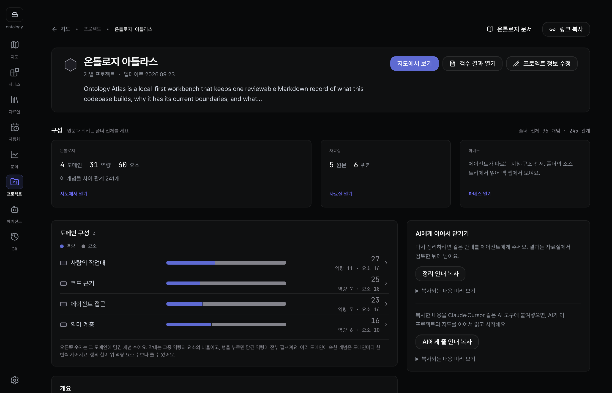
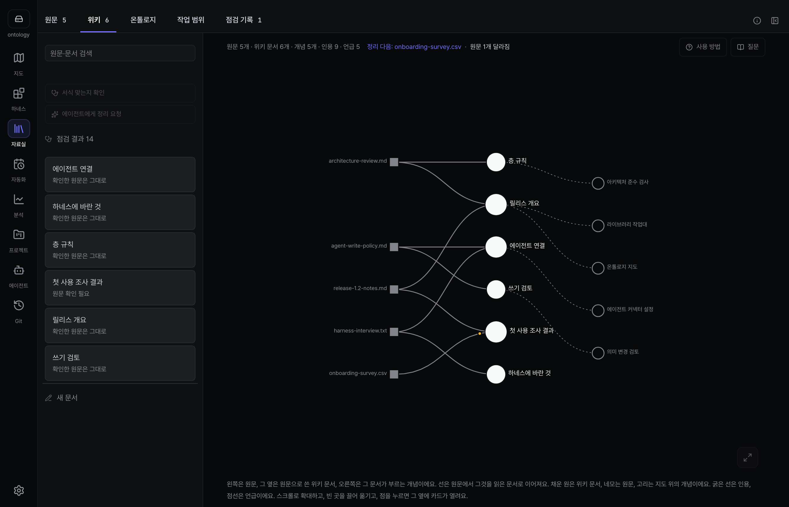
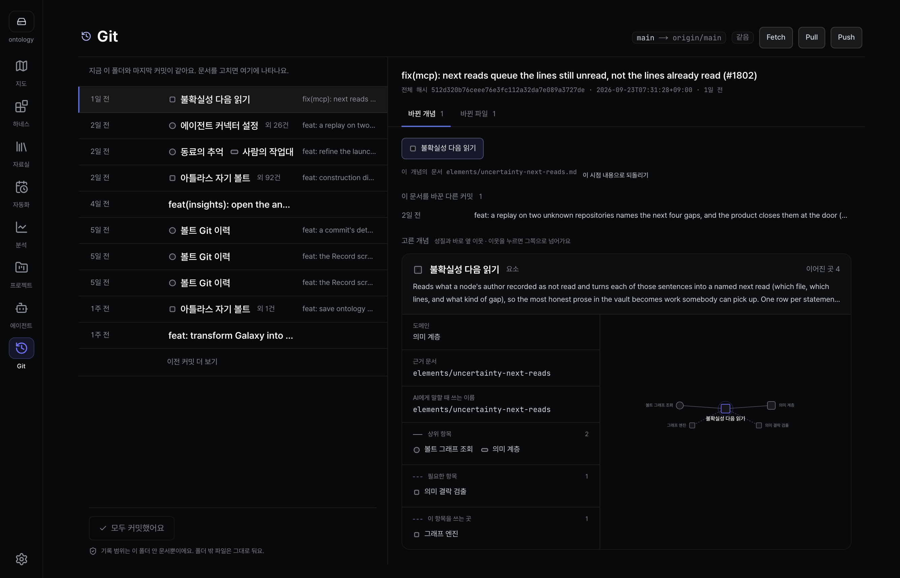
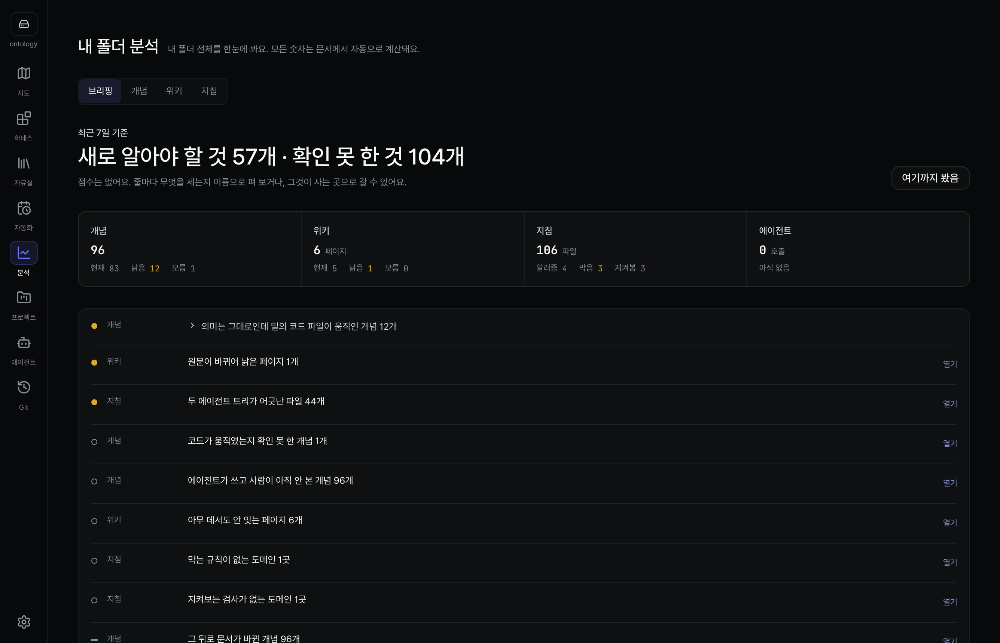
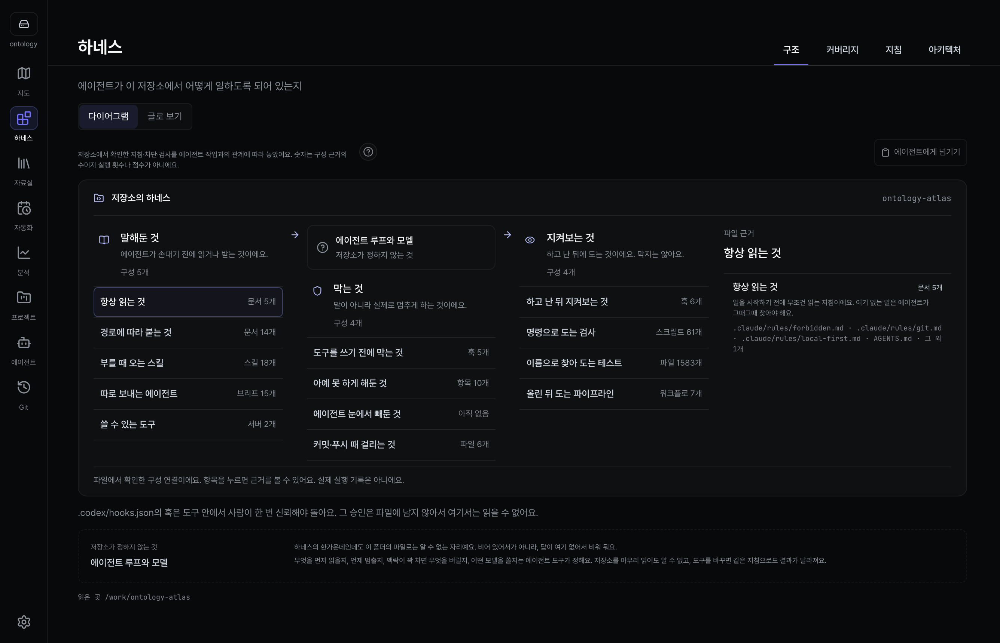
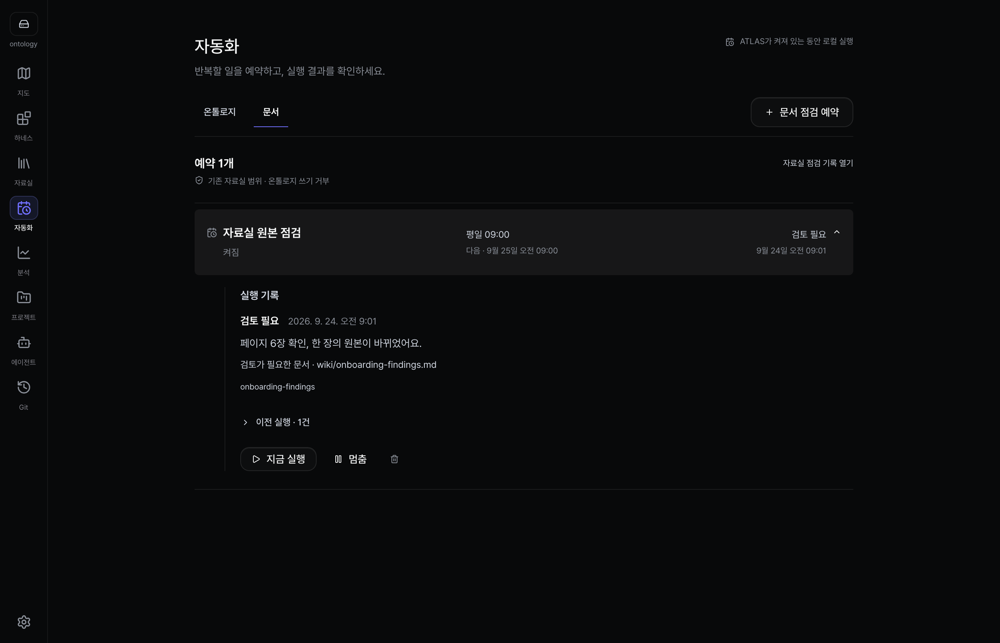

[English](README.md) | [한국어](README.ko.md) | [日本語](README.ja.md) | [简体中文](README.zh.md)

<h1 align="center">
  <picture>
    <source media="(prefers-color-scheme: dark)" srcset="public/brand/lockup-dark@2x.png" />
    
  </picture>
</h1>

<p align="center"><strong>AI 에이전트가 코드를 바꿔도 내 시스템을 계속 이해하세요.</strong></p>

<p align="center">
  코드가 무엇을 하고 왜 그렇게 생겼는지 담은 지도를 저장소 안 마크다운으로 남겨요.<br />
  나도, 내 코딩 에이전트도 그 파일을 읽어요.
</p>

<p align="center">
  <a href="https://ontologyatlas.com/ko/download/"><strong>macOS용 받기</strong></a> ·
  <a href="https://ontologyatlas.com/ko/topology/">브라우저에서 써보기</a> ·
  <a href="https://ontologyatlas.com/ko/guide/">가이드</a>
</p>

<p align="center"><a href="LICENSE"></a> <a href="https://github.com/wlsdks/ontology-atlas/releases"></a> <a href="https://mcpservers.org/servers/wlsdks/ontology-atlas"></a></p>


## 왜 Atlas인가

코딩 에이전트가 코드를 바꾸는 속도가 이제 팀이 머릿속에 그림을 유지하는 속도보다
빨라요. Atlas는 그 그림을 코드 옆에 둬요. 각 부분이 무엇을 위한 것인지, 어느
파일이 구현하는지, 무엇이 무엇에 기대는지, 아직 아무도 모르는 것이 무엇인지까지요.
에이전트는 작업 전에 그 그림을 읽고 작업 뒤에 갱신을 제안해요. 나는 변경마다 마크다운
diff로 보고 그대로 두거나, 고치거나, 거절해요.

- **에이전트가 맥락을 갖고 시작해요.** Claude Code, Codex, Cursor, Antigravity가 MCP로 작업에 걸린 개념, 코드 경로, 의존 관계, 아직 풀리지 않은 질문을 읽어요.
- **기록은 내가 가져요.** `atlas/` 폴더에 개념마다 마크다운 파일 하나가 있고, 코드처럼 Git으로 버전을 관리하고 리뷰해요.
- **무엇이 사실인지는 내가 정해요.** 에이전트의 제안은 내가 받아들이기 전까지 제안으로 남아요.
- **모르는 것은 모른다고 해요.** 지도의 선은 선언된 관계일 뿐, 실행 시 영향의 증거가 아니에요. 근거가 없으면 안전이 아니라 미확인으로 보여요.

## 화면 둘러보기

<table>
<tr>
<td width="50%"><br /><b>프로젝트</b> — 모든 프로젝트와, 그중 코드 근거가 얼마나 있는지.</td>
<td width="50%"><br /><b>자료실</b> — 문서가 들어가면 출처가 달린 위키 페이지가 나와요.</td>
</tr>
<tr>
<td><br /><b>Git</b> — 커밋하기 전에 정확한 마크다운 diff를 봐요.</td>
<td><br /><b>분석</b> — 점수가 아니라 측정으로, 다음에 고칠 것.</td>
</tr>
<tr>
<td><br /><b>하네스</b> — 저장소가 에이전트에게 말해 두고, 막고, 지켜보는 것.</td>
<td><br /><b>자동화</b> — 폴더를 최신으로 유지하는 예약 점검.</td>
</tr>
</table>

## 빠른 시작

1. **설치**: [다운로드 페이지](https://ontologyatlas.com/ko/download/)에서 앱을 받거나 [브라우저 버전](https://ontologyatlas.com/ko/topology/)을 여세요.
2. **폴더 열기**: Atlas는 폴더 안의 마크다운을 그 자리에서 읽거나 저장소에 `atlas/` 폴더를 새로 만들고, 무엇이든 쓰기 전에 경로를 먼저 보여 줘요.
3. **에이전트 연결**: **에이전트 › MCP**에서 쓰는 도구의 **연결**을 누르고, 에이전트를 다시 시작한 뒤 다음 작업에 대해 물어보세요.

macOS(Apple Silicon)용 앱은 서명과 공증을 거쳤고, 앱 안에 MCP 서버가 들어 있어요. Windows x64는 서명하지 않은 베타예요. Linux에서는 브라우저 버전을 쓰거나, [소스 체크아웃에서 CLI와 MCP 서버를 실행](cli/README.md#set-up-from-a-source-checkout)하세요. [릴리스](https://github.com/wlsdks/ontology-atlas/releases)에 버전마다 파일과 체크섬이 있어요.

## 동작 방식

```text
your-repo/
├── src/
└── atlas/                 ← 코드와 함께 클론하고, 브랜치를 따고, 리뷰해요
    ├── project.md
    ├── domains/  capabilities/  elements/
    ├── sources/           받은 그대로 보관한 문서
    └── wiki/              그 문서로 쓴 페이지, 모든 사실에 출처 표시
```

frontmatter에 `kind:`가 있는 마크다운 파일 하나가 개념 하나예요. `uid`는 바뀌지 않고,
`slug`는 지금의 주소이며, `path`는 그 개념이 설명하는 코드를 가리켜요. 지도, 문서,
자료실, 분석, Git 화면이 모두 이 파일을 읽어요.

에이전트가 폴더에 닿는 길은 둘이에요.

- **MCP:** 에이전트가 Atlas MCP 서버를 띄우고, 그 서버가 디스크의 폴더를 직접 읽고 써요. 앱이 꺼져 있어도 돼요. [에이전트 연결하기](docs/guide/connect-agent.md) · [MCP 레퍼런스](mcp/README.md)
- **ACP:** Claude Agent와 Codex는 앱 안 대화에서도 일해요. 쓰기는 내가 허락할 때까지 기다려요. [에이전트](docs/features/agents.md)

## 로컬 우선

- 백엔드, 계정, 텔레메트리가 없어요. 폴더는 내 디스크에 평범한 마크다운으로 남아요.
- 내 API key나 로컬 모델로 모델을 부르는 기능은 직접 켜야 쓸 수 있고, 호출마다 목적지가 `.ontology-atlas/llm-audit.jsonl`에 기록돼요.
- 연결한 코딩 에이전트는 내 질문과 읽은 맥락을 자기 제공자에게 보낼 수 있어요. 이 전송은 Atlas의 기록에 들어가지 않아요.

[신뢰에 관하여](docs/guide/trust.md) · [보안](SECURITY.md)

## 현재 상태

Atlas는 아직 초기 단계예요. 우리 벤치마크에서는 Atlas를 썼을 때 더 나은 답을 아직
확인하지 못했고, Atlas 쪽이 더 느렸어요([정정 기록](docs/benchmark/FINDINGS-2026-08-31-metric-split.md)).
구축 실험과 그 실패, 한계는 [구축 측정](docs/benchmark/CONSTRUCTION.md)에 있어요.

## 문서

[Atlas란?](docs/guide/what-is-atlas.md) · [첫 5분](docs/guide/first-five-minutes.md) · [무엇이 개념이 되나](docs/guide/what-becomes-a-node.md) · [관계](docs/guide/relations.md) · [명세](docs/ONTOLOGY-ATLAS-SPEC.md) · [기능](docs/FEATURES.md) · [CLI](cli/README.md) · [아키텍처](docs/ARCHITECTURE.md)

## 기여하기

먼저 [CONTRIBUTING.md](CONTRIBUTING.md)를 읽어 주세요. 외부 PR은 포크에서 보내요.
사람과 에이전트가 함께 따르는 규칙은 [AGENTS.md](AGENTS.md)에 있어요.

```bash
pnpm install
pnpm dev
pnpm checks:changed -- --run
```

`pnpm pr:land <number>`는 리뷰를 마친 PR을 머지하고 원래 커밋을 그대로 남겨요.
전체 검사 안내는 [개발 검사](docs/DEVELOPMENT-CHECKS.md)에 있어요. 저장소 명령 표는
영어 README의 [Contributing](README.md#contributing)에 있어요.

## 라이선스

[MIT](LICENSE). 서드파티 고지는 [NOTICE.md](NOTICE.md)에, 라이선스 전문은 [public/third-party-licenses.txt](public/third-party-licenses.txt)에 있어요. 픽셀 마스코트와 그 출처는 [브랜드](docs/design/brand.md)에 설명돼 있어요.
