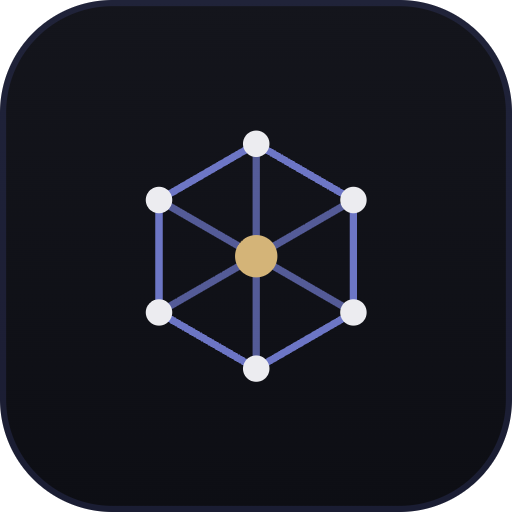
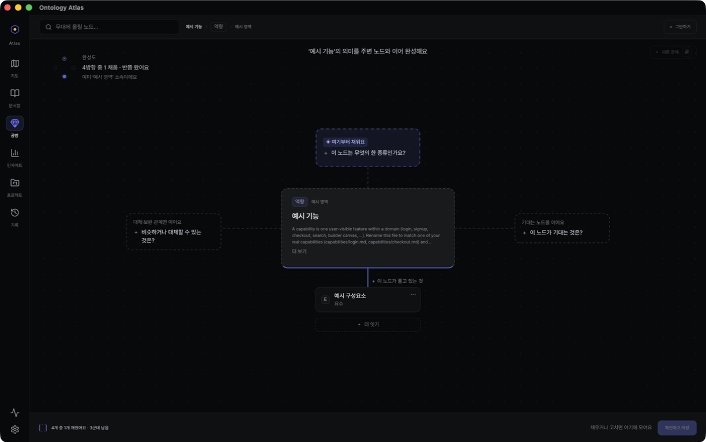
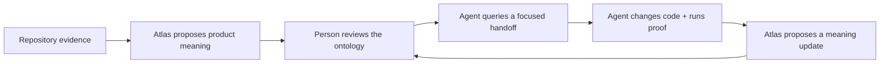
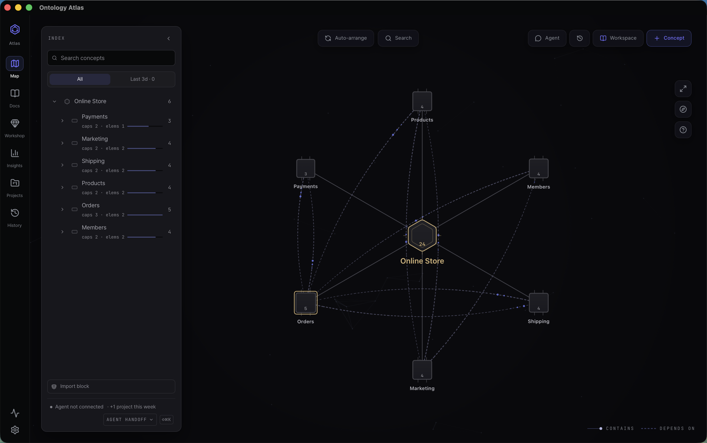
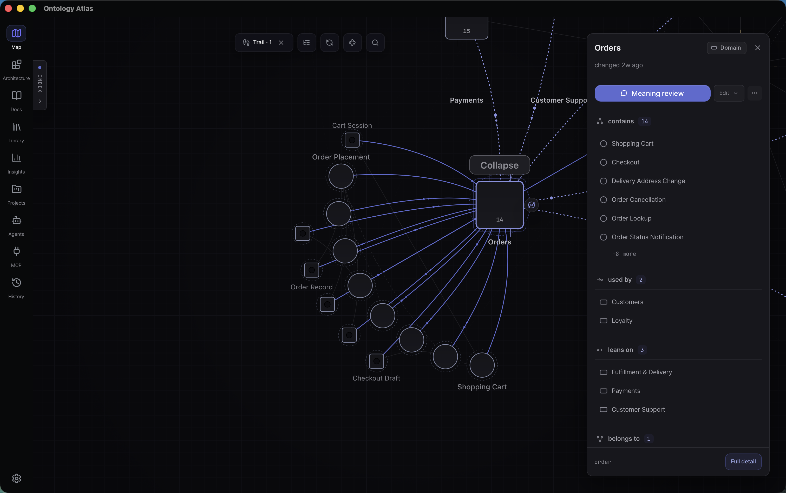
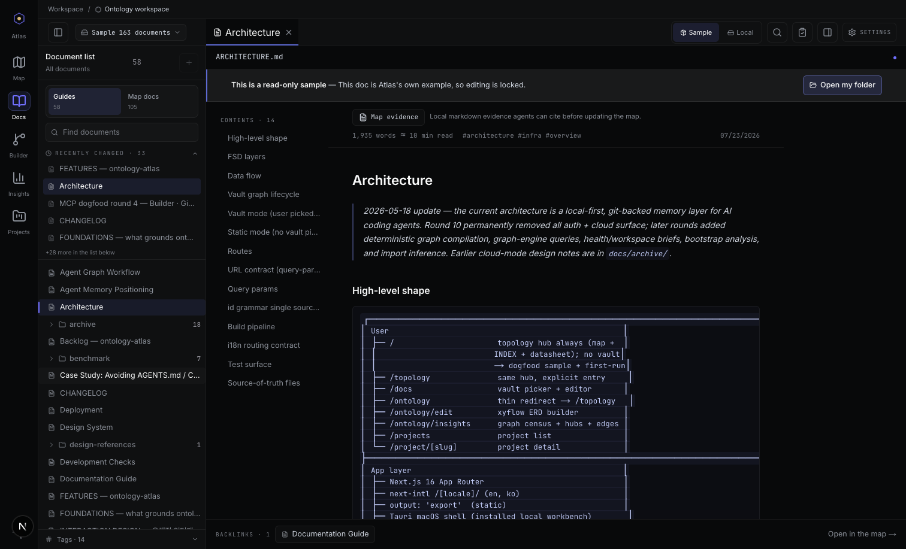
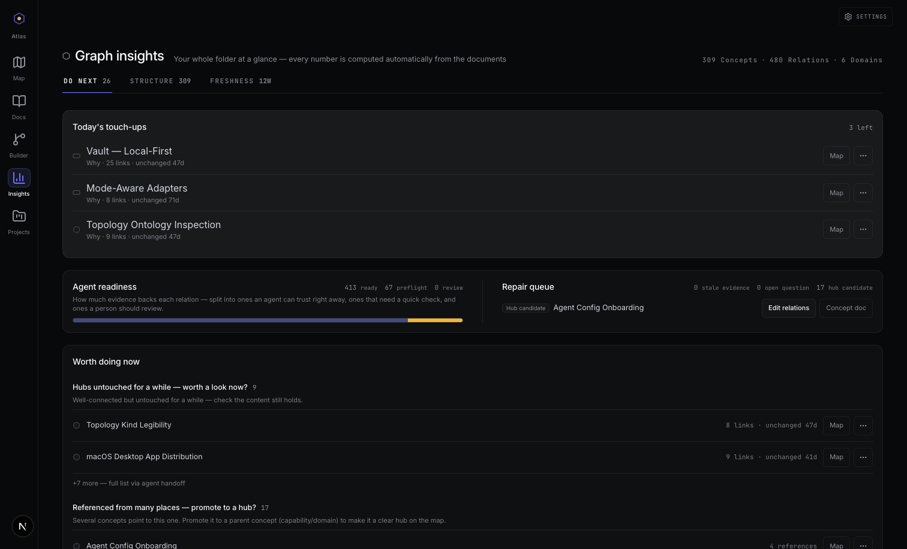

# Ontology Atlas

<p align="center">
  
</p>

<p align="center">
  <strong>The shared meaning layer for people and their AI agents.</strong>
</p>

<p align="center">
  Turn the Markdown already living in your repository into a queryable model of
  product domains, capabilities, implementation evidence, dependencies, and
  impact — then grow it together through MCP, CLI, and a visual workbench.
</p>

<p align="center">
  <a href="https://wlsdks.github.io/ontology-atlas/"><strong>Live demo</strong></a>
  ·
  <a href="#quick-start"><strong>Quick start</strong></a>
  ·
  <a href="mcp/README.md"><strong>MCP setup</strong></a>
  ·
  <a href="cli/README.md"><strong>CLI reference</strong></a>
  ·
  <a href="https://github.com/wlsdks/ontology-atlas/releases"><strong>Releases</strong></a>
</p>

<p align="center">
  <a href="LICENSE"></a>
  <a href="mcp/README.md"></a>
  <a href="cli/README.md"></a>
  
</p>

<p align="center">
  
</p>

<p align="center">
  <sub>Persisted focus → four typed relation bearings → explicit Markdown write boundary.</sub>
</p>

---

## Why Atlas exists

Coding agents can inspect source, but source alone does not explain what a
product is trying to do. The meaning they reconstruct in one session — domain
boundaries, capability intent, trusted evidence, change impact, and the right
verification path — usually disappears before the next one.

Traditional documentation has the opposite problem: people can read it, but it
drifts away from the code and rarely gives an agent typed, queryable facts.

Ontology Atlas joins those two worlds:

| Without a shared meaning layer | With Ontology Atlas |
|---|---|
| Every agent rebuilds product context from scratch | Agents start from the relevant domain, capability, and evidence |
| Architecture knowledge is scattered across prose and chat | Plain Markdown frontmatter forms one typed, traversable graph |
| Impact and verification are rediscovered after the edit | The handoff names dependencies, blast radius, and proof paths |
| Machine memory is hard for people to judge | Every update is a normal file and a normal git diff |

This is the product's identity: **agent-native, human-sovereign**. Agents are
first-class readers and maintainers; people remain the arbiters of meaning
because the source of truth stays on their disk, in Markdown, under git.

## The loop



Atlas deliberately sits above source-code intelligence. Language servers, grep,
AST indexes, and code graphs answer where a symbol lives and what calls it.
Atlas answers why that artifact matters, which capability it proves, what else
depends on the meaning it carries, and how the next agent should verify a
change.

## Quick start

Requires Node.js 24.

> **Current distribution status (checked 2026-07-27):** the public
> `ontology-atlas` and `ontology-atlas-mcp` npm packages return `E404`. Until
> the maintainer completes the guarded publish checklist, run these commands
> from an Ontology Atlas source checkout. The app fails closed instead of
> generating an `npx` configuration that cannot start.

```bash
# Create a git-friendly ontology vault and agent configuration.
node cli/src/index.mjs init ./ontology

# Analyze the repository, review the proposal, then explicitly land it.
node cli/src/index.mjs index . --vault ./ontology
node cli/src/index.mjs index . --vault ./ontology --apply

# Get the compact starting packet for a person or coding agent.
node cli/src/index.mjs workspace-brief ./ontology
node cli/src/index.mjs agent-brief ./ontology
```

`index` combines repository meaning analysis, TS/JS import evidence, and vault
validation. Its default run is side-effect free; `--apply` is the explicit
write boundary.

The generated config connects Claude Code, Cursor, and Codex to the same vault.
You can verify the actual MCP process and contracts at any time:

```bash
node cli/src/index.mjs mcp-verify ./ontology
```

No backend. No login. No hosted database. Open the vault in a text editor,
Obsidian, the visual app, or an MCP-capable agent — it remains the same set of
files.

## See the product

### Read the system as a map

The topology hub starts with the product, then lets you zoom from domains and
capabilities into the implementation evidence that realizes them.



Selecting a concept creates durable focus. The map dims unrelated facts while
the inspector exposes relation direction, evidence, path actions, and a
copyable agent handoff.



### Inspect and edit the Markdown source

The Docs workspace keeps prose and graph facts together: document list,
frontmatter-backed evidence, backlinks, checks, search, and the command palette.



### Shape relations in Workshop

Workshop opens a persisted ontology focus from the map, a deep link, or the MCP
`builder_context` compatibility operation. Nodes and relations still write to
Markdown only after an explicit confirmation.


### Turn graph health into a work queue

Insights turns the ontology into concrete follow-up: stale hubs, agent
readiness, repair candidates, kind distribution, relation structure, and
freshness.



## Six work surfaces, one vault

| Surface | What it is for |
|---|---|
| **Map** (`/` and `/topology`) | Overview, semantic zoom, typed relation inspection, focus/path modes, impact, and handoff |
| **Docs** (`/docs`) | Read and edit Markdown, inspect frontmatter evidence and backlinks, search, run workspace checks |
| **Workshop** (`/ontology/studio`) | Complete a node's meaning against four fixed relation bearings, with a visible write-confirm boundary |
| **Insights** (`/ontology/insights`) | Five maintenance questions: do next, composition, connections, boundaries, and freshness |
| **Projects** (`/projects`) | Project cards and domain/capability/evidence coverage derived from containment |
| **Git** (`/git`) | Vault-scoped changes, history, and local snapshot handoff without remote transport |

The **MCP server** exposes that vault to Claude Code, Cursor, Codex, and other
MCP clients as 32 tools over stdio JSON-RPC: **19 read + 13 write**.

Every surface reads and writes the
same `.md` files. The interface changes; the authority does not.

## Built for real agent work

### Bootstrap product meaning from a repository

Atlas does more than mirror folder names. The analysis surface ranks README,
package, documentation, source, test, and import evidence; distinguishes
observed facts from proposed meaning; and returns a proposal validation contract
before anything can be written.

```bash
ontology-atlas analyze . --vault ./ontology
ontology-atlas infer-imports . --vault ./ontology
ontology-atlas index . --vault ./ontology
```

### Start from a focused handoff

```bash
ontology-atlas workspace-brief ./ontology
ontology-atlas agent-brief ./ontology --graph-db-pack
ontology-atlas node capabilities/authentication ./ontology
ontology-atlas blast-radius capabilities/authentication ./ontology
```

The agent brief includes business-first reading order, graph entry points,
focused MCP calls, CLI fallbacks, investigation playbooks, write guardrails,
health, and stop conditions. An agent gets a smaller and more trustworthy
starting packet instead of a dump of the whole repository.

`workspace-brief` is the cheap first-contact dashboard. It returns hotspots,
per-project node counts (`project_scope`), health-check coverage as
`id:status:count`, and growth counts before the agent chooses where to read
deeper.

### Query graph-database behavior without a graph database

`compile_ontology` deterministically turns frontmatter into canonical nodes,
edges, aliases, issues, a stable `graphHash`, and optional indexes.
`query_ontology` runs graph operations over that artifact:

- neighborhoods, paths, all paths, reachability, and typed pattern walks;
- centrality, communities, domain coupling, project maps, and containment;
- impact, blast radius, cycles, components, and topological order;
- similar-node checks, relation preflight, growth plans, and maintenance queues;
- workspace, health, agent, and persisted Workshop context.

The CLI exposes the same authority for connector-less environments:

```bash
ontology-atlas schema ./ontology
ontology-atlas match-nodes ./ontology --kind capability --min-degree 3
ontology-atlas all-paths domains/auth capabilities/token-issue ./ontology
ontology-atlas health ./ontology
```

### Keep writes safe and reviewable

- Analysis and planning tools are side-effect free by default.
- Destructive graph changes return a complete dry-run before confirmation.
- Renames and merges redirect backlinks atomically.
- Optimistic `mtime` guards stop an agent from overwriting a concurrent edit.
- Relation preflight catches duplicates, inverses, and schema drift.
- Vault-scoped git history and snapshot tools never include files outside the
  ontology.

See the complete [MCP tool contracts](mcp/README.md) and
[CLI command reference](cli/README.md).

## What is in a vault?

One Markdown file is one ontology node. Frontmatter is the machine-readable
graph record; the body is the explanation a person can judge.

```yaml
---
slug: capabilities/token-issue
kind: capability
title: Token issue
domain: domains/auth
elements:
  - elements/src/auth/token-service
dependencies:
  - capabilities/session-refresh
---

Issues access and refresh tokens for authenticated users.
```

Atlas uses a deliberately small hierarchy:

```text
project
└── domain
    └── capability
        └── element
```

Typed relations add dependency, evidence, containment, and descriptive meaning.
The goal is not to index every symbol. A source artifact earns a place when it
helps a person or agent understand a capability, trace impact, or run the right
proof.

## Local-first by construction

| Promise | Proof in this repository |
|---|---|
| **Your disk is the database** | Markdown frontmatter is the graph; confirmed writes go back to the selected vault |
| **Git is the history** | Diffs stay human-readable; history and snapshots are scoped to the vault |
| **No backend or account** | The static export ships no backend, auth, or cloud SDK; your disk is the only store |
| **Deterministic graph** | Compile and graph-query contracts are covered across MCP, CLI, and shared tests |
| **Static web demo** | Next.js exports to `out/`; the public sample needs no server persistence |
| **Dogfooding** | This repository's own vault has **97 nodes**: capabilities 38, document 3, domains 6, elements 48, project 1, vault-readme 1. |

The macOS app uses a Tauri bridge to your selected folder. The hosted web app
can open a local folder through the File System Access API. The MCP server and
CLI read the same directory directly from the filesystem.

## Install the visual workbench

The [live demo](https://wlsdks.github.io/ontology-atlas/) opens with this
repository's read-only dogfood graph. Pick your own Markdown folder to switch to
your data.

For the full desktop workflow, download the signed macOS build from
[GitHub Releases](https://github.com/wlsdks/ontology-atlas/releases). Maintainers
can run the shell from source:

```bash
git clone https://github.com/wlsdks/ontology-atlas
cd ontology-atlas
pnpm install
pnpm desktop:dev
```

## Local development

```bash
pnpm install
pnpm dev                 # http://localhost:3000
pnpm checks:changed      # focused verifier suggestions
pnpm exec tsc --noEmit
pnpm test:run
pnpm lint
pnpm build               # static export → out/
```

Useful dogfood and contract gates:

```bash
pnpm dogfood:verify      # real MCP process + tool/health/query smoke
pnpm dogfood:compile     # compile this repo's ontology
pnpm dogfood:health      # graph integrity dashboard
pnpm docs-vault:check    # committed app sample matches docs/
pnpm package:check       # MCP/CLI/docs/performance contracts
```

Architecture at a glance:

| Area | Stack |
|---|---|
| Workbench | Next.js 16, React 19, TypeScript 5, static export, Tauri macOS shell |
| Visual graph | Custom canvas-2D topology engine, Graphology, ForceAtlas2, xyflow Builder |
| Local storage | Markdown, git, Tauri vault bridge, File System Access API |
| Agent interface | Model Context Protocol SDK, stdio JSON-RPC |
| Verification | Vitest, Testing Library, Node test runner, Playwright |

Feature-Sliced Design import direction is enforced by ESLint:

```text
app -> views -> widgets -> features -> entities -> shared
```

## Documentation

| Document | Start here when you need… |
|---|---|
| [Product direction](docs/PRODUCT-DIRECTION.md) | The mission, audience, and product boundaries |
| [Foundations](docs/FOUNDATIONS.md) | Ontology theory and the research behind Atlas |
| [Features](docs/FEATURES.md) | The current app, MCP, CLI, and desktop inventory |
| [Architecture](docs/ARCHITECTURE.md) | Local-first data flow and runtime contracts |
| [MCP guide](mcp/README.md) | Registration, 32 tool contracts, and troubleshooting |
| [CLI guide](cli/README.md) | 52 commands and examples |
| [Development checks](docs/DEVELOPMENT-CHECKS.md) | Focused and release-level verification |
| [Contributing](CONTRIBUTING.md) | Contributor workflow and quality bar |

## Contributing

Issues and pull requests are welcome. The most useful field reports are:

- bootstrap a real repository and show where the proposed meaning is weak;
- connect an MCP agent and show where the handoff is missing evidence;
- bring a messy existing vault and show where validation or repair is unclear;
- test the visual workbench at real desktop sizes and report unreadable graph
  states.

Read [AGENTS.md](AGENTS.md) before making changes. It is the canonical guide for
both people and AI agents working in this repository.

## License

[MIT](LICENSE)

---

## 한국어

Ontology Atlas는 사람과 AI 에이전트가 함께 키우는 **공유 의미 계층**입니다.
저장소의 Markdown을 프로젝트 → 도메인 → 기능 → 구현 근거로 연결하고, MCP·CLI·
시각 워크벤치가 모두 같은 온톨로지를 읽고 씁니다.

- 에이전트는 작업 전에 관련 의미, 영향 범위, 검증 경로를 받습니다.
- 작업 후에는 새 의미를 제안하고, 사람은 평범한 Markdown/git diff로 판단합니다.
- 백엔드, 로그인, 별도 DB가 없습니다. 파일이 그래프이고 git이 이력입니다.

```bash
node cli/src/index.mjs init ./ontology
node cli/src/index.mjs index . --vault ./ontology
node cli/src/index.mjs index . --vault ./ontology --apply
node cli/src/index.mjs agent-brief ./ontology
```

2026-07-27 기준 공개 npm 패키지는 아직 `E404`입니다. 위 명령은 Ontology
Atlas 소스 체크아웃 루트에서 실행하며, 공개 배포와 fresh-shell `npx` 검증이
끝나기 전에는 앱도 실행 불가능한 `npx` 설정을 만들지 않습니다.

[라이브 데모](https://wlsdks.github.io/ontology-atlas/)에서 실제 dogfood
온톨로지를 먼저 볼 수 있습니다. MCP 연결은 [MCP 가이드](mcp/README.md),
전체 명령은 [CLI 가이드](cli/README.md), 제품의 현재 기능은
[Features](docs/FEATURES.md)를 참고하세요.
