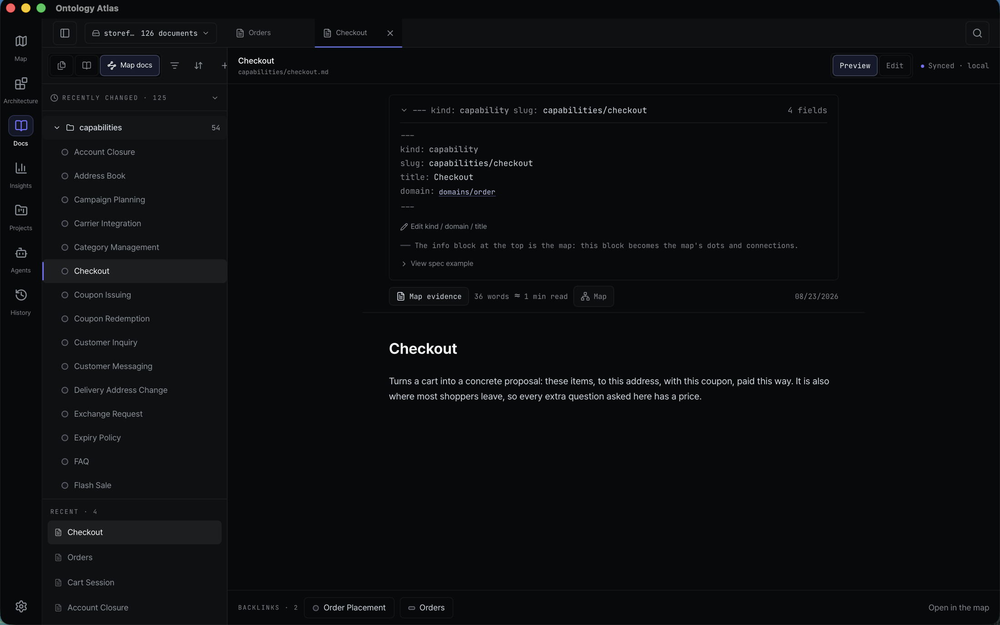
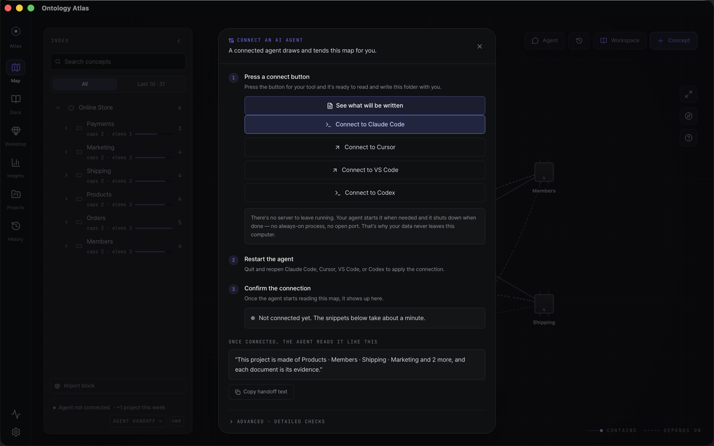
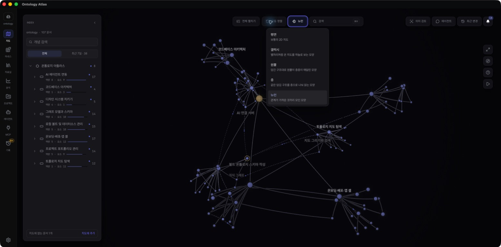
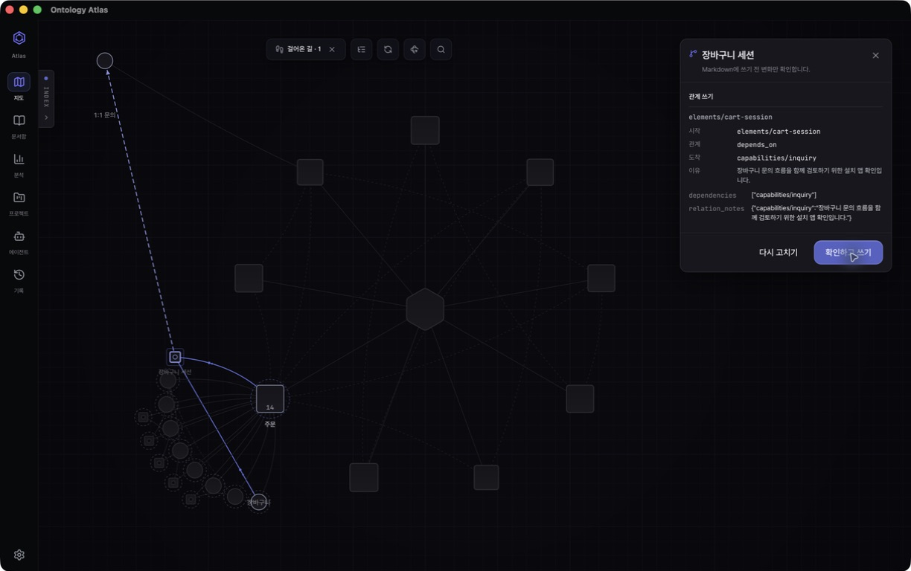
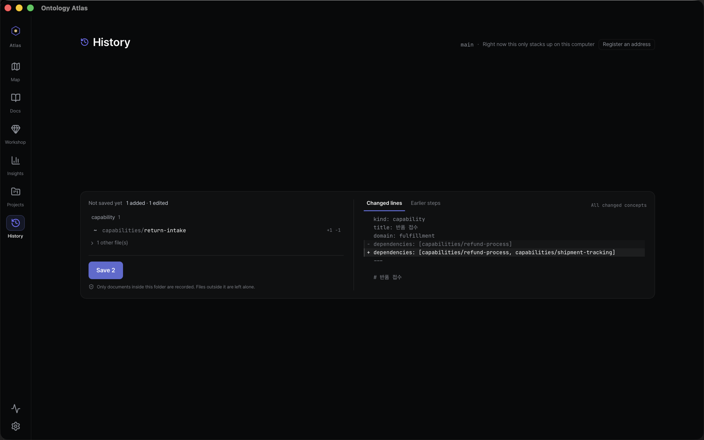
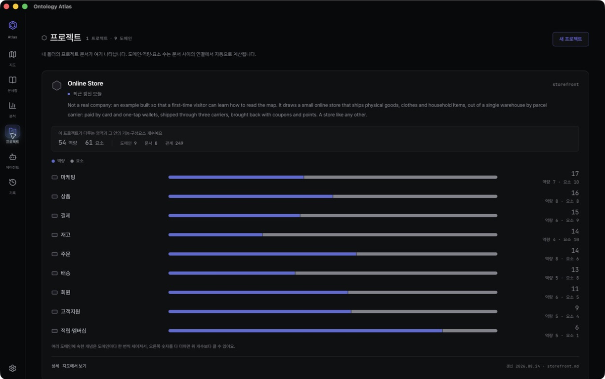

# Ontology Atlas

<p align="center">
  <picture>
    <source media="(prefers-color-scheme: dark)" srcset="public/brand/lockup-dark.svg" />
    
  </picture>
</p>

<p align="center">
  <strong>Understand what your codebase builds, why it is structured that way,<br />
  and what a change will affect.</strong>
</p>

<p align="center">
  <a href="https://wlsdks.github.io/ontology-atlas/en/download/"><strong>Download for macOS</strong></a>
  ·
  <a href="https://wlsdks.github.io/ontology-atlas/en/download/"><strong>Windows x64 beta</strong></a>
</p>

<p align="center">
  <sub>Windows is a public, unsigned beta. Microsoft Defender SmartScreen may
  warn about an unknown publisher, and managed work PCs may block it.</sub>
</p>


<p align="center">
  <sub>The installed macOS app reading the example vault in
  <a href="samples/storefront"><code>samples/storefront</code></a> — an online
  store, written as nothing but Markdown files in a folder. The interface moves
  quickly; the live demo and <a href="docs/FEATURES.md">feature inventory</a>
  are the current behavior contract.</sub>
</p>

<p align="center">
  Ontology Atlas keeps that explanation as a codebase ontology in repository
  Markdown: product domains and capabilities linked to implementation evidence,
  dependencies, and impact. People judge the files and git diffs; AI agents
  query and maintain the same ontology over MCP.
</p>

<p align="center">
  <strong>Each desktop download includes the Atlas app and its MCP server.</strong>
  One button writes the connection files; the restart and <code>mcp-verify</code>
  steps then prove the live connection from your agent's working folder.
</p>

<p align="center">
  <a href="https://wlsdks.github.io/ontology-atlas/en/topology/">Live demo</a>
  ·
  <a href="https://wlsdks.github.io/ontology-atlas/en/guide/">Guide</a>
  ·
  <a href="#the-journey">The journey</a>
  ·
  <a href="#where-it-stands">Where it stands</a>
  ·
  <a href="#what-this-is-not">What this is not</a>
  ·
  <a href="#status--read-this-before-installing">Status</a>
</p>

<p align="center">
  <a href="LICENSE"></a>
  <a href="mcp/README.md"></a>
  <a href="cli/README.md"></a>
  
</p>

---

## In 30 seconds

Source code shows how a system works. It rarely preserves which product
capability the code serves, why its boundaries exist, or what a change could
affect. Atlas keeps those answers beside the code in a folder of Markdown files.

Use Atlas before a change so a person and an AI agent start from the same
answer: what the code is for, where to begin, what else it touches, and what to
verify. That answer stays bounded — a list of observed capabilities is not
treated as exhaustive, and unsupported scope remains visible uncertainty.

Each file's frontmatter declares what it is (`project`, `domain`, `capability`,
`element`, or a linked `document`) and what it points at. That folder is the
whole database.

Because the kinds and relation types are a small fixed set, the folder is not
just readable — it is **computable**. Atlas compiles it into a graph and answers
questions a note-taking tool cannot: *what breaks if I change this, what is this
capability's blast radius, which paths connect these two things, what is
disconnected, what is stale.*

Your agent asks those questions over MCP. You read the same answers as a map,
and every write the agent makes lands as a line in a Markdown file you can diff.

Architecture is a separate contract, not another ontology layer. A reviewed
`architecture-profile/v1` document declares implementation roles, scoped paths,
allowed dependency direction, and which known import usages those rules govern;
`inspect_architecture` and the `architecture` CLI compare that intent with
usage-qualified current source imports and return `conforms`, `violated`, or
`unknown`. Unknown coverage or import usage is never shown as green.

The exact five-kind discriminator, relation support matrix, direct `is_a` test,
and standards/inference boundary live in the
[vault specification](docs/ONTOLOGY-ATLAS-SPEC.md#2-the-five-authorable-node-kinds-and-reserved-reader-kind).

## Status — read this before installing

Every public build is prerelease software. A release candidate walks the same
signing, notarization, installer, updater, and hosted-download checks as a final
build, but has not been widely run yet.

The [download page](https://wlsdks.github.io/ontology-atlas/en/download/) is the
release authority: it renders a generated record of the current published tag,
real asset sizes, checksums, platforms, and signing state. This README does not
pin a tag or copy those values, so an older document cannot contradict the files
people are about to install. [GitHub Releases](https://github.com/wlsdks/ontology-atlas/releases)
is the second direct source.

- **The unsigned Windows beta is a real risk, not a formality.** SmartScreen
  may warn about an unknown publisher, and a managed work PC may refuse the
  installer outright. [Security](SECURITY.md) explains what is and is not
  promised.
- **Installing the desktop app installs the agent surface.** Both bundles carry
  the compiled MCP server. There is no npm package; Linux and every other
  platform runs the browser app, or the CLI and MCP server from a source
  checkout. The in-app updater reads a stable Pages manifest staged from the
  newest non-draft GitHub Release, including release candidates; every archive
  still has to pass the bundled updater signature check before installation.
- **Screenshots demonstrate the product journey, not release availability.**

## Where it stands

Two tiers here, and the second is the one worth reading. Nothing below is a
roadmap promise. It summarizes current product behavior documented in the
[feature inventory](docs/FEATURES.md), the
[specification](docs/ONTOLOGY-ATLAS-SPEC.md), and the
[decision ledger](docs/DECISIONS.md). For what is downloadable today, use the
[download page](https://wlsdks.github.io/ontology-atlas/en/download/).

### Working today

- **A Markdown folder is the whole database.** Point the app at one and it reads
  and writes in place — no import step, no index to build, no account.
- **The macOS app**, Developer ID signed and notarized, with the compiled MCP
  server inside its own bundle.
- **Agent setup starts with one button and ends with a real proof.** The app
  shows the exact paths before writing, creates only the missing connection
  files on confirm, then guides the agent restart and `mcp-verify` check. File
  presence is never presented as a live connection.
- **MCP over stdio** for Claude Code, Cursor, VS Code, Codex, and any other MCP
  client — a typed read and write surface the running server advertises through
  `tools/list`. [Agent guide](mcp/README.md).
- **A CLI carrying the same authority as the agent** — scaffold, validate,
  dry-run writes, bounded traversal, blast radius, commit preflight,
  vault-scoped git snapshots, agent handoff. [CLI reference](cli/README.md).
- **The workbench surfaces, all reading one folder** — Map, Architecture, Docs,
  Insights, Projects, Agents, and Git History. Architecture is additive: the
  existing Git destination, change badge, and keyboard path remain available.
- **Export to standard graph formats.** JSON-LD and GraphML come off the same
  deterministic compile artifact, so the vault opens in rdflib, Protégé, Gephi,
  Cytoscape, NetworkX, or Neo4j without a converter of your own.
- **Scaffolded vaults carry their own agent skills.** A connected coding agent
  finds review / grow / absorb procedures in its command menu with no extra
  setup, because `init` wrote them into the vault.
- **The hosted web app as a gateway** — a static export that opens your local
  folder through the File System Access API, with nothing installed.

### Shipping, not settled

- **Windows x64 is an intentionally unsigned public beta.** It carries the same
  local folder and MCP surface as macOS; what it does not carry is a signature,
  so SmartScreen may warn and a managed PC may block it outright.
- **The vault format is v2.0-rc — an RFC open for public comment.** It documents
  behavior already enforced by contract tests in this repository, and it carries
  its own kill criterion: no outside engagement inside the stated feedback
  window and the standardization track is shelved rather than quietly
  maintained.
  [Specification §0](docs/ONTOLOGY-ATLAS-SPEC.md#0-rfc-status-and-feedback).
- **Linux and other platforms have no packaged build.** They run the browser
  app, or the CLI and MCP server from a source checkout — the same vault, fewer
  screens.
- **Web and desktop do not promise the same screens, and that is not a backlog.**
  Git history and offline work are desktop capabilities. The web remembers its
  File System Access handle in IndexedDB and restores it while browser
  permission remains granted, but it cannot run git or native bridges. The
  capability table is in the [feature inventory](docs/FEATURES.md).

A third tier — what we have decided *not* to build, and why — is
[What this is not](#what-this-is-not), below.

## The journey

### 1. Open a folder

The app's first question is a folder. Point it at a vault — a directory of
Markdown — and it reads it in place. No import step, no index to build, no
account.

The vault in every screenshot below is
[`samples/storefront`](samples/storefront): an online store described as
products, inventory, orders, payments, delivery, members, marketing and support —
each with the capabilities inside it and the things those capabilities work with.
Run `node cli/src/index.mjs overview samples/storefront` for the current census;
no document here writes the number, because it changes whenever anyone adds a node.



Docs is the same folder without the canvas: preview or edit Markdown, inspect the
frontmatter that becomes the graph, follow backlinks, and jump back to the same
concept on the map. There is no imported copy to synchronize.

### 2. Connect your agent



Atlas finds the coding agents already installed on this computer, lets you open
the supported ones beside the map, and keeps MCP setup scoped to the selected
folder.

- **Connect once, with visible scope.** The flow shows which folder and client
  config it will change. The resulting files are plain text you can inspect.
- **Then prove the connection from the agent's folder.** The final step gives
  the exact `mcp-verify` check; that check starts the bundled MCP server, reads
  the active vault, and reports the real result or failure.
- **Nothing stays running.** The server speaks stdio; your agent starts it when
  it needs it and it exits afterwards. The MCP server opens no port and makes no
  network request; the coding agent itself may use its provider when you ask it to.

Claude Code, Cursor, Codex, and other supported clients get a direct setup path.
Any other MCP client can use the generated snippet.
The bundled server advertises its current read/write surface through
`tools/list`; the [agent guide](mcp/README.md) documents every tool and its
contract, and `mcp-verify` proves the live inventory.

### 3. Read the map


Selecting a node dims everything unrelated and opens its record without hiding
the node behind the inspector. The same fact serves two readers at once: a
visual hierarchy for a person and typed parents, evidence, and actions for an
agent.

Recent changes can narrow the map while preserving project and domain context;
Footprints record the order in which you opened concepts. Both are views over
local file and session evidence, not hosted activity guesses.



Three spatial readings are explicit rather than mixed together: **Flat** is the
normal 2D map, **Dome** places containment tiers in depth, and **Cloud** lets
relations determine all three axes. Changing the view never changes the graph.

### 4. Plan against reviewed architecture

Architecture stays separate from the Ontology Map. The Living Blueprint keeps
the same role order while you move through **Understand → Plan → Verify**. Plan
copies an `architectureChangePlan:v1` handoff; the connected agent runs
`inspect_architecture` before and after editing. In a source checkout the exact
fallback is:

```console
node cli/src/index.mjs architecture . --vault docs/ontology --profile atlas-web --json
```

Pattern names such as Feature-Sliced Design, Hexagonal, Clean Architecture, or
MVP are reviewed declarations. Atlas derives conformance from source evidence;
it does not infer a fashionable label from folder names.

### 5. Review a relation beside its node



Edit one relation from the selected node. Atlas shows a directional preview on
the map, then a compact review of the source, type, target, reason, and exact
frontmatter fields. **Confirm and write** is the only point that changes the
Markdown file; returning to edit or cancelling changes nothing.

### 6. Review the change, then record it



Whatever wrote — you, the map editor, the CLI, or an agent over MCP — lands here
first as a diff you read before it becomes history. The change above was written
by a command, not by hand, and the command said what it would do to the graph
before touching a file:

```console
$ node $ATLAS/cli/src/index.mjs relate capabilities/return-request capabilities/refund dependencies ./storefront --dry-run

capabilities/return-request --dependencies--> capabilities/refund
  verdict matches_existing_schema · exists no
  schema  capability --dependencies--> capability
  pattern count 51 · resolved 51 · external 0 · unresolved 0
  recommendation safe_to_add · No exact or inverse edge found; capability --dependencies--> capability is an existing schema pattern.

nearby schema patterns
  3 · capability --dependencies--> capability (count 51)
  2 · capability --relates--> capability (count 12)
  1 · capability --elements--> element (count 54)
  1 · capability --domain--> domain (count 49)
  1 · domain --capabilities--> capability (count 49)

dry-run would write dependencies on capabilities/return-request → capabilities/refund (no file changed)
```

An edge that would introduce a shape the vault has never used comes back as
`new_schema_pattern · review_new_schema` instead, so a drifting agent is visible
before it writes rather than after.

Git is scoped to the vault. Files outside the folder you picked are never
touched, and the screen says so.

### 7. Keep it healthy


Insights turns graph health into a work queue: what is disconnected, stale, or
missing evidence, and which repair to make next. Composition shows whether the
folder is balanced across kinds and whether each domain has capabilities backed
by implementation elements. Every number branches from the same compiled graph.

### 8. See the shape of the whole project



Nothing on this screen is maintained by hand. Frontmatter has no `project:` key
— the runtime walks the containment graph from each `project` root and derives
coverage from how the documents link to each other.

## What your agent gets

**Typed MCP tools** over stdio JSON-RPC serve Claude Code, Cursor, Codex, and
any MCP client. The running server advertises the exact current read/write
inventory through `tools/list`; the value is that the answers are typed, so an
agent can act on them.

Ask *what breaks if I change this?* and Atlas follows only approved dependency
declarations. It does not turn folder structure into causal confidence:

```console
$ node $ATLAS/cli/src/index.mjs blast-radius capabilities/mcp-server docs/ontology --depth 2
capabilities/mcp-server — blast radius (depth 2, incoming)
  risk unknown · 1 node · 1 relation · 0 cross-domain

impact certainty unknown · declared 1 · rationale 0 · source-backed 0
Counts below follow declared depends_on only. Use reachability/subgraph for structure;
do not read unknown as low risk.
```

- **Focused context, not a repository dump.** Briefs give an agent the project,
  domain, evidence, impact boundary, first tools, and stop conditions it needs.
- **Graph questions with typed answers.** Paths and reachability explain
  structure; blast radius follows only declared dependencies and reports
  qualification/completeness honestly. No graph database or hosted memory is involved.
- **Writes that survive review.** Analysis is side-effect free by default;
  destructive operations dry-run first, renames repair backlinks, and mtime
  guards protect concurrent human edits.
- **The same authority without MCP.** The CLI exposes the same local folder to
  sessions that cannot attach a connector.

Connect and use it through the [MCP guide](mcp/README.md), or start from the
[CLI reference](cli/README.md).

## Why not just use a notes tool

Local Markdown, git diffs, and MCP are table stakes. Notes tools such as
[Basic Memory](https://github.com/basicmachines-co/basic-memory) already provide
them; hosted graph-memory products provide typed traversal in a database. Atlas
combines a human-readable local vault with a product ontology and a workbench
where people and agents judge the same facts.

| | Notes with MCP | Hosted graph memory | Ontology Atlas |
|---|---|---|---|
| Store | Markdown you own | Vendor database | Markdown you own |
| Structure | Freeform notes and links | Vendor-defined types | Project → domain → capability → element, documents, typed relations |
| Graph questions | Note traversal | Graph engine | Blast radius, reachability, cycles, paths, centrality, health |
| Evidence from code | Hand-authored | Corpus ingestion | Bounded read-only proposals; nothing lands until approval |
| Human surface | Notes app | Vendor console | Local Map, Architecture, Docs, Insights, Projects, Agents, and contextual History |

If you only need an agent to remember conversations, a notes tool is lighter.
Atlas is for modeling the product your code implements. The argument and its
sources live in [Foundations](docs/FOUNDATIONS.md).

## A vault is just files

One Markdown file is one node. Frontmatter is the machine-readable record; the
body is the explanation a person judges.

```yaml
---
uid: 71890f3e-7b5d-4c0a-8f14-123456789abc
slug: capabilities/token-issue
kind: capability
title: Token issue
domain: domains/auth
path: src/auth/token-service.ts          # a path — code evidence
elements:
  - elements/jwt-signer                  # a slug — an implementation-role node
dependencies:
  - capabilities/session-refresh  # a slug — another node
---

Issues access and refresh tokens for authenticated users.
```

That distinction is the one thing worth learning up front: **a path points at
code, a slug points at a node.** Mixing them is the most common first mistake,
and `node $ATLAS/cli/src/index.mjs validate` reports it as a dangling reference.

The usual business-to-code reading spine is deliberately small:

```text
project
└── domain
    └── capability
        └── element
```

`document` is the fifth authorable kind and can describe concepts anywhere on
that spine. Typed relations add dependency, association, containment, and
descriptive meaning; implementation evidence lives in node paths and bodies,
not in an invented `evidence` relation.
The goal is not to index every symbol — a source artifact earns a node when it
helps a person or an agent understand a capability, trace impact, or run the
right proof. Curated, not exhaustive.

## Ontology quality contract

- **There is no vault-wide or project-wide node cap.** Node count is an
  observation, never a pass condition.
- **Direct fan-out is a review signal, not a limit.** A wide hub is correct when
  its children resolve, name distinct roles, and carry clear provenance.
- **Bridge nodes must earn their layer.** They name one shared behavior, differ
  from their siblings, and actually reparent the children they group. Count
  alone never justifies a bridge.
- **Analyzer bounds are evidence-packet bounds, not graph bounds.** Each language
  adapter keeps one proposal readable; it does not limit ontology size or a
  node's number of relations.
- **`uid` and `slug` have different jobs.** UID is permanent identity; slug is
  the readable current address. Source locations belong in `path:` evidence.
- **External field trials stay isolated.** Generalized measurements may improve
  Atlas, but a trial repository's ontology is never merged into the product's
  dogfood graph.

The authority and verification path for each rule lives in the
[Ontology Quality Authority Map](docs/ONTOLOGY-QUALITY.md). The practical node
test is [What becomes a node?](docs/guide/what-becomes-a-node.md).

## How relations are stored

There is no relation database or sync step. The declaring Markdown file owns one
frontmatter line, and Atlas derives the edge and its backlink when it reads the
vault:

```yaml
---
slug: capabilities/vault-live-updates
kind: capability
domain: domains/local-vault-management
dependencies:
  - capabilities/topology-canvas-render   # directed: this depends on that
relates:
  - capabilities/mcp-conflict-guard       # symmetric: read these together
---
```

Containment is the structural layer, not a ceiling; typed meaning relations can
cross domains and branches. `dependencies` is directed, while `relates` is
symmetric, so the map never turns similarity into causality. See the
[relations guide](docs/guide/relations.md) for every relation type, direction,
writing rule, and map behavior, and the [vault specification](docs/ONTOLOGY-ATLAS-SPEC.md)
for the complete frontmatter contract.

## Product destinations, one vault

Map, Architecture, Docs, Insights, Projects, Agents, contextual History, MCP,
and CLI all read the same
Markdown folder. The installed app is the full workbench; the hosted web app is
the no-install gateway and a second-best workbench where native bridges are not
available. MCP and CLI skip the screens and operate on the same files directly.

See the [feature inventory](docs/FEATURES.md) for every current surface and the
[architecture guide](docs/ARCHITECTURE.md) for the desktop/web boundary. The
[live demo](https://wlsdks.github.io/ontology-atlas/en/topology/) opens Atlas's
own dogfood vault in [`docs/ontology/`](docs/ontology/); run
`node cli/src/index.mjs overview docs/ontology` when you need its current census.

## Local-first, by construction

- **Your disk is the database.** Frontmatter is the graph; confirmed writes go
  back to the folder you picked. There is no other store.
- **Git is the history.** Diffs stay human-readable; history and snapshots are
  scoped to the vault.
- **No Atlas backend, account, or telemetry.** The web app is a static export.
  The desktop app checks the public updater manifest automatically once per day.
  Atlas does not upload vault content; a connected coding agent communicates
  with its own provider only when you ask it to.
- **Two ways in, one folder.** The hosted web app can open a local folder through the File System Access API. The desktop app uses a Tauri bridge to your selected folder and keeps the same vault open as a workspace.
- **The Tauri macOS shell is a shell, not a silo.** MCP and CLI still read the
  selected folder directly; the app does not move it into a private store.
- **The bundled MCP server is a file, not a service.** It sits inside the app
  bundle and keeps working when the app is closed, because your agent launches
  it itself.

## What this is not

- **Not a general-purpose ontology editor.** Atlas starts from a codebase. A
  business concept belongs when it explains what that codebase builds, why an
  implementation boundary exists, or what a change can affect. Unrelated
  knowledge management belongs in a more general tool.
- **Not a wiki, and not agent memory.** A wiki only people write rots the week
  it is written; a store only agents write drifts with nobody left to judge it.
  Atlas is one layer both audiences read and write, and the arbiter is a git
  diff. The side-by-side comparison is
  [above](#why-not-just-use-a-notes-tool).
- **Not a code index.** Grep, language servers, AST indexes, and CodeGraph
  answer where a symbol lives and what calls it, and Atlas replaces none of
  them. It answers why that artifact matters, which capability it serves, and
  what to verify before changing it — it tells the agent which structural
  question is worth asking. Curated, not exhaustive.
- **Not an RDF, OWL, SKOS, or SHACL implementation.** Atlas exports a bounded
  graph shape, but its Markdown vault is not an RDF serialization, its validator
  is not a SHACL processor, and its query engine is not a reasoner. A persisted
  relation is a declared claim, never an entailment, and an absent one is a
  visible gap, never a negative fact. The boundary is written down instead of
  implied:
  [specification §5.2](docs/ONTOLOGY-ATLAS-SPEC.md#52-standards-boundary).
- **Not a service.** No backend, no account, no telemetry, no daemon, no port.
  The web app is a static export, and the MCP server is a file your agent
  launches and closes again.
- **Not on npm.** `npx ontology-atlas` is a 404 and is not a future feature. The
  desktop bundle carries the compiled server; everything else runs from a source
  checkout.
- **Not extensible by running other people's code.** There will be no
  third-party plugin runtime. Extension happens through MCP tools, agent skills,
  and files inside your own vault — things a `git diff` can show you before they
  run.
- **Not finished.** Every public build so far is a release candidate.

## Running from source

Requires Node.js 24 and pnpm. This is the source-checkout fallback for
environments without a supported installed app.

```bash
# Keep the tool outside the project you are describing.
git clone https://github.com/wlsdks/ontology-atlas ~/tools/ontology-atlas
cd ~/tools/ontology-atlas && pnpm install
pnpm --dir mcp install   # mcp/ carries its own lockfile — the line above skips it
ATLAS=~/tools/ontology-atlas/cli/src/index.mjs

cd /path/to/your/repo

# Scaffold a vault in your repo and generate its agent config.
node $ATLAS init ./ontology

# Analyze without writing; --apply is the explicit write boundary.
node $ATLAS index . --vault ./ontology
node $ATLAS index . --vault ./ontology --apply

# Give a person or coding agent a compact starting packet.
node $ATLAS agent-brief ./ontology
```

Both install commands are required: `mcp/` owns a separate lockfile, so rerun
`pnpm --dir mcp install` after each pull. Restart your agent in your repository,
then use `node $ATLAS mcp-verify ./ontology` to prove the real server process and
vault contract.

> Run `init` in your own repository, not inside the Atlas clone. This clone
> already ships a committed `.mcp.json` pointing at Atlas's own vault, and
> `init` refuses to overwrite it — your agent would silently answer from
> *our* ontology instead of yours.

The committed `.mcp.json` also declares `chrome-devtools`
(`chrome-devtools-mcp`, pinned, run with `--isolated
--no-usage-statistics --redact-network-headers`). The design and craft review
seats in `.claude/agents/` measure rendered geometry and computed styles through
it, so without it the design gate cannot run. It starts a Chrome instance only
when a seat asks for one; `pnpm agents:check` fails if a seat ever names a server
this file does not declare.

Continue with the [CLI reference](cli/README.md), [MCP setup](mcp/README.md), or
run the desktop shell with `pnpm desktop:dev`.

## Verifying a change

Start with the repository-aware gate selector:

```bash
pnpm checks:changed
```

It chooses the focused checks for the files you changed and is also the last
command to run before a pull request. The [contributor guide](CONTRIBUTING.md)
explains the workflow; [development checks](docs/DEVELOPMENT-CHECKS.md) owns the
full gate reference, and [map testability](docs/MAP-TESTABILITY.md) owns canvas
performance, readability, contrast, and browser instrumentation.

For Markdown changes, that selector includes `pnpm docs:language`. For source,
test, configuration, and historical-prototype changes, it includes
`pnpm source:language`. Together they keep English canonical prose and comments
from regressing while preserving typed Korean locale data and runtime strings.

Run `pnpm knip` to evaluate JavaScript/TypeScript dead files, exports, and types
across the frontend, scripts, CLI, and MCP scopes. It is a repository-wide
diagnostic with an
explicit exception ledger and a shrink-only export/type ratchet. Configuration
hints and empty subject lanes fail closed as setup errors; file, dependency, and
cycle findings block. It never rewrites code.

### Refreshing the agent runtime catalog

The list of coding agents the desktop app can launch is a committed snapshot of
the [ACP registry](https://agentclientprotocol.com/get-started/registry), not a
runtime fetch — the app stays usable offline and never opens a connection the
person did not ask for.

```bash
pnpm acp:registry          # refresh src-tauri/src/acp-registry.json
pnpm acp:registry:check    # fail if the committed snapshot is stale
```

Refresh it deliberately and read the diff: a new entry means the app will offer
to launch a program it has never run here. Only the runtimes this repository has
actually measured are marked `verified`.

## Documentation

- **Use the product:** [hosted guide](https://wlsdks.github.io/ontology-atlas/en/guide/) ·
  [features](docs/FEATURES.md) · [MCP setup](mcp/README.md) ·
  [CLI reference](cli/README.md)
- **Model a vault:** [what becomes a node?](docs/guide/what-becomes-a-node.md) ·
  [relations](docs/guide/relations.md) · [v2 specification](docs/ONTOLOGY-ATLAS-SPEC.md) ·
  [quality authority map](docs/ONTOLOGY-QUALITY.md)
- **Understand and contribute:** [product direction](docs/PRODUCT-DIRECTION.md) ·
  [foundations](docs/FOUNDATIONS.md) · [architecture](docs/ARCHITECTURE.md) ·
  [security](SECURITY.md) · [decisions](docs/DECISIONS.md)

## Contributing

Issues and pull requests are welcome. The most valuable reports today come from
pointing Atlas at a real repository and showing where the proposed meaning, the
agent handoff, or the validation falls short.

Read [CONTRIBUTING.md](CONTRIBUTING.md) first — external pull requests come from
forks, and that is a security boundary rather than a formality. If you are
working inside this repository, [AGENTS.md](AGENTS.md) is the canonical guide for
people and AI agents alike.

## License

[MIT](LICENSE)
