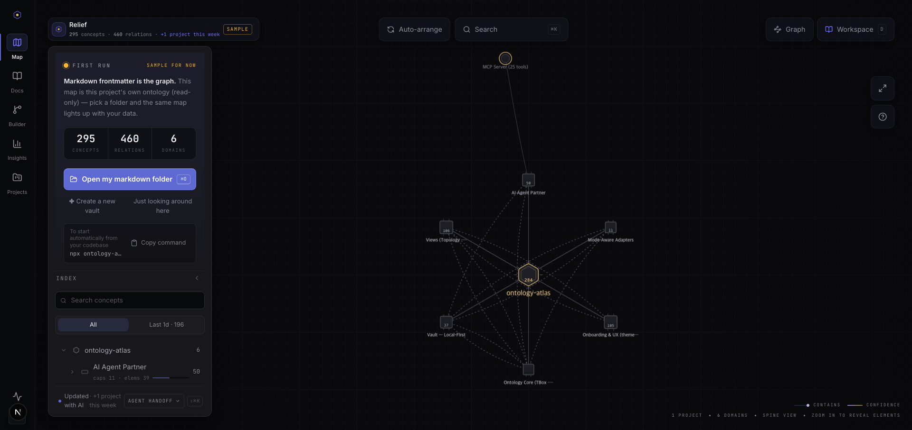
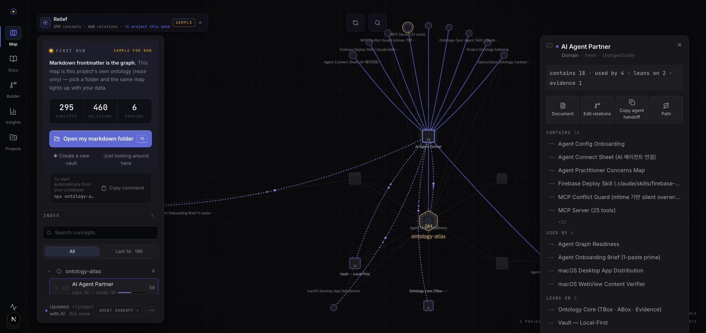
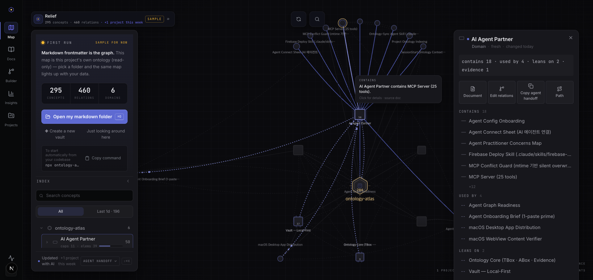
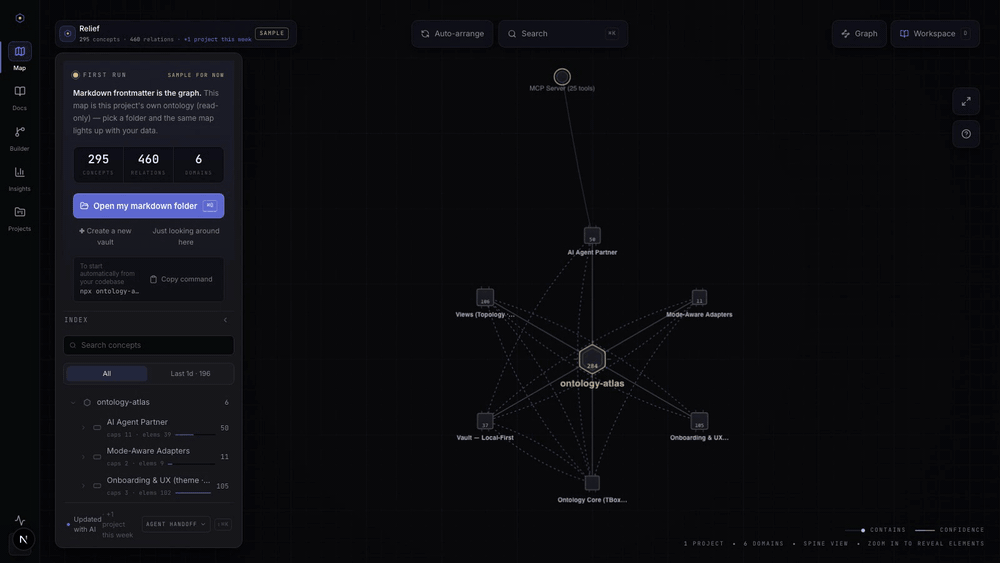
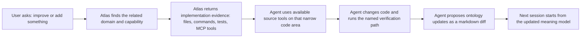
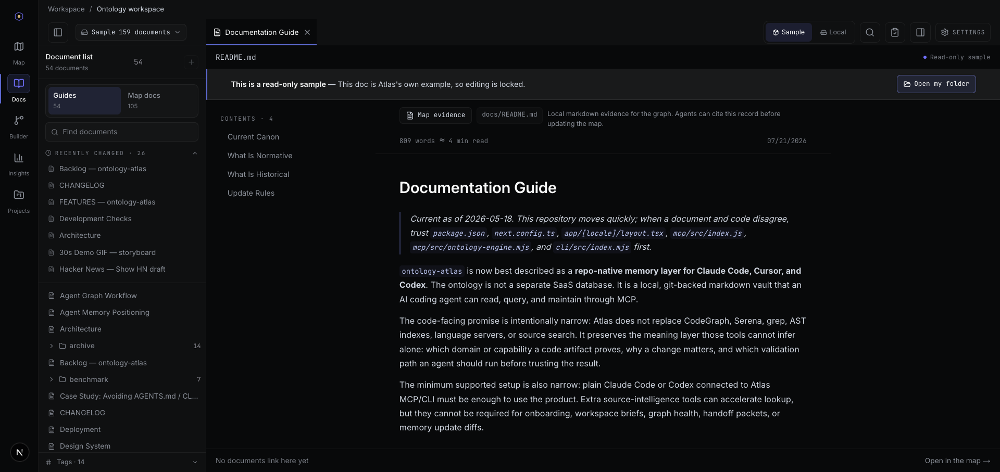
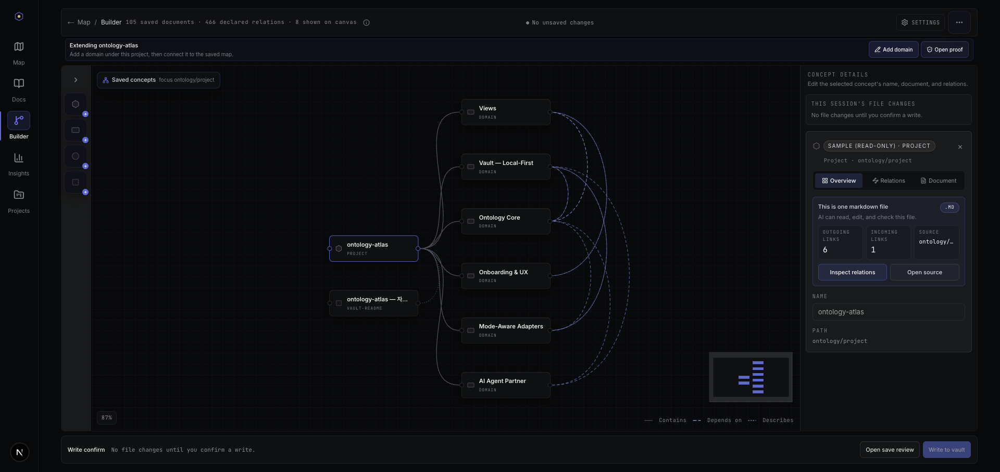
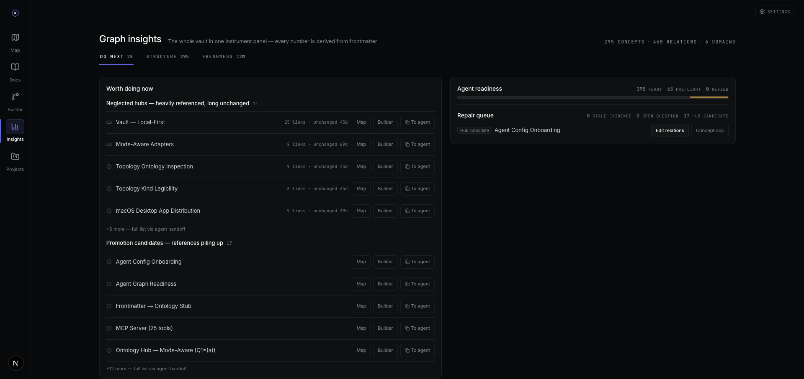
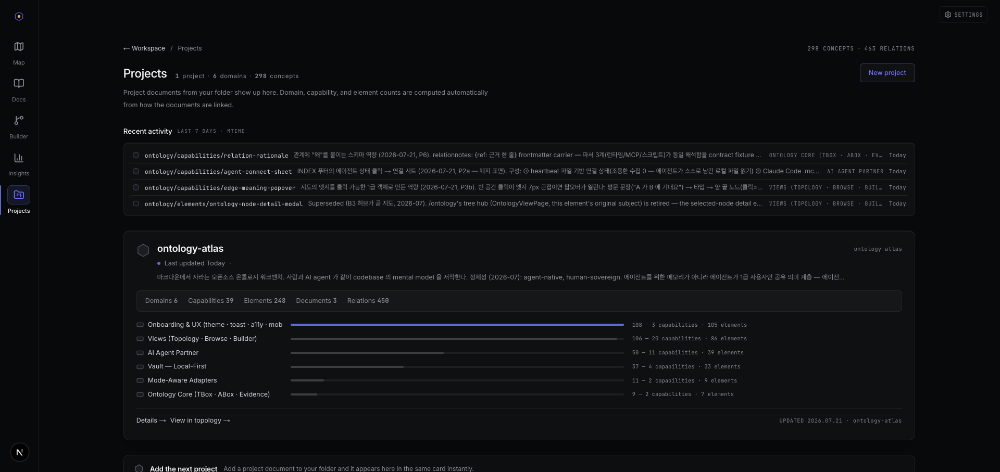

# ontology-atlas

> **A repo-native memory layer for Claude Code, Cursor, and Codex.**
>
> Your AI coding agent forgets your codebase between sessions. Give it a
> local, git-backed mental model it can read, query, and maintain through MCP.
>
> And agents now ship faster than humans can read. The same graph pays down
> that cognitive debt — you keep understanding what is being built, and stay
> the arbiter of what it means.

[](LICENSE)
[](https://nextjs.org)
[](mcp/README.md)

| Open it | Link |
|---|---|
| **App brand** | **Ontology Atlas** (repo, CLI, MCP package, and release assets stay `ontology-atlas`) |
| **Website / demo** | **https://wlsdks.github.io/ontology-atlas/** |
| **GitHub repository** | https://github.com/wlsdks/ontology-atlas |
| **MCP docs** | [`mcp/README.md`](mcp/README.md) |

## See It First

The topology hub — one map from business domains down to implementation
evidence, rendered from plain markdown frontmatter:



Click a node for ego focus plus typed facts (contains / used by / leans on /
evidence), hover an edge for its meaning in plain language:

| Node focus + typed facts | Edge meaning on hover |
|---|---|
|  |  |

30 seconds of the loop — overview, semantic zoom, node focus, edge meaning,
back to overview:



Or skip the install entirely: the **[live demo](https://wlsdks.github.io/ontology-atlas/)**
serves this exact map (read-only sample) — pick your own markdown folder and it
becomes your data.

`ontology-atlas` is a local-first workbench for the shared memory between a
developer and their AI coding agent. The graph is not stored in a hosted
database. It is plain markdown frontmatter inside your repo, so every change is
reviewable as a normal git diff.

**Identity — agent-native, human-sovereign.** This is not "memory for agents"
(machine-only vector stores) and not another wiki (human-only, instantly
stale). It is one meaning layer both audiences read and write: agents are
first-class users — they query it before touching code and keep it fresh
through MCP after real changes — while humans stay the arbiters of meaning,
because every node is plain markdown they can read, approve, and diff. Agents
supply the freshness; humans supply the judgment.

```bash
npx ontology-atlas init ./ontology
ontology-atlas analyze . --vault ./ontology
ontology-atlas workspace-brief ./ontology
ontology-atlas health ./ontology
```

No backend. No login. No cloud account. Your repo is the source of truth —
this map is markdown files on your disk, so it still opens in a text editor,
in Obsidian, in `cat`, even if `ontology-atlas` itself is long gone.

---

## Why It Exists

AI coding agents are useful, but they usually rebuild project context from
scratch every session. They remember the current prompt better than the long
term shape of the codebase: domains, capabilities, dependencies, ownership,
and design decisions. `ontology-atlas` gives agents a durable local memory they
can query before touching code and update after real changes.

If you've been searching for a **codebase map** for AI agents, an **agent
memory** layer, or a **context layer** that survives
[context rot](https://www.producttalk.org/context-rot/) — this is that shape of
tool, purpose-built for the layer above source code: domains, capabilities, and
the elements that prove them, not another symbol index. Andrej Karpathy's 2026
note framed the general pattern as *"Obsidian is the IDE; the LLM is the
programmer; the wiki is the codebase"*
([gist](https://gist.github.com/karpathy/442a6bf555914893e9891c11519de94f));
`ontology-atlas` is that mechanism specialized one layer down — a graph over
your business domains and the code that proves them, not a wiki over your notes.

Atlas does not replace the agent's source tools. CodeGraph, Serena, language
servers, grep, and AST indexes answer structural questions — where a symbol
lives, what calls it. Atlas answers meaning questions: which domain or
capability the code proves, why the change matters, what impact to check, and
which validation path to run before the memory is trusted. None of those code
tools are required for Atlas to deliver its first brief, handoff packet, or
health check — the minimum useful setup is Atlas plus a normal MCP-capable
agent.

See [`docs/CASE-STUDY-AGENTS-MD-DRIFT.md`](docs/CASE-STUDY-AGENTS-MD-DRIFT.md)
for how this repo keeps its own `AGENTS.md`/`CLAUDE.md` from drifting apart, and
extends the same "permanent reference file" idea into the vault for facts that
change faster than instructions do.

## How It Helps A Coding Agent

Atlas helps before, during, and after a coding task. It does not replace the
agent's source-code tools; it gives the agent a smaller, better starting packet
so those tools are aimed at the right problem.



For a request like "improve the topology relation labels," the useful memory is
not every symbol in the graph renderer. The useful memory is a compact handoff:

```text
Relevant capability: topology ontology inspection
Meaning: relation labels must expose typed ontology facts without covering the
graph or hiding the next action.
Implementation evidence:
- src/widgets/topology-map-v2/ui/topology-v2-datasheet.ts
- src/widgets/topology-map-v2/ui/TopologyMapV2.tsx
- scripts/verify-macos-app-launch.mjs
Recommended code lookup:
- Use whatever source tool the agent has (grep, language server, Serena,
  CodeGraph) and inspect only the evidence files named above.
Verification path:
- focused unit test for the topology label contract
- macOS app verification when desktop topology behavior changes
Memory update rule:
- update the ontology only if the change adds, renames, or clarifies a domain,
  capability, element, relation, or verification contract.
```

That packet saves tokens because the agent no longer has to rebuild the whole
product story from source files and chat history. More importantly, it reduces
wrong edits: the agent knows what the code is for, which proof matters, and
when the durable repo memory should change.

## How The Memory Works

In this project, an ontology is the executable meaning model of a product and
the codebase that realizes it: projects, domains, capabilities, elements, and
the relations that explain why they belong together or depend on each other. It
is not a slide-deck taxonomy and not a raw source index. Business concepts
belong when they explain product intent, ownership, capability boundaries, or
impact; source files belong as `element` nodes when they prove a higher-level
`domain` or `capability`. The daily target is the layer that connects those two
worlds.

So Atlas stores meaningful implementation evidence, not every code fact. A
class, route, command, or test earns a node when it helps an agent start with
the right capability, trace impact, or run the right proof. Exhaustive symbol
graphs stay the job of code-intelligence tools.

Every markdown file is one graph node. Frontmatter is the machine-readable
record; the body is the human-readable explanation.

```yaml
---
slug: capabilities/token-issue
kind: capability
title: Token issue
domain: domains/auth
elements:
  - elements/src/auth/token-service
dependencies:
  - capabilities/session-refresh
---

Issues access and refresh tokens for authenticated users.
```

`compile_ontology` reads the vault and produces a deterministic graph artifact:
canonical nodes, canonical edges, aliases, issues, `graphHash`, `maxMtime`, and
optional query indexes. `query_ontology` then answers graph-style questions
over that artifact: neighbors, paths, centrality, communities, impact, blast
radius, project scope, lineage, cycles, health, agent brief, workspace brief,
and maintenance plan. This is not a server-side graph database — it is a
markdown-backed ontology vault with graph database behavior at runtime.

## Quick Start

### 1. Create a local vault

```bash
npx ontology-atlas init ./ontology
```

The command scaffolds a git-friendly markdown vault and writes repo-local MCP
configs for your agent. Claude Code and Cursor can read the generated
`.mcp.json`; Codex can read the generated `.codex/config.toml`. A global
`codex mcp add ...` fallback is printed too.

Already have a vault? Run `ontology-atlas agent-setup ./ontology --write` to
repair only the agent config files without adding starter markdown.

### 2. Draft the first graph

```bash
ontology-atlas analyze . --vault ./ontology      # preview only
ontology-atlas bootstrap . --vault ./ontology    # write accepted candidates
ontology-atlas workspace-brief ./ontology
```

`analyze` is side-effect-free. It proposes domains, capabilities, elements, and
relations from real repo structure. `infer-imports` can add TS/JS import
evidence for dependency edges.

### 3. Use the visual app

The hosted site is the product introduction and demo. Daily visual editing
starts in the installed macOS app: download the signed DMG from the GitHub
Releases page after the release gate publishes it, launch the app, and pick your
local vault folder.

Maintainers can run the desktop shell from source while developing:

```bash
git clone https://github.com/wlsdks/ontology-atlas
cd ontology-atlas
pnpm install
pnpm desktop:dev
```

## Five surfaces, one vault

The app puts five views over the same frontmatter graph, reachable from the
left nav rail. The **Map** is the one shown above; the other four each open the
same `.md` files from a different angle.

| Docs | Builder |
|---|---|
|  |  |
| `/docs` — read and edit any vault document. The frontmatter block renders `kind` / `domain` / `evidence` right on the page (the visible proof that frontmatter *is* the graph), with inline quick-patch, a backlinks strip, and a `⌘K` palette. | `/ontology/edit` — an xyflow ERD canvas for adding nodes and drawing relations visually. Every write lands through a confirm bar into the same vault the map reads. |

| Insights | Projects |
|---|---|
|  |  |
| `/ontology/insights` — turns the same frontmatter into a work queue: neglected hubs, promotion candidates, kind census, relation breakdown, and agent readiness. | `/projects` — every `kind: project` doc as a card, with the domains, capabilities, and evidence counts derived from the containment graph. |

A sixth surface has no screenshot because it is agent-facing: the **MCP server**
(`mcp/`) exposes the same vault to Claude Code, Cursor, and Codex as **31 tools
over stdio JSON-RPC — 18 read + 13 write**. Every surface reads and writes the
same `.md` files; pick the interface that matches the task and the vault stays
the source of truth.

## Agent Workflow

Use the graph before code work:

```bash
ontology-atlas workspace-brief ./ontology
ontology-atlas agent-brief ./ontology
ontology-atlas agent-brief ./ontology --graph-db-pack
ontology-atlas overview ./ontology
ontology-atlas backlinks capabilities/token-issue ./ontology
ontology-atlas blast-radius capabilities/token-issue ./ontology
```

`agent-brief` is the Claude Code/Codex handoff: readiness score, graph
entrypoints, first MCP calls, investigation playbooks, write guardrails,
`relation_check` decision guide, health coverage, and the read-first write
policy. `agent-brief --graph-db-pack` prints a shell-pasteable graph scan pack
for connector-less sessions, with the selected vault path already inserted.
`workspace-brief` is the cheap first-contact dashboard: it shows hotspots,
per-project node counts (`project_scope`), health-check coverage as
`id:status:count`, and growth counts before the agent chooses where to read
deeper.

Then let the agent sync memory after non-trivial changes:

- New code capability: add a `kind: capability` node.
- New concrete file/module worth tracking: add a `kind: element` node.
- New dependency: add a relation.
- Rename or merge: use the safe dry-run commands first, then confirm.

Manual editing is allowed, but the product bet is automation: bootstrap first,
agent-maintained memory after that.

## Web Routes

| Route | Purpose |
|---|---|
| `/` | The topology hub (map + INDEX + datasheet) everywhere — hosted web included. With no vault selected it renders this project's own dogfood sample plus a "first run" starter in the INDEX panel (open my folder / create a new vault); no separate marketing landing |
| `/download` | macOS release download and install guide |
| `/docs` | Local vault picker, markdown editor, command palette |
| `/ontology` | Thin redirect to `/topology?index=expanded` (the old tree/ego hub is retired) |
| `/ontology/edit` | ERD canvas builder |
| `/ontology/insights` | Kind census, hubs, relation breakdown |
| `/topology` | The topology hub — spatial graph view + INDEX concept panel + node datasheet |
| `/projects` | Project list from `kind: project` docs |
| `/project/[slug]` | Project detail (inline edit when a local vault is loaded) |
| `/project/[slug]/edit` | Full project editor |
| `/project/new` | New project form |
| `/project/fallback` | Static-export fallback for unknown project slugs |

The public website's root map opens straight into a read-only dogfood sample
and lets you open and edit your own local vault folder directly in the browser
(File System Access API, no install). `/download` stays the static promo/download
page. Only `/docs`'s own separate local-source *browsing* tab and heavier daily
workflows (recent vaults, agent config writing, packaging) stay in the installed
macOS app.

## Verifiable promises

| Promise | How this repo checks it |
|---|---|
| **No backend** | `pnpm bundle:check` keeps Firebase/server SDK chunks out of the root/topology, download, and local-first app routes. |
| **Static deploy** | `pnpm build` exports to `out/`; the demo is served as static files from GitHub Pages (`wlsdks.github.io/ontology-atlas`). |
| **Static dogfood manifest** | `pnpm docs-vault:check` keeps committed `src/entities/docs-vault/data/manifest.json` and `public/docs-vault/` in sync with `docs/`. |
| **Vault integrity** | `pnpm vault:validate`, `test:vault:validate`, `vault:audit`, and `test:vault:audit` remain explicit local/release-preflight gates. |
| **MCP/CLI contracts** | `pnpm test:cli:args`, `pnpm test:mcp:docs`, `pnpm package:check`, `pnpm test:contracts`, and focused `test:mcp:*` scripts cover the agent surface. |
| **Graph hot paths** | `pnpm perf:graph:check` is part of `pnpm package:check`, so compile/query latency budgets run before release. |
| **Dogfooding** | This repo's own vault has **105 nodes**: capabilities 39, document 3, domains 6, elements 55, project 1, vault-readme 1. |

## Local Development

```bash
pnpm install
pnpm dev                 # http://localhost:3000
pnpm exec tsc --noEmit
pnpm lint
pnpm test:run
pnpm build               # static export → out/
pnpm bundle:check        # local-first chunk-leak guard
```

Vault and dogfood tooling is intentionally local and scriptable:

```bash
pnpm vault:validate              # frontmatter integrity (pass any folder as arg)
pnpm vault:audit                 # dogfood ontology paths match real repo files
pnpm docs-vault:check            # committed docs-vault output freshness
pnpm dogfood:compile             # compile this repo's own vault
pnpm dogfood:health              # graph health gate
pnpm dogfood:agent               # agent-brief over the dogfood vault
```

CI runs `docs-vault:check`, `vault:validate`, `test:vault:validate`,
`vault:audit`, `test:vault:audit`, and `package:check` on every PR. The full
maintainer command matrix lives in
[`docs/DEVELOPMENT-CHECKS.md`](docs/DEVELOPMENT-CHECKS.md).

## Architecture

| Area | Stack |
|---|---|
| App | Next.js 16, React 19, TypeScript 5, App Router, static export, Tauri macOS shell |
| UI | Tailwind CSS 4, Radix primitives, lucide icons |
| Graph | Custom canvas-2D engine (topology-map-v2), Graphology + ForceAtlas2 physics, xyflow (ERD builder) |
| Local-first | Tauri native vault bridge, source-browser File System Access fallback, IndexedDB handle/path persistence |
| Agent interface | `@modelcontextprotocol/sdk`, stdio JSON-RPC |
| Tests | Vitest, Testing Library, jsdom, Playwright, Node test runner |

Feature-Sliced Design import direction is enforced by ESLint:

```text
app -> views -> widgets -> features -> entities -> shared
```

## Documentation

| Document | Use it for |
|---|---|
| [`docs/PRODUCT-DIRECTION.md`](docs/PRODUCT-DIRECTION.md) | Product strategy and launch framing |
| [`docs/AGENT-MEMORY-POSITIONING.md`](docs/AGENT-MEMORY-POSITIONING.md) | Why this is agent memory, not an ontology editor |
| [`docs/CASE-STUDY-AGENTS-MD-DRIFT.md`](docs/CASE-STUDY-AGENTS-MD-DRIFT.md) | How this repo avoids AGENTS.md/CLAUDE.md drift, and why the vault extends the same pattern |
| [`docs/AGENT-GRAPH-WORKFLOW.md`](docs/AGENT-GRAPH-WORKFLOW.md) | CLI-only vs MCP-connected graph workflows, graph DB differences, and verification evidence |
| [`docs/FEATURES.md`](docs/FEATURES.md) | Current CLI, MCP, and web feature inventory |
| [`docs/ARCHITECTURE.md`](docs/ARCHITECTURE.md) | Local-first architecture and data flow |
| [`docs/DEVELOPMENT-CHECKS.md`](docs/DEVELOPMENT-CHECKS.md) | Maintainer verification and release checks |
| [`mcp/README.md`](mcp/README.md) | MCP registration and tool contracts |
| [`cli/README.md`](cli/README.md) | CLI commands and examples |
| [`CONTRIBUTING.md`](CONTRIBUTING.md) | Contribution workflow |

## Contributing

Issues and PRs are welcome. The most useful feedback right now is practical:

- Try `npx ontology-atlas init` in a real repo.
- Connect an AI coding agent through MCP and note where the memory helps or fails.
- Bring a messy markdown vault and report where validation or bootstrap is confusing.

Before contributing, read [`AGENTS.md`](AGENTS.md). It is the canonical guide
for both humans and AI agents working in this repo.

## License

MIT. See [`LICENSE`](LICENSE).

---

## 한국어 가이드

`ontology-atlas`는 Claude Code, Cursor, Codex 같은 AI coding agent가
코드베이스의 장기 맥락을 잃지 않도록 돕는 local-first memory layer입니다.

핵심은 간단합니다.

- markdown frontmatter가 그래프입니다.
- git repo가 진실원입니다.
- 백엔드, 로그인, DB가 없습니다.
- 개발자와 AI agent가 같은 `.md` vault를 읽고 씁니다.

빠른 시작:

```bash
npx ontology-atlas init ./ontology
ontology-atlas analyze . --vault ./ontology
ontology-atlas bootstrap . --vault ./ontology
ontology-atlas workspace-brief ./ontology
ontology-atlas agent-brief ./ontology
ontology-atlas agent-brief ./ontology --graph-db-pack
```

시각 편집은 설치된 macOS 앱에서 시작합니다. 웹 사이트는 제품 소개와 데모
진입점이고, 실제 vault 폴더 열기와 저장은 앱 안에서 이뤄집니다. 개발 중
데스크톱 shell 을 소스에서 실행하려면:

```bash
pnpm install
pnpm desktop:dev
```

제품의 목표는 "온톨로지를 손으로 관리하게 만드는 도구"가 아닙니다. 목표는
repo를 열면 초안을 만들고, agent가 작업 후 mental model 업데이트를 제안하고,
사용자가 diff처럼 승인하고, 다음 agent 작업에서 바로 더 나은 맥락을 느끼는
루프입니다.
