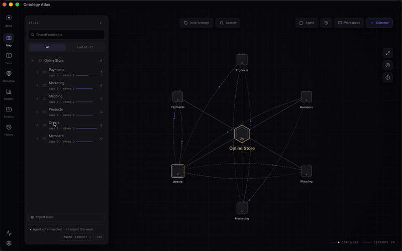

# Ontology Atlas

<p align="center">
  <picture>
    <source media="(prefers-color-scheme: dark)" srcset="public/brand/lockup-dark.svg" />
    
  </picture>
</p>

<p align="center">
  <strong>Your AI coding agent forgets your product between sessions.<br />
  Keep the shared map beside the code — in Markdown you own.</strong>
</p>

<p align="center">
  <a href="https://wlsdks.github.io/ontology-atlas/en/download/"><strong>Download for macOS</strong></a>
  ·
  <a href="https://wlsdks.github.io/ontology-atlas/en/download/"><strong>Windows x64 beta</strong></a>
</p>

<p align="center">
  <sub>Windows is a public, unsigned beta. Microsoft Defender SmartScreen may
  warn about an unknown publisher, and managed work PCs may block it.</sub>
</p>


<p align="center">
  <sub>The installed macOS app reading the example vault in
  <a href="samples/storefront"><code>samples/storefront</code></a> — an online
  store, written as nothing but Markdown files in a folder. The interface moves
  quickly; the live demo and <a href="docs/FEATURES.md">feature inventory</a>
  are the current behavior contract.</sub>
</p>

<p align="center">
  Ontology Atlas turns repository Markdown into a typed graph of the product:
  domains, capabilities, evidence, dependencies, and impact. People judge the
  map and git diffs; AI agents query and maintain the same vault over MCP.
</p>

<p align="center">
  <strong>Each desktop download includes the Atlas app and its MCP server.</strong>
  One button writes your agent's config and proves the connection.
</p>

<p align="center">
  <a href="https://wlsdks.github.io/ontology-atlas/en/topology/">Live demo</a>
  ·
  <a href="https://wlsdks.github.io/ontology-atlas/en/guide/">Guide</a>
  ·
  <a href="#the-journey">The journey</a>
  ·
  <a href="#status--read-this-before-installing">Status</a>
</p>

<p align="center">
  <a href="LICENSE"></a>
  <a href="mcp/README.md"></a>
  <a href="cli/README.md"></a>
  
</p>

---

## In 30 seconds

A folder of Markdown files. Each file's frontmatter declares what it is
(`project`, `domain`, `capability`, `element`, or a linked `document`) and what
it points at. That is the whole database.

Because the kinds and relation types are a small fixed set, the folder is not
just readable — it is **computable**. Atlas compiles it into a graph and answers
questions a note-taking tool cannot: *what breaks if I change this, what is this
capability's blast radius, which paths connect these two things, what is
disconnected, what is stale.*

Your agent asks those questions over MCP. You read the same answers as a map,
and every write the agent makes lands as a line in a Markdown file you can diff.

The exact five-kind discriminator, relation support matrix, direct `is_a` test,
and standards/inference boundary live in the
[vault specification](docs/ONTOLOGY-ATLAS-SPEC.md#2-the-five-authorable-node-kinds-and-reserved-reader-kind).

## Status — read this before installing

*Last updated 2026-08-03.*

- **The current public builds are prerelease software.** Use the stable
  [download page](https://wlsdks.github.io/ontology-atlas/en/download/) for the
  current macOS and Windows x64 assets, checksums, sizes, and signing state.
- **macOS builds are Developer ID signed and Apple-notarized.** The Windows x64
  beta is intentionally unsigned, so SmartScreen may show an unknown-publisher
  warning and managed work PCs may block it. See [Security](SECURITY.md).
- **Installing the desktop app also installs the agent surface.** Both bundles
  carry the compiled MCP server. There is no npm package; unsupported platforms
  can use the browser app or run the CLI and MCP server from a source checkout.
- **Screenshots demonstrate the product journey, not release availability.**
  The download page and [GitHub Releases](https://github.com/wlsdks/ontology-atlas/releases)
  remain the authority for shipped assets.

## The journey

### 1. Open a folder

The app's first question is a folder. Point it at a vault — a directory of
Markdown — and it reads it in place. No import step, no index to build, no
account.

The vault in every screenshot below is
[`samples/storefront`](samples/storefront): an online store described as
products, inventory, orders, payments, delivery, members, marketing and support —
each with the capabilities inside it and the things those capabilities work with.
Run `node cli/src/index.mjs overview samples/storefront` for the current census;
no document here writes the number, because it changes whenever anyone adds a node.

### 2. Connect your agent


This is normally a paragraph of setup instructions. Here it is a button.

- **See what will be written, first.** The sheet shows the exact absolute paths,
  whether each file is created or overwritten, and that the result is plain text
  you can read in a git diff. Nothing is written until you confirm.
- **Then it proves itself.** After writing, the app spawns the bundled MCP
  server and runs a real round trip against your vault. You get a confirmation
  naming the tool count and a node it actually read — or the failure reason. No
  fake progress bar.
- **Nothing stays running.** The server speaks stdio; your agent starts it when
  it needs it and it exits afterwards. No port, no daemon, no traffic leaving
  the machine.

Claude Code, Cursor, VS Code and Codex each get a button. Any other MCP client
can copy the snippet from **Advanced · detailed checks**.
The bundled server advertises its current read/write surface through
`tools/list`; the [agent guide](mcp/README.md) documents every tool and its
contract, and `mcp-verify` proves the live inventory.

### 3. Read the map


Selecting a node dims everything unrelated and opens its record. The same fact
serves two readers at once: a visual hierarchy for a person, and a typed
relation list — `contains`, `used by`, `leans on` — for an agent, with **Copy
handoff** right there, because the next reader is often not a human.

The map can answer a simpler question before you inspect any one node: **what
changed this week?** Turn on **Recent** and Atlas keeps documents changed inside
the selected time window crisp while the rest of the map recedes. The INDEX
narrows to those nodes but preserves their project and domain parents, so a
refund change still reads in the context of Customer Support and Payments. In a
local vault, the signal comes from the Markdown files' modification times on
your disk — not inferred activity or a hosted service.


_Installed-app capture from a local, capture-only copy of `samples/storefront`.
Seven documents were marked as changed in this 7-day fixture — **7 is not a
product limit**. Cyan dashed rings mark recent nodes; the INDEX retains their
project/domain parent chain so the change remains readable in context._

**Footprints** mark the concepts you opened, numbered in the order you walked
them, so a long session leaves a path you can retrace instead of a map you have
to re-derive.


Shape, size, spacing and opacity are yours, and the strip above the controls is
not a picture of the feature — it is **the same renderer the map uses**, drawing
your current values as you change them. The map background is a separate choice
of three (dots, a proximity constellation, or layered depth dots), previewed the
same way from the real canvas tokens.

That preview is why Settings can be a plain centred dialog: you do not need to
see the map behind it, because the thing you are adjusting is drawn right there.

<p align="center">
  
</p>

<p align="center">
  <sub>Recorded from the app window. Picking a domain in the INDEX expands it,
  moves the camera, and opens its record.
  (<a href="docs/assets/readme/atlas-map-focus.webm">webm</a>)</sub>
</p>

### 4. Complete what a node means


Shape relations in Workshop: the four relation types are nailed to fixed compass
bearings — what this node **is a kind of** (up), what it **holds** (down), what
it **leans on** (right), what it is **similar to** (left). Missing relations are
drawn as dashed empty sockets, and filling one writes a real frontmatter
relation. The `builder_context` an agent hands you (a persisted Workshop focus
URL) survives a reload, so it can point you at a node and you land on it.

Nothing lands until you confirm. That boundary is visible on purpose.

### 5. Review the change, then record it


Whatever wrote — you, the Workshop, the CLI, or an agent over MCP — lands here
first as a diff you read before it becomes history. The change above was written
by a command, not by hand, and the command said what it would do to the graph
before touching a file:

```console
$ node $ATLAS/cli/src/index.mjs relate capabilities/return-request capabilities/refund dependencies ./storefront --dry-run

capabilities/return-request --dependencies--> capabilities/refund
  verdict matches_existing_schema · exists no
  schema  capability --dependencies--> capability
  pattern count 51 · resolved 51 · external 0 · unresolved 0
  recommendation safe_to_add · No exact or inverse edge found; capability --dependencies--> capability is an existing schema pattern.

nearby schema patterns
  3 · capability --dependencies--> capability (count 51)
  2 · capability --relates--> capability (count 12)
  1 · capability --elements--> element (count 54)
  1 · capability --domain--> domain (count 49)
  1 · domain --capabilities--> capability (count 49)

dry-run would write dependencies on capabilities/return-request → capabilities/refund (no file changed)
```

An edge that would introduce a shape the vault has never used comes back as
`new_schema_pattern · review_new_schema` instead, so a drifting agent is visible
before it writes rather than after.

Git is scoped to the vault. Files outside the folder you picked are never
touched, and the screen says so.

### 6. Keep it healthy


Insights turns graph health into a work queue: what is disconnected, what is
stale, what is missing evidence, which repair to make next. **Agent readiness**
splits every relation into what an agent can trust immediately, what needs a
quick check, and what a person should decide.

**What the agent did** reads `.ontology-atlas/activity.jsonl` from inside your
vault — plain text, in the folder, part of the same diff. The example vault has
no agent history yet, so that panel is empty here; connect an agent and its
writes show up in the same place, from the same file. Nothing is collected
anywhere else to produce it.

### 7. See the shape of the whole project


Nothing on this screen is maintained by hand. Frontmatter has no `project:` key
— the runtime walks the containment graph from each `project` root and derives
coverage from how the documents link to each other.

## What your agent gets

**Typed MCP tools** over stdio JSON-RPC serve Claude Code, Cursor, Codex, and
any MCP client. The running server advertises the exact current read/write
inventory through `tools/list`; the value is that the answers are typed, so an
agent can act on them.

Ask *what breaks if I change this?* and Atlas follows only approved dependency
declarations. It does not turn folder structure into causal confidence:

```console
$ node $ATLAS/cli/src/index.mjs blast-radius capabilities/mcp-server docs/ontology --depth 2
capabilities/mcp-server — blast radius (depth 2, incoming)
  risk unknown · 1 노드 · 1 관계 · 0 cross-domain

impact certainty unknown · declared 1 · rationale 0 · source-backed 0
Counts below follow declared depends_on only. Use reachability/subgraph for structure;
do not read unknown as low risk.
```

- **Focused context, not a repository dump.** Briefs give an agent the project,
  domain, evidence, impact boundary, first tools, and stop conditions it needs.
- **Graph questions with typed answers.** Paths and reachability explain
  structure; blast radius follows only declared dependencies and reports
  qualification/completeness honestly. No graph database or hosted memory is involved.
- **Writes that survive review.** Analysis is side-effect free by default;
  destructive operations dry-run first, renames repair backlinks, and mtime
  guards protect concurrent human edits.
- **The same authority without MCP.** The CLI exposes the same local folder to
  sessions that cannot attach a connector.

Connect and use it through the [MCP guide](mcp/README.md), or start from the
[CLI reference](cli/README.md).

## Why not just use a notes tool

Local Markdown, git diffs, and MCP are table stakes. Notes tools such as
[Basic Memory](https://github.com/basicmachines-co/basic-memory) already provide
them; hosted graph-memory products provide typed traversal in a database. Atlas
combines a human-readable local vault with a product ontology and a workbench
where people and agents judge the same facts.

| | Notes with MCP | Hosted graph memory | Ontology Atlas |
|---|---|---|---|
| Store | Markdown you own | Vendor database | Markdown you own |
| Structure | Freeform notes and links | Vendor-defined types | Project → domain → capability → element, documents, typed relations |
| Graph questions | Note traversal | Graph engine | Blast radius, reachability, cycles, paths, centrality, health |
| Evidence from code | Hand-authored | Corpus ingestion | Bounded read-only proposals; nothing lands until approval |
| Human surface | Notes app | Vendor console | Local map, Workshop, History, and Insights |

If you only need an agent to remember conversations, a notes tool is lighter.
Atlas is for modeling the product your code implements. The argument and its
sources live in [Foundations](docs/FOUNDATIONS.md).

## A vault is just files

One Markdown file is one node. Frontmatter is the machine-readable record; the
body is the explanation a person judges.

```yaml
---
uid: 71890f3e-7b5d-4c0a-8f14-123456789abc
slug: capabilities/token-issue
kind: capability
title: Token issue
domain: domains/auth
path: src/auth/token-service.ts          # a path — code evidence
elements:
  - elements/jwt-signer                  # a slug — an implementation-role node
dependencies:
  - capabilities/session-refresh  # a slug — another node
---

Issues access and refresh tokens for authenticated users.
```

That distinction is the one thing worth learning up front: **a path points at
code, a slug points at a node.** Mixing them is the most common first mistake,
and `node $ATLAS/cli/src/index.mjs validate` reports it as a dangling reference.

The usual business-to-code reading spine is deliberately small:

```text
project
└── domain
    └── capability
        └── element
```

`document` is the fifth authorable kind and can describe concepts anywhere on
that spine. Typed relations add dependency, association, containment, and
descriptive meaning; implementation evidence lives in node paths and bodies,
not in an invented `evidence` relation.
The goal is not to index every symbol — a source artifact earns a node when it
helps a person or an agent understand a capability, trace impact, or run the
right proof. Curated, not exhaustive.

## Ontology quality contract

- **There is no vault-wide or project-wide node cap.** Node count is an
  observation, never a pass condition.
- **Direct fan-out is a review signal, not a limit.** A wide hub is correct when
  its children resolve, name distinct roles, and carry clear provenance.
- **Bridge nodes must earn their layer.** They name one shared behavior, differ
  from their siblings, and actually reparent the children they group. Count
  alone never justifies a bridge.
- **Analyzer bounds are evidence-packet bounds, not graph bounds.** Each language
  adapter keeps one proposal readable; it does not limit ontology size or a
  node's number of relations.
- **`uid` and `slug` have different jobs.** UID is permanent identity; slug is
  the readable current address. Source locations belong in `path:` evidence.
- **External field trials stay isolated.** Generalized measurements may improve
  Atlas, but a trial repository's ontology is never merged into the product's
  dogfood graph.

The authority and verification path for each rule lives in the
[Ontology Quality Authority Map](docs/ONTOLOGY-QUALITY.md). The practical node
test is [What becomes a node?](docs/guide/what-becomes-a-node.md).

Atlas deliberately sits *above* code intelligence. Grep, language servers, and
AST indexes answer where a symbol lives and what calls it. Atlas answers why
that artifact matters, which capability it serves, and what to verify before
changing it. It replaces none of them — it tells the agent which structural
question is worth asking.

## How relations are stored

There is no relation database or sync step. The declaring Markdown file owns one
frontmatter line, and Atlas derives the edge and its backlink when it reads the
vault:

```yaml
---
slug: capabilities/vault-live-updates
kind: capability
domain: domains/local-vault-management
dependencies:
  - capabilities/topology-canvas-render   # directed: this depends on that
relates:
  - capabilities/mcp-conflict-guard       # symmetric: read these together
---
```

Containment is the structural layer, not a ceiling; typed meaning relations can
cross domains and branches. `dependencies` is directed, while `relates` is
symmetric, so the map never turns similarity into causality. See the
[relations guide](docs/guide/relations.md) for every relation type, direction,
writing rule, and map behavior, and the [vault specification](docs/ONTOLOGY-ATLAS-SPEC.md)
for the complete frontmatter contract.

## Product destinations, one vault

Map, Docs, Workshop, Insights, Projects, History, MCP, and CLI all read the same
Markdown folder. The installed app is the full workbench; the hosted web app is
the no-install gateway and a second-best workbench where native bridges are not
available. MCP and CLI skip the screens and operate on the same files directly.

See the [feature inventory](docs/FEATURES.md) for every current surface and the
[architecture guide](docs/ARCHITECTURE.md) for the desktop/web boundary. The
[live demo](https://wlsdks.github.io/ontology-atlas/en/topology/) opens Atlas's
own dogfood vault in [`docs/ontology/`](docs/ontology/); run
`node cli/src/index.mjs overview docs/ontology` when you need its current census.

## Local-first, by construction

- **Your disk is the database.** Frontmatter is the graph; confirmed writes go
  back to the folder you picked. There is no other store.
- **Git is the history.** Diffs stay human-readable; history and snapshots are
  scoped to the vault.
- **No backend, no account, no telemetry.** The web app is a static export.
  Nothing is transmitted anywhere unless you explicitly ask for it.
- **Two ways in, one folder.** The hosted web app can open a local folder through the File System Access API. The desktop app uses a Tauri bridge to your selected folder and keeps the same vault open as a workspace.
- **The Tauri macOS shell is a shell, not a silo.** MCP and CLI still read the
  selected folder directly; the app does not move it into a private store.
- **The bundled MCP server is a file, not a service.** It sits inside the app
  bundle and keeps working when the app is closed, because your agent launches
  it itself.

## Running from source

Requires Node.js 24 and pnpm. This is the source-checkout fallback for
environments without a supported installed app.

```bash
# Keep the tool outside the project you are describing.
git clone https://github.com/wlsdks/ontology-atlas ~/tools/ontology-atlas
cd ~/tools/ontology-atlas && pnpm install
pnpm --dir mcp install   # mcp/ carries its own lockfile — the line above skips it
ATLAS=~/tools/ontology-atlas/cli/src/index.mjs

cd /path/to/your/repo

# Scaffold a vault in your repo and generate its agent config.
node $ATLAS init ./ontology

# Analyze without writing; --apply is the explicit write boundary.
node $ATLAS index . --vault ./ontology
node $ATLAS index . --vault ./ontology --apply

# Give a person or coding agent a compact starting packet.
node $ATLAS agent-brief ./ontology
```

Both install commands are required: `mcp/` owns a separate lockfile, so rerun
`pnpm --dir mcp install` after each pull. Restart your agent in your repository,
then use `node $ATLAS mcp-verify ./ontology` to prove the real server process and
vault contract.

> Run `init` in your own repository, not inside the Atlas clone. This clone
> already ships a committed `.mcp.json` pointing at Atlas's own vault, and
> `init` refuses to overwrite it — your agent would silently answer from
> *our* ontology instead of yours.

Continue with the [CLI reference](cli/README.md), [MCP setup](mcp/README.md), or
run the desktop shell with `pnpm desktop:dev`.

## Verifying a change

Start with the repository-aware gate selector:

```bash
pnpm checks:changed
```

It chooses the focused checks for the files you changed and is also the last
command to run before a pull request. The [contributor guide](CONTRIBUTING.md)
explains the workflow; [development checks](docs/DEVELOPMENT-CHECKS.md) owns the
full gate reference, and [map testability](docs/MAP-TESTABILITY.md) owns canvas
performance, readability, contrast, and browser instrumentation.

### Refreshing the agent runtime catalog

The list of coding agents the desktop app can launch is a committed snapshot of
the [ACP registry](https://agentclientprotocol.com/get-started/registry), not a
runtime fetch — the app stays usable offline and never opens a connection the
person did not ask for.

```bash
pnpm acp:registry          # refresh src-tauri/src/acp-registry.json
pnpm acp:registry:check    # fail if the committed snapshot is stale
```

Refresh it deliberately and read the diff: a new entry means the app will offer
to launch a program it has never run here. Only the runtimes this repository has
actually measured are marked `verified`.

## Documentation

- **Use the product:** [hosted guide](https://wlsdks.github.io/ontology-atlas/en/guide/) ·
  [features](docs/FEATURES.md) · [MCP setup](mcp/README.md) ·
  [CLI reference](cli/README.md)
- **Model a vault:** [what becomes a node?](docs/guide/what-becomes-a-node.md) ·
  [relations](docs/guide/relations.md) · [v2 specification](docs/ONTOLOGY-ATLAS-SPEC.md) ·
  [quality authority map](docs/ONTOLOGY-QUALITY.md)
- **Understand and contribute:** [product direction](docs/PRODUCT-DIRECTION.md) ·
  [foundations](docs/FOUNDATIONS.md) · [architecture](docs/ARCHITECTURE.md) ·
  [security](SECURITY.md) · [decisions](docs/DECISIONS.md)

## Contributing

Issues and pull requests are welcome. The most valuable reports today come from
pointing Atlas at a real repository and showing where the proposed meaning, the
agent handoff, or the validation falls short.

Read [CONTRIBUTING.md](CONTRIBUTING.md) first — external pull requests come from
forks, and that is a security boundary rather than a formality. If you are
working inside this repository, [AGENTS.md](AGENTS.md) is the canonical guide for
people and AI agents alike.

## License

[MIT](LICENSE)
