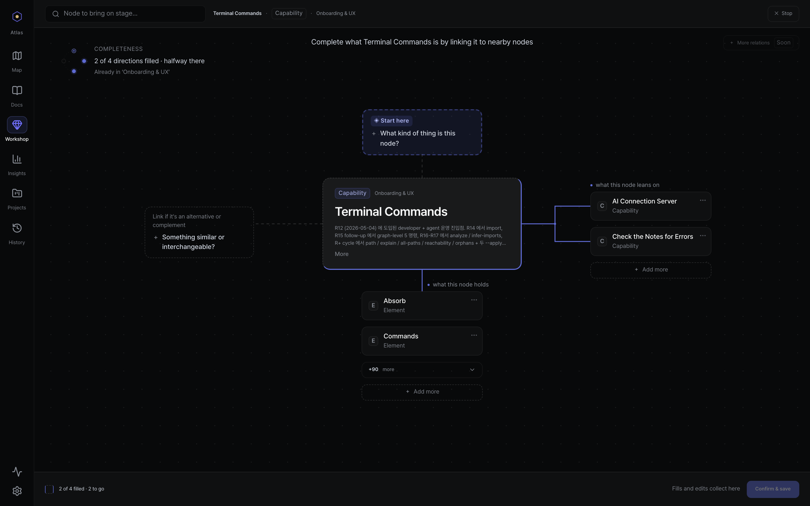

# Ontology Atlas

<p align="center">
  
</p>

<p align="center">
  <strong>Your AI coding agent forgets your codebase between sessions.<br />
  Give it a memory you can actually read.</strong>
</p>

<p align="center">
  Ontology Atlas turns the Markdown in your repository into a typed, queryable
  model of your product — domains, capabilities, implementation evidence,
  dependencies, impact. Agents read and maintain it over MCP; you judge every
  change as a plain git diff. A CLI, an MCP server, and a local workbench.
</p>

<p align="center">
  <a href="https://wlsdks.github.io/ontology-atlas/"><strong>Live demo</strong></a>
  ·
  <a href="#quick-start-from-source"><strong>Quick start</strong></a>
  ·
  <a href="mcp/README.md"><strong>MCP setup</strong></a>
  ·
  <a href="cli/README.md"><strong>CLI reference</strong></a>
  ·
  <a href="#status--read-this-before-installing"><strong>Status</strong></a>
</p>

<p align="center">
  <a href="LICENSE"></a>
  <a href="mcp/README.md"></a>
  <a href="cli/README.md"></a>
  
</p>


<p align="center">
  <sub>This repository describing itself — 97 Markdown files in <code>docs/ontology/</code>, plus the
  source paths they cite as evidence. Every one of the 97 opens as a file you can edit and diff.</sub>
</p>

---

## Why this exists

A coding agent reconstructs product context from source every session — domain
boundaries, capability intent, what counts as evidence, what a change affects —
and loses all of it before the next one. Documentation has the opposite failure:
people can read it, but it drifts from the code and gives an agent nothing typed
to query.

Existing tools each fix one side. Agent-memory services keep graphs and vector
stores a human cannot audit. Wikis keep prose an agent cannot traverse. Ontology
Atlas is one layer that has to pass both tests at once:

| Without a shared layer | With Ontology Atlas |
|---|---|
| Every agent session rebuilds product context from scratch | The agent starts from the relevant domain, capability, and evidence |
| Architecture knowledge scatters across prose and chat | Markdown frontmatter forms one typed, traversable graph |
| Impact and verification are rediscovered after the edit | The handoff names dependencies, blast radius, and proof paths |
| Machine memory is impossible for people to judge | Every update is a normal file and a normal git diff |

That is the identity in two words: **agent-native, human-sovereign.** Agents are
first-class readers and maintainers; people stay the arbiters of meaning, because
the source of truth is Markdown on their own disk, under git.

Atlas deliberately sits *above* code intelligence. Grep, language servers, and
AST indexes answer where a symbol lives and what calls it. Atlas answers why that
artifact matters, which capability it serves, and what to verify before changing
it. It replaces none of them — it tells the agent which structural question is
worth asking. The theory and prior art behind that position are cited in
[docs/FOUNDATIONS.md](docs/FOUNDATIONS.md).

## Status — read this before installing

*Last updated 2026-07-27. Refreshed at every release.*

This project has not shipped its first public release yet. Plainly:

- **No public release exists yet.** The first build, `v1.0.0-rc.1`, is in the
  pipeline behind a manual approval gate. When it ships it appears on
  [GitHub Releases](https://github.com/wlsdks/ontology-atlas/releases).
- **The release workflow signs with a Developer ID certificate and notarizes
  with Apple**; `v1.0.0-rc.1` is the first build to exercise that path. Update
  packages are signed with a separate project key that the app verifies before
  replacing anything — see [SECURITY.md](SECURITY.md). The in-app one-button
  updater ships with the first release; its real update path gets its first
  end-to-end exercise only once a second release exists.
- **The npm packages are not published yet** — `ontology-atlas` and
  `ontology-atlas-mcp` currently return `E404`. Everything below runs from a
  source checkout.
- **The desktop app is macOS-only** (Windows in preparation). The CLI, the MCP
  server, and the browser app run anywhere Node 24 does.
- **What works today:** the [live demo](https://wlsdks.github.io/ontology-atlas/)
  (this repository's own ontology, read-only, no install) and the full CLI + MCP
  + workbench from a source checkout.

## Quick start (from source)

Requires Node.js 24 and pnpm.

```bash
# Keep the tool outside the project you are describing.
git clone https://github.com/wlsdks/ontology-atlas ~/tools/ontology-atlas
cd ~/tools/ontology-atlas && pnpm install
ATLAS=~/tools/ontology-atlas/cli/src/index.mjs

cd /path/to/your/repo

# 1. Scaffold a vault in *your* repo. Also writes .mcp.json (Claude Code /
#    Cursor) and .codex/config.toml (Codex), wired to this vault.
node $ATLAS init ./ontology

# 2. Analyze the repository. The default run is side-effect free;
#    --apply is the explicit write boundary.
node $ATLAS index . --vault ./ontology
node $ATLAS index . --vault ./ontology --apply

# 3. The compact packet a person or coding agent starts from.
node $ATLAS agent-brief ./ontology
```

Restart your agent in your repository and the 32 MCP tools register from the
generated config. `node $ATLAS mcp-verify ./ontology` proves the actual server
process and its contracts at any time.

> Run `init` in your own repository, not inside the Atlas clone. This clone
> already ships a committed `.mcp.json` pointing at Atlas's own vault, and
> `init` refuses to overwrite it — your agent would silently answer from
> *our* ontology instead of yours.

No backend. No login. No telemetry. The vault is a folder of `.md` files — open
it in a text editor, in Obsidian, in the app, or through an MCP-connected agent,
and it stays the same files.

## What your agent gets

**32 MCP tools — 19 read, 13 write** — over stdio JSON-RPC, for Claude Code,
Cursor, Codex, and any MCP client. The point is not the tool count; it is that
the answers are *typed*, so an agent can act on them.

Here is a real question — *what breaks if I change this?* — answered against this
repository's own vault:

```console
$ node cli/src/index.mjs blast-radius ai-agent-partner docs/ontology --depth 2

ai-agent-partner — blast radius (depth 2, incoming)
  risk high · 32 노드 · 69 관계 · 16 cross-domain

affected by kind
  capability     17
  element        7
  document       3
  domain         3
  project        1
  vault-readme   1

affected by domain
  domains/ai-agent-partner                 13
  domains/views                            6
  domains/onboarding-ux                    4
  domains/vault-local-first                4

affected nodes (distance 별)
  d1 capabilities/agent-config-onboarding — Agent Config Onboarding
  d1 capabilities/agent-connect-sheet — Agent Connect Sheet (AI 에이전트 연결)
  d1 capabilities/mcp-server — MCP Server (32 tools)
  ...
```

*Verbatim, against this repository's own vault. Some labels are Korean because
the maintainer is — the vault's language is whatever you write in it, and the
CLI's own labels are on the list to translate.*

No graph database is involved. `compile_ontology` builds the graph
deterministically from frontmatter, and `query_ontology` runs paths,
reachability, blast radius, cycles, centrality, similarity, and health over it.

Three properties make this usable by an agent rather than merely printable:

- **Focused starting context, not a repo dump.** `agent_brief` returns reading
  order, graph entry points, first tool calls, investigation playbooks, write
  guardrails, and stop conditions. `workspace-brief` is the cheap first-contact dashboard:
  per-project node counts (`project_scope`), health-check coverage as
  `id:status:count`, and growth counts before the agent chooses where to read
  deeper — so the first call is a summary, not a download.
- **Writes that survive review.** Analysis tools are side-effect free by default;
  destructive changes return a complete dry-run before confirmation; renames and
  merges redirect backlinks atomically; optimistic `mtime` guards stop an agent
  from overwriting a concurrent human edit.
- **The same authority without a connector.** The CLI's 52 commands cover the
  same ground for sessions with no MCP client attached.

Full contracts: [MCP guide](mcp/README.md) · [CLI reference](cli/README.md).

## Six work surfaces, one vault

Every surface reads and writes the
same `.md` files — the interface changes, the authority does not. The MCP server
is listed here on purpose: to this product an agent is a surface, not an add-on.

| Surface | What it is for |
|---|---|
| **Map** (`/`, `/topology`) | Overview-first topology, semantic zoom, typed relation inspection, focus and path modes, impact, agent handoff |
| **Docs** (`/docs`) | Read and edit the Markdown source, frontmatter evidence, backlinks, search |
| **Workshop** (`/ontology/studio`) | Complete one node's meaning against four fixed relation bearings, behind a visible write-confirm boundary |
| **Insights** (`/ontology/insights`) | The maintenance board — what to do next, composition, connections, boundaries, freshness |
| **Projects** (`/projects`) | Project cards and coverage derived from containment |
| **Git** (`/git`) | Vault-scoped changes, history, and local snapshots — nothing outside the vault is ever committed |
| **MCP server** (32 tools, 19 read + 13 write) | The agent's surface — the same graph over stdio JSON-RPC, with dry-runs and write guardrails |

The [live demo](https://wlsdks.github.io/ontology-atlas/) opens with this
repository's own vault. Point it at your own Markdown folder in the browser and
the same map switches to your data.

| | |
|---|---|
| **Dogfooding** | This product describes itself: **97 nodes** — capabilities 38, elements 48, domains 6, document 3, project 1, vault-readme 1 — living in [`docs/ontology/`](docs/ontology/). The map also draws the source paths those files cite as evidence, which is why the app's census reads higher than the file count. |

A test fails if those counts drift from the folder. Numbers in this README are
checked against the vault, not maintained by hand.


Selecting a node dims everything unrelated and opens its record. The same fact is
a visual hierarchy for a person and a typed relation list for an agent —
`contains`, `used by`, `leans on` — with **Copy handoff** right there, because the
next reader is often not a human.



Shape relations in Workshop: a node's missing relations are drawn as empty
sockets on four fixed bearings, and filling one writes a real frontmatter
relation. Nothing lands until you confirm — the boundary is visible, on purpose.
The `builder_context` (persisted Workshop focus URL) survives a reload, so an
agent can hand you a node and you land on it. *(The node body here is Korean
because this vault is ours; yours reads in whatever language you write.)*


Insights turns graph health into a work queue: what is disconnected, what is
stale, what is missing evidence, and which repair to make next.

## A vault is just files

One Markdown file is one node. Frontmatter is the machine-readable record; the
body is the explanation a person judges.

```yaml
---
slug: capabilities/token-issue
kind: capability
title: Token issue
domain: domains/auth
elements:
  - src/auth/token-service.ts     # a path — code evidence
depends_on:
  - capabilities/session-refresh  # a slug — another node
---

Issues access and refresh tokens for authenticated users.
```

That distinction is the one thing worth learning up front: **a path points at
code, a slug points at a node.** Mixing them is the most common first mistake,
and `ontology-atlas validate` reports it as a dangling reference.

The hierarchy is deliberately small:

```text
project
└── domain
    └── capability
        └── element
```

Typed relations add dependency, evidence, containment, and descriptive meaning.
The goal is not to index every symbol — a source artifact earns a node when it
helps a person or an agent understand a capability, trace impact, or run the
right proof. Curated, not exhaustive.

## Local-first, by construction

- **Your disk is the database.** Frontmatter is the graph; confirmed writes go
  back to the folder you picked. There is no other store.
- **Git is the history.** Diffs stay human-readable; history and snapshots are
  scoped to the vault.
- **No backend, no account, no telemetry.** The web app is a static export.
  Nothing is transmitted anywhere unless you explicitly ask for it.
- **Two ways in, one folder.** The hosted web app can open a local folder
  through the File System Access API, so the live demo works on your own files
  without installing anything. The macOS app uses a Tauri bridge to your
  selected folder instead, which lifts the browser's limits and lets the same
  vault stay open as a real desktop workspace.
- **The Tauri macOS shell is a shell, not a silo.** It is granted a deliberately
  short permission list — broad filesystem, shell, HTTP, and opener grants are
  refused by a build gate — and the MCP server and CLI read that same directory
  directly.

Maintainers can run the desktop shell from source today:

```bash
pnpm install && pnpm desktop:dev
```

## Verifying a change

The gates a contributor runs before opening a pull request:

```bash
pnpm exec tsc --noEmit    # types
pnpm lint                 # 0 errors (warnings are tracked, not zero)
pnpm test:run             # unit + contract suites
pnpm docs-vault:check     # committed app sample matches docs/
pnpm package:check        # MCP/CLI/docs/performance contracts
pnpm vault:validate       # frontmatter integrity
```

`pnpm checks:changed` picks the smallest sufficient subset for what you touched;
[CONTRIBUTING.md](CONTRIBUTING.md) explains when to escalate to the full set.

## Documentation

| Document | Start here when you need… |
|---|---|
| [Product direction](docs/PRODUCT-DIRECTION.md) | Mission, audience, and boundaries |
| [Foundations](docs/FOUNDATIONS.md) | The cited theory and prior art behind the positioning |
| [Features](docs/FEATURES.md) | The complete current inventory — app, MCP, CLI, desktop |
| [Architecture](docs/ARCHITECTURE.md) | Local-first data flow and runtime contracts |
| [MCP guide](mcp/README.md) | Registration and all 32 tool contracts |
| [CLI reference](cli/README.md) | All 52 commands with examples |
| [Decisions](docs/DECISIONS.md) | What was decided, what lost the argument, and what would overturn it |
| [Security](SECURITY.md) | Threat model, release-credential protection, reporting |

## Contributing

Issues and pull requests are welcome. The most valuable reports today come from
pointing Atlas at a real repository and showing where the proposed meaning, the
agent handoff, or the validation falls short.

Read [CONTRIBUTING.md](CONTRIBUTING.md) first — external pull requests come from
forks, and that is a security boundary rather than a formality. If you are
working inside this repository, [AGENTS.md](AGENTS.md) is the canonical guide for
people and AI agents alike.

## License

[MIT](LICENSE)

---

## 한국어

Ontology Atlas 는 사람과 AI 에이전트가 함께 키우는, 저장소 안의 의미 계층입니다.
Markdown frontmatter 가 곧 그래프이고, 에이전트는 MCP 32개 도구로 읽고 쓰며,
사람은 평범한 git diff 로 판단합니다. 백엔드·로그인·텔레메트리가 없고 vault
폴더가 유일한 저장소입니다.

- **아직 공개 릴리스가 없습니다.** 첫 빌드(`v1.0.0-rc.1`)가 승인 게이트 뒤에
  있고 npm 패키지도 미발행이라, 위 Quick start 는 소스 체크아웃 기준입니다.
- [라이브 데모](https://wlsdks.github.io/ontology-atlas/)에서 이 저장소 자신의
  온톨로지(97 노드)를 설치 없이 볼 수 있습니다.
- 연결은 [MCP 가이드](mcp/README.md), 전체 명령은 [CLI 가이드](cli/README.md),
  기여는 [CONTRIBUTING.md](CONTRIBUTING.md) — 한국어 이슈와 PR 을 환영합니다.
