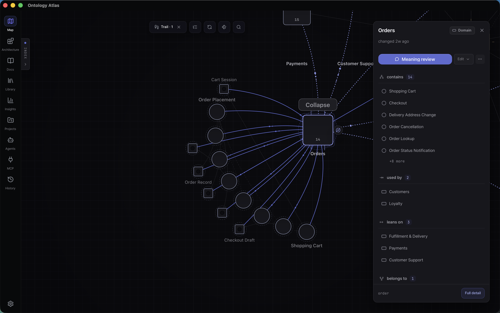
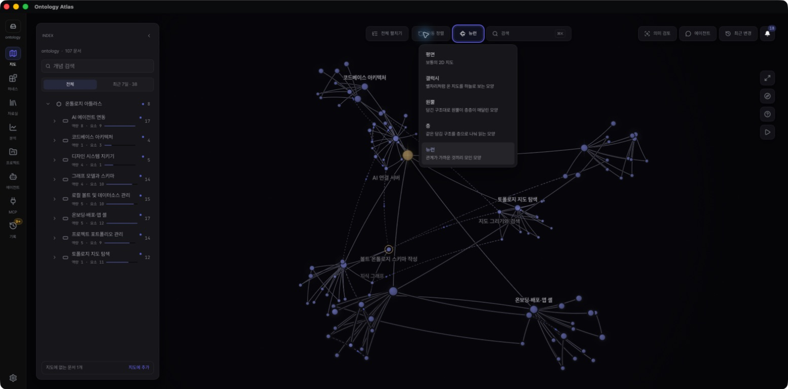
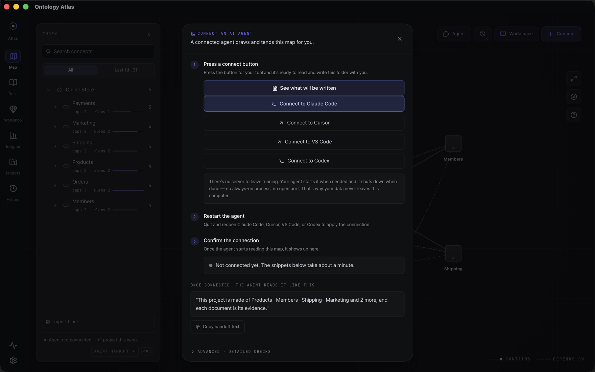
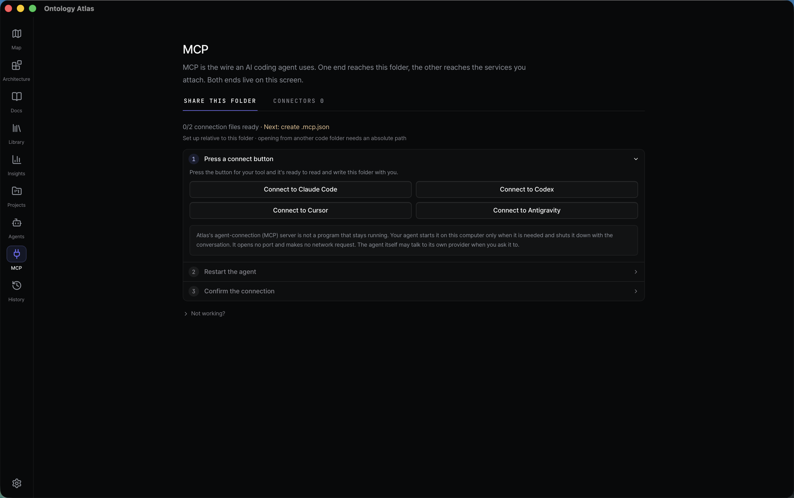
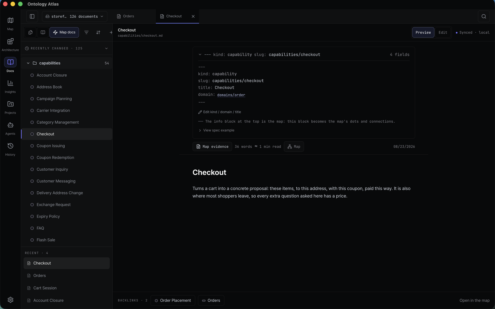
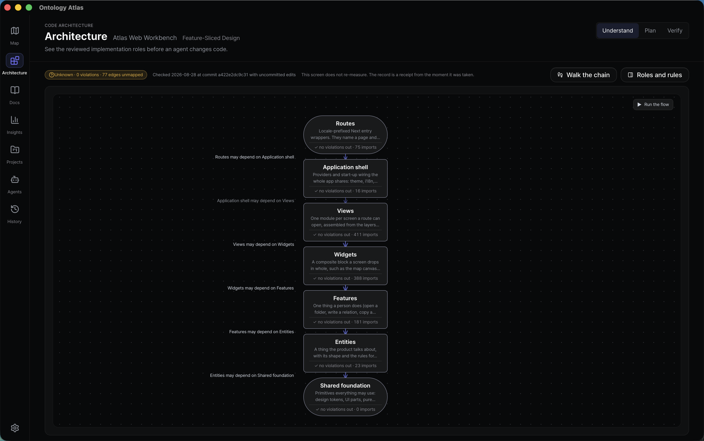
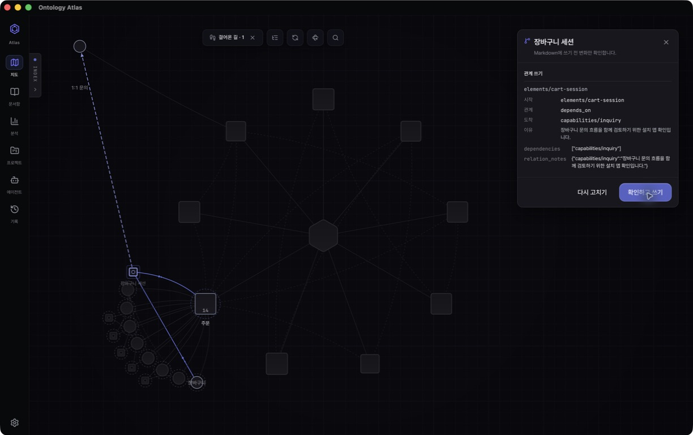
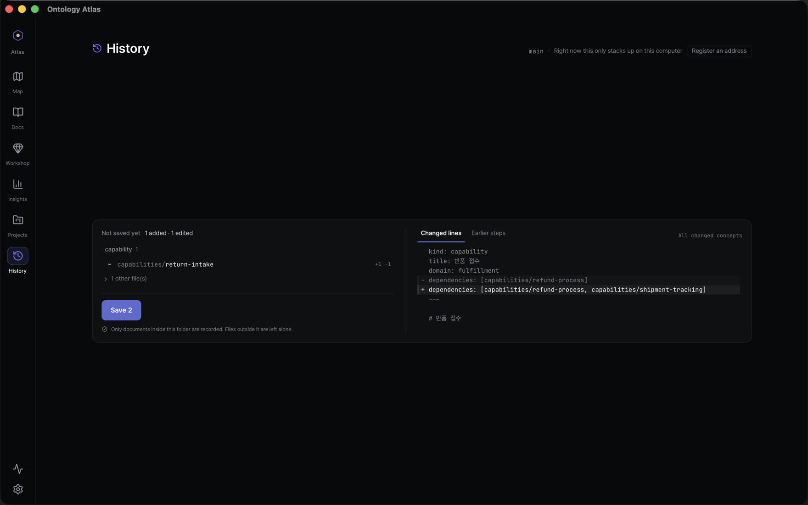
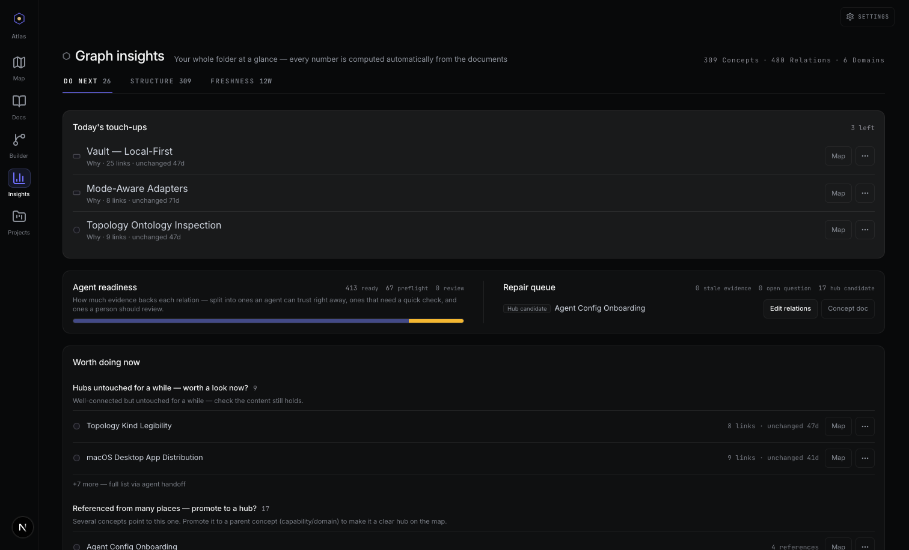

# Ontology Atlas

<p align="center">
  <picture>
    <source media="(prefers-color-scheme: dark)" srcset="public/brand/lockup-dark@2x.png" />
    
  </picture>
</p>

<p align="center">
  <strong>Understand your system as AI agents change its code.</strong><br />
  <sub>Give agents task context. Inspect the meaning, evidence, and unknowns yourself.</sub>
</p>

<p align="center">
  <a href="https://ontologyatlas.com/en/download/"><strong>Download for macOS</strong></a>
  ·
  <a href="https://ontologyatlas.com/en/download/"><strong>Windows x64 beta</strong> <sub>unsigned</sub></a>
  ·
  <a href="https://ontologyatlas.com/en/topology/">Live demo</a>
  ·
  <a href="https://ontologyatlas.com/en/guide/">Guide</a>
  ·
  <a href="#status--read-this-before-installing">Status</a>
</p>

<p align="center">
  <a href="LICENSE"></a>
  <a href="mcp/README.md"></a>
  <a href="cli/README.md"></a>
  
  <a href="https://mcpservers.org/servers/wlsdks/ontology-atlas"></a>
</p>


<p align="center"><sub>Every screenshot reads <a href="samples/storefront"><code>samples/storefront</code></a>, an online store described by Markdown files in this repository.</sub></p>

Folder walks admit up to 100,000 tracked entries and report truncation beyond that
ceiling or depth 12; this is a capacity bound, not a frame-rate guarantee.

The optional companion game and related personal-record screens are retired.
Existing local saves remain untouched; no replacement viewer or export is provided.

## In 30 seconds

Quoted frontmatter keys and nested string values round-trip across app, MCP and
CLI edits. An MCP rewrite that would discard malformed declarations is refused;
explicit replacement of an identifiable whole field can repair it.

| | |
|---|---|
| **What** | An `atlas/` folder of Markdown inside your repository. Each file's frontmatter says what it is (`project`, `domain`, `capability`, `element`, `document`) and what it points at. That folder is the whole database. |
| **For your agent** | Typed task context over MCP: capabilities, code anchors, declared dependencies, evidence, and unknowns. |
| **For you** | The same records on a map, in documents, and as Git diffs, so you decide which meaning changes to keep. |
| **Honest by design** | A graph path is a declared relationship, not proof of runtime impact. Missing evidence shows as unknown, never as safe. |

```text
your-repo/
├── src/
└── atlas/                 ← the whole ontology, cloned, branched and reviewed with the code
    ├── project.md
    ├── domains/  capabilities/  elements/
    ├── sources/           documents kept exactly as they arrived
    └── wiki/              pages written from those sources, every fact cited
```

## See it

<table>
<tr>
<td width="50%"><br /><b>Map</b> — select a concept; everything unrelated recedes.</td>
<td width="50%"><br /><b>Five views</b> — Flat, Galaxy, Cone, Strata and Neural.</td>
</tr>
<tr>
<td><br /><b>Agents</b> — chat with Claude Code or Codex inside the app.</td>
<td><br /><b>MCP</b> — one button per agent, then a live connection proof.</td>
</tr>
<tr>
<td><br /><b>Library</b> — gather any document, compile cited wiki pages.</td>
<td><br /><b>Documents</b> — edit the Markdown that becomes the graph.</td>
</tr>
<tr>
<td><br /><b>Architecture</b> — reviewed roles against the imports in code.</td>
<td><br /><b>Relation review</b> — see before and after, then confirm.</td>
</tr>
<tr>
<td><br /><b>History</b> — the exact Markdown diff before you save.</td>
<td><br /><b>Analysis</b> — what to fix next, by measurement, not a score.</td>
</tr>
</table>

## How it works

1. **Open a folder** — the app reads Markdown in place, or starts `atlas/` from your code. The path is shown before anything is written.
2. **Connect your agent** — one button writes the MCP config; a restart and `mcp-verify` prove the connection is live.
3. **Ask for context** — `query_ontology` with `operation: "agent_brief"` gives the agent a bounded brief for its task.
4. **Review the meaning** — proposed changes arrive as Markdown diffs; you keep, correct, or reject them in Git.

Definition previews preserve complete introductory text; the full document retains
exclusions and uncertainties. [Local code inspections](docs/features/map/analysis-modes.md)
show the connected folder and offer native permission recovery before reading.

```console
$ node $ATLAS blast-radius capabilities/mcp-tool-server docs/ontology --depth 2
capabilities/mcp-tool-server — blast radius (depth 2, incoming)
  risk unknown · 1 node · 1 relation · 0 cross-domain
```

<details>
<summary><b>What one node looks like</b></summary>

```yaml
---
uid: 71890f3e-7b5d-4c0a-8f14-123456789abc   # permanent identity, kept through renames
slug: capabilities/token-issue
kind: capability
title: Token issue
domain: domains/auth
path: src/auth/token-service.ts          # a path — code evidence
elements:
  - elements/jwt-signer                  # a slug — an implementation-role node
dependencies:
  - capabilities/session-refresh         # a slug — another node
---

Issues access and refresh tokens for authenticated users.
```

A path points at code; a slug points at a node. `dependencies` are directed and
`relates` is symmetric, so the map never turns similarity into causality. Only
files with `kind:` join the graph; `sources/**` and `wiki/**` pages do not.
Full contracts: [what becomes a node?](docs/guide/what-becomes-a-node.md) ·
[relations](docs/guide/relations.md) ·
[vault specification](docs/ONTOLOGY-ATLAS-SPEC.md).

</details>

## Principles

| Local-first | Not a… |
|---|---|
| Your disk is the database; Git is the history. | general-purpose ontology editor |
| No Atlas backend, account, or telemetry. | code index or IDE |
| Model and provider transfers are opt-in and logged in `.ontology-atlas/llm-audit.jsonl`. | automatic acceptance of generated knowledge |
| MCP and CLI read the folder directly, even with the app closed. | RDF/OWL/SHACL implementation ([§5.2](docs/ONTOLOGY-ATLAS-SPEC.md#52-standards-boundary)) |
| Extensions are files a `git diff` shows you, never third-party code. | service, and not on npm |

Malformed model responses, including compatible local endpoints, end the
conversation turn with an explicit diagnostic and no tool calls from that response.
The existing retry action remains available.

**Measured, honestly:** our first benchmark mostly tested vocabulary only Atlas
knew. Re-scored, we have not yet measured a difference in answer quality, and
Atlas was slower. [The correction](docs/benchmark/FINDINGS-2026-08-31-metric-split.md) ·
[benchmark log](docs/benchmark/README.md).

## Status — read this before installing

- The [download page](https://ontologyatlas.com/en/download/) is the release authority: tag, sizes, checksums, and signing state. [GitHub Releases](https://github.com/wlsdks/ontology-atlas/releases) is the second source.
- **macOS** is Developer ID signed and notarized, with the MCP server inside the bundle.
- **Windows x64 is an unsigned beta** — SmartScreen may warn, and a managed PC may refuse it. See [Security](SECURITY.md).
- **Linux and others** run the browser app, or the CLI and MCP server from a [source checkout](cli/README.md#set-up-from-a-source-checkout).
- Every release is a plain version; the in-app updater verifies each archive's signature before installing. The daily check can be turned off in Settings → About.

## Documentation

**Use it:** [hosted guide](https://ontologyatlas.com/en/guide/) ·
[features](docs/FEATURES.md) · [MCP setup](mcp/README.md) ·
[CLI reference](cli/README.md)<br />
**Model a vault:** [what becomes a node?](docs/guide/what-becomes-a-node.md) ·
[relations](docs/guide/relations.md) ·
[specification](docs/ONTOLOGY-ATLAS-SPEC.md) ·
[quality authority map](docs/ONTOLOGY-QUALITY.md)<br />
**Understand it:** [product direction](docs/PRODUCT-DIRECTION.md) ·
[architecture](docs/ARCHITECTURE.md) · [security](SECURITY.md) ·
[decisions](docs/DECISIONS.md)

## Contributing

Issues and pull requests are welcome; the most useful report points Atlas at a
real repository and shows where it falls short. Read
[CONTRIBUTING.md](CONTRIBUTING.md) first (external pull requests come from
forks), and [AGENTS.md](AGENTS.md) is canonical for people and agents alike.
Start with `pnpm checks:changed -- --run`; land with `pnpm pr:land <number>`.

<details>
<summary><b>Repository commands</b></summary>

| Command | What it answers |
|---|---|
| `pnpm agents:check` | Each harness's instruction integrity; independent Codex and Claude files need not match |
| `pnpm backlog` · `pnpm backlog:check` | Current task records and concurrent-state conflicts; append a UUID record per worktree observation ([guide](docs/BACKLOG.md)) |
| `pnpm bundle:plan` · `pnpm bundle:prune` | Land several branches as one: plan the merge (which carry work, shared files, trial conflicts) and afterwards prune the component branches main provably contains. See `/land-bundle` |
| `pnpm checks:changed` | Which gates this change actually needs |
| `pnpm conflicts:scan` | Which open pull requests (and `-- --match=<glob>` local branches) change the same files as this branch, and whether a trial merge with each conflicts; read-only, one `gh` call |
| `pnpm decisions:find <terms>` · `pnpm decisions:check` | The decision record to cite or overturn, and whether this change owes one |
| `pnpm doc:new -- --type=<kind> --area=<area> --slug=<slug>` | A new living document from its template in `docs/.templates/`, at the path its kind decides |
| `pnpm docs:check` | Docs gates, including `pnpm docs:language`, `pnpm source:language`, `pnpm changelog:check`, `pnpm dev-checks:check`, `pnpm docs:meta` |
| `pnpm docs:meta` · `pnpm doc:history -- <path>` | Whether every living document carries its kind, status and area with pointers that resolve; one document's commits across moves, which is its version |
| `pnpm docs:move` | Moves the documents listed in `docs/.moved.json` and rewrites every reference; rerun it after merging main into an older branch (`-- --check` only reports) |
| `pnpm e2e:durations -- <timings dir>` | Rewrites the per-file weights that balance the browser shards from downloaded `playwright-timings-*` reports |
| `pnpm e2e:sleeps:check` | A change may not add a fixed `waitForTimeout` to an e2e spec unless a `// measurement window:` note says why |
| `pnpm gates:yield -- --runs=200` | Which CI checks ever failed, per distinct run, from the lane reports `checks.yml` uploads (cached in `~/.cache/atlas-gate-yield`); a row with 50+ runs, no failed run and 60+ days of history reads `no CI failure`, a check to examine rather than delete, since pre-push and `pnpm checks:changed` catches are not in this data. Reports start with the change that added them |
| `pnpm gateway:capture -- --base-url=<static export>` | Re-shoots the six app screens the download page shows, Korean and English (`public/gateway/<screen>.<locale>.png`), from a served `pnpm build`, against this repository's own ontology |
| `pnpm knip` | Dead files, exports and types across every scope |
| `pnpm lessons` · `pnpm lessons:check` | Shared harness lessons that are open or verified but not yet fixed; record and review them with `/harness-retro` ([records guide](docs/records/README.md#harness-lessons)) |
| `pnpm licenses:check` · `pnpm notice:build` · `pnpm notice:check` | Whether every package the web export, the MCP sidecar and the desktop app ship is on the license allow-list ([rules](docs/engineering/third-party-code.md)); regenerate `NOTICE.md` and `public/third-party-licenses.txt` after a production dependency changes, and prove both current |
| `pnpm messages:build` · `pnpm messages:check` · `pnpm messages:adopt` | Compose the ignored `messages/<locale>.json` from one file per namespace (`messages/<locale>/<Namespace>.json`), prove it current, and carry a pre-split branch's catalogue edits onto the parts while merging main |
| `pnpm perf:mcp:memory` · `pnpm perf:mcp:memory:check` | Whether the MCP server keeps memory it should release: heap after two forced collections across 50 repeated calls per tool and across moved Git HEADs, on a generated vault; about a minute, kept out of pre-push |
| `pnpm pr:ci <n>` | Fire CI on a draft now, so a green, disjoint change can take the fast path |
| `pnpm pr:land --plan <n...>` · `pnpm pr:land --conduct` | Dry-run what a landing would do without writing to GitHub, and run trains until the queue is empty |
| `pnpm pr:land <n>` · `pnpm pr:queue` | Queue a pull request for the landing train (or merge it on the fast path), and show the queue and the train in flight |
| `pnpm typecheck` | Types across every file, with Next's generated route and page types, so the browser build need not check them again |

Rows stay sorted by command, and the reference's entries by area, so two
branches that each add one land on different lines; `pnpm dev-checks:check`
names the line to move and `-- --fix` sorts both.
[Development checks](docs/DEVELOPMENT-CHECKS.md) is the full gate reference, one
entry per area; [map testability](docs/engineering/map-testability.md) owns canvas
performance, readability, contrast, and instrumentation.

</details>

## License

[MIT](LICENSE). Third-party notices are in [NOTICE.md](NOTICE.md), and the full
license texts in [public/third-party-licenses.txt](public/third-party-licenses.txt).

The planet traveler is Atlas’s shared pixel mascot across the README, website, app icons, waiting states, and optional companion. Asset sources and regeneration instructions are in [Brand](docs/design/brand.md); `pnpm brand:sprites` rebuilds its registered pixel grids before the existing brand fan-out.
