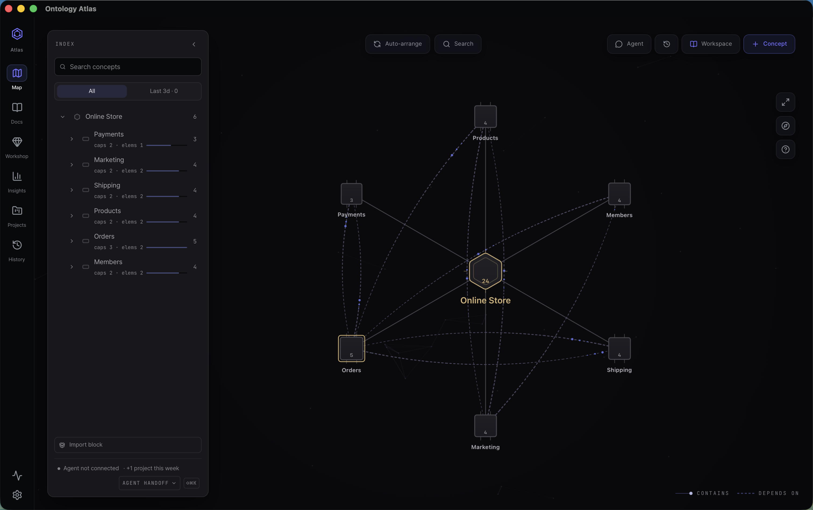

[English](README.md) | [한국어](README.ko.md) | [日本語](README.ja.md) | [简体中文](README.zh.md)

<h1 align="center">
  <picture>
    <source media="(prefers-color-scheme: dark)" srcset="public/brand/lockup-dark@2x.png" />
    
  </picture>
</h1>

<p align="center"><strong>Understand your system as AI agents change its code.</strong></p>



<p align="center">
  <a href="https://ontologyatlas.com/en/download/"><strong>Download for macOS</strong></a> ·
  <a href="https://ontologyatlas.com/en/download/">Windows x64 beta</a> <sub>unsigned</sub> ·
  <a href="https://ontologyatlas.com/en/topology/">Try it in the browser</a> ·
  <a href="https://ontologyatlas.com/en/guide/">Guide</a>
</p>

<p align="center"><a href="LICENSE"></a> <a href="https://mcpservers.org/servers/wlsdks/ontology-atlas"></a></p>

- **macOS** (Apple Silicon) is signed and notarized, and carries the MCP server inside the app.
- **Windows x64** is an unsigned beta: SmartScreen may warn, and a managed PC may block it.
- **Linux** has no app yet: use the browser version, or run the CLI and MCP server from a [source checkout](cli/README.md#set-up-from-a-source-checkout).

The [download page](https://ontologyatlas.com/en/download/) lists each release's version, sizes and checksums; [GitHub Releases](https://github.com/wlsdks/ontology-atlas/releases) holds the same files.

## What it does

- **Gives your coding agent task context.** Claude Code, Codex, Cursor and Antigravity connect over MCP and read the capabilities, code paths, dependencies, evidence and unknowns a task touches.
- **Keeps that meaning in Markdown you own.** An `atlas/` folder in your repository holds one file per concept. Git is its history and its review.
- **Leaves the final say to you.** Proposed changes arrive as Markdown diffs you keep, correct or reject.
- **Shows people the same folder.** Map, documents, Library, Insights and Git history all read those files.
- **Says what it does not know.** A line on the map is a declared relationship, not proof of runtime impact. Missing evidence shows as unknown, never as safe.

**Not yet proven:** re-scored, our benchmark has not measured a difference in answer quality with Atlas, and Atlas was slower ([the correction](docs/benchmark/FINDINGS-2026-08-31-metric-split.md)).

The optional companion game and related personal-record screens are retired.
Existing local saves remain untouched; no replacement viewer or export is provided.

## Quick start

1. **Install** the app from the [download page](https://ontologyatlas.com/en/download/), or open the [browser version](https://ontologyatlas.com/en/topology/).
2. **Open a folder.** Atlas reads its Markdown in place, or starts an `atlas/` folder in your repository, and shows the path before it writes anything.
3. **Connect your agent.** In **Agents › MCP**, press **Connect** for your tool, restart the agent, and ask about your next task.

## The folder

```text
your-repo/
├── src/
└── atlas/                 ← cloned, branched and reviewed with the code
    ├── project.md
    ├── domains/  capabilities/  elements/
    ├── sources/           documents kept exactly as they arrived
    └── wiki/              pages written from those sources, every fact cited
```

A Markdown file whose frontmatter has `kind:` is one concept. Its `uid` never changes, its `slug` is its current address, and its `path` names the code it describes. A folder can hold any number of concepts.

Read [What becomes a node?](docs/guide/what-becomes-a-node.md), [Relations](docs/guide/relations.md) and the [specification](docs/ONTOLOGY-ATLAS-SPEC.md).

## Work with coding agents

- **MCP** (Model Context Protocol): your agent starts the Atlas MCP server, which reads and writes the folder on disk, even with the app closed. [Connect an agent](docs/guide/connect-agent.md) · [MCP reference](mcp/README.md)
- **ACP** (Agent Client Protocol): Claude Agent and Codex also run in the app's own chat. Reads go straight through; each Atlas write waits until you allow it once. [Agents screen](docs/features/agents.md)

## Local-first and privacy

- Atlas has no backend, account or telemetry. Your folder stays plain Markdown on your disk.
- Calls Atlas makes to a model with your API key or a local model are opt-in, and each records its destination in `.ontology-atlas/llm-audit.jsonl`.
- A connected coding agent may send your prompt and the context it reads to its own provider; that log does not cover those transfers.

[Trust](docs/guide/trust.md) · [Security](SECURITY.md)

## CLI

The CLI runs from a source checkout as `node cli/src/index.mjs` with Node.js 24; there is no npm package. It scaffolds, validates, compiles and queries a folder, and `mcp-verify` proves a live agent connection. [CLI reference](cli/README.md)

## Development

Read [CONTRIBUTING.md](CONTRIBUTING.md) first; external pull requests come from forks. [AGENTS.md](AGENTS.md) is the contract for people and agents.
Run `pnpm install` and `pnpm dev`, check a change with `pnpm checks:changed -- --run`, and land it with `pnpm pr:land <number>`.
[Development checks](docs/DEVELOPMENT-CHECKS.md) is the full gate reference; [Features](docs/FEATURES.md), [Architecture](docs/ARCHITECTURE.md) and [Product direction](docs/PRODUCT-DIRECTION.md) describe what the product does and why.

<details>
<summary><b>Repository commands</b></summary>

| Command | What it answers |
|---|---|
| `pnpm agents:check` | Each harness's instruction files are valid; Codex and Claude files need not match |
| `pnpm backlog` · `pnpm backlog:check` | Current task records and concurrent-state conflicts ([guide](docs/BACKLOG.md)) |
| `pnpm bundle:plan` · `pnpm bundle:prune` | Plan landing several branches as one, then prune the branches main contains (`/land-bundle`) |
| `pnpm checks:changed` | Which gates this change needs |
| `pnpm conflicts:scan` | Which open pull requests change the same files as this branch, and whether a trial merge conflicts |
| `pnpm decisions:find <terms>` · `pnpm decisions:check` | The decision to cite or overturn, and whether this change owes one |
| `pnpm doc:new -- --type=<kind> --area=<area> --slug=<slug>` | A new living document from its template in `docs/.templates/` |
| `pnpm docs:check` | Docs gates, including `pnpm docs:language`, `pnpm source:language`, `pnpm changelog:check`, `pnpm dev-checks:check`, `pnpm docs:meta` |
| `pnpm docs:meta` · `pnpm doc:history -- <path>` | Every living document's kind, status and area; one document's commits across moves |
| `pnpm docs:move` | Moves the documents in `docs/.moved.json` and rewrites references (`-- --check` only reports) |
| `pnpm e2e:durations -- <timings dir>` | Rebalances the browser shards from downloaded `playwright-timings-*` reports |
| `pnpm e2e:sleeps:check` | Refuses a new fixed `waitForTimeout` without a `// measurement window:` note |
| `pnpm gates:yield -- --runs=200` | Which CI checks ever failed, per run, from the lane reports CI uploads |
| `pnpm gateway:capture -- --base-url=<static export>` | Re-shoots the six app screens on the download page, in Korean and English |
| `pnpm knip` | Dead files, exports and types |
| `pnpm lessons` · `pnpm lessons:check` | Open harness lessons; record and review them with `/harness-retro` |
| `pnpm licenses:check` · `pnpm notice:build` · `pnpm notice:check` | Shipped packages are on the license allow-list, and `NOTICE.md` is current ([rules](docs/engineering/third-party-code.md)) |
| `pnpm messages:build` · `pnpm messages:check` · `pnpm messages:adopt` | Compose `messages/<locale>.json` from one file per namespace, prove it current, and carry an old branch's edits |
| `pnpm messages:coverage -- --locale <code>` | Checks one locale's strings against `en`: arguments, plurals, script, keep-terms and typography |
| `pnpm perf:mcp:memory` · `pnpm perf:mcp:memory:check` | Whether the MCP server releases memory across repeated calls; about a minute |
| `pnpm pr:ci <n>` | Fire CI on a draft now |
| `pnpm pr:land --plan <n...>` · `pnpm pr:land --conduct` | Dry-run a landing, or run trains until the queue is empty |
| `pnpm pr:land <n>` · `pnpm pr:queue` | Queue a pull request for the landing train, and show the queue |
| `pnpm seo:check` | After `pnpm build`: every sitemap URL in `out/` canonicalizes to itself, `/` and each locale root point at `/{locale}/download/`, and titles and descriptions are unique per locale |
| `pnpm typecheck` | Types across every file, with Next's generated route and page types |

</details>

## License

[MIT](LICENSE). Third-party notices are in [NOTICE.md](NOTICE.md), and the full license texts in [public/third-party-licenses.txt](public/third-party-licenses.txt).

The planet traveler is Atlas’s shared pixel mascot across the README, website, app icons, waiting states, and verified agent-work feedback. Asset sources and regeneration instructions are in [Brand](docs/design/brand.md); `pnpm brand:sprites` rebuilds its registered pixel grids before the existing brand fan-out.
