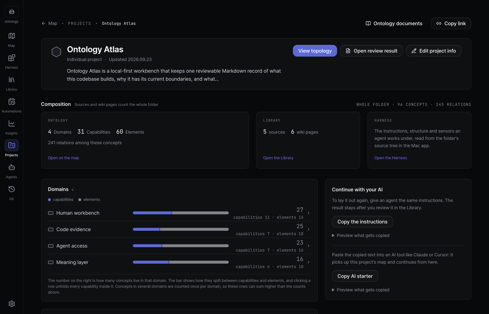
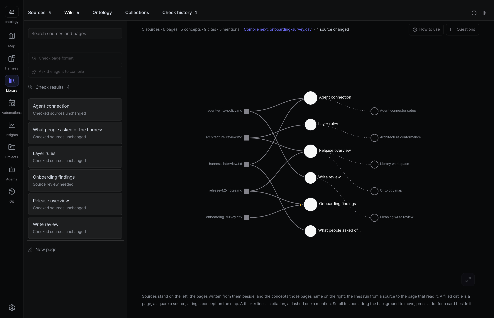
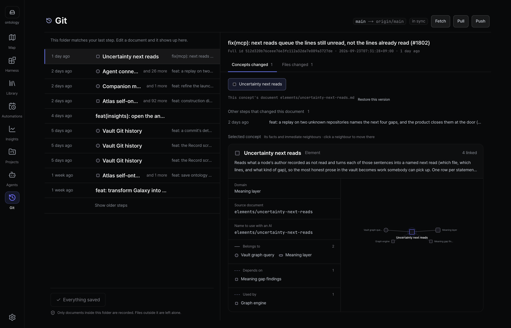
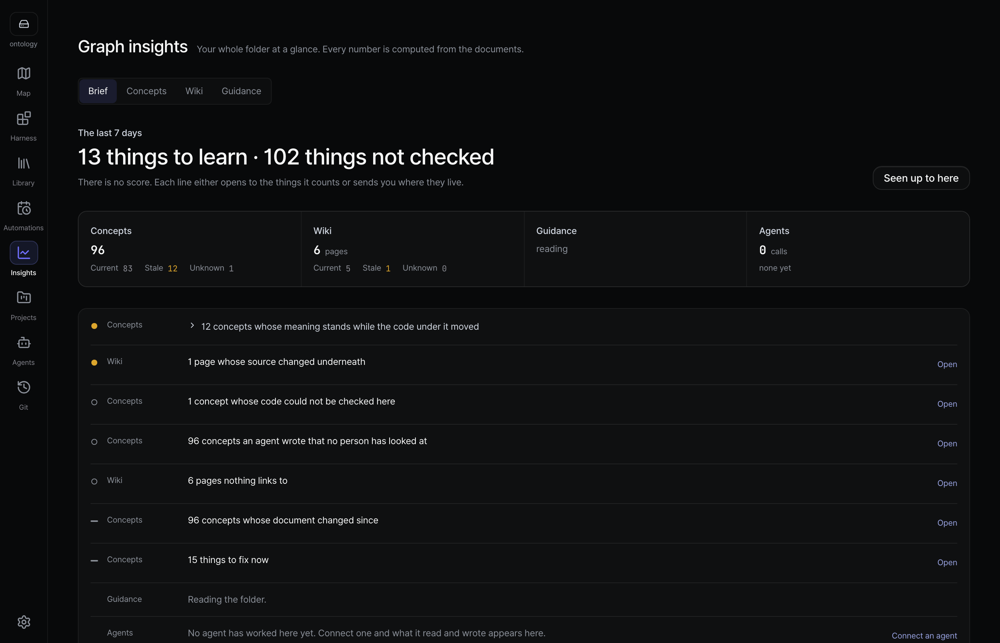
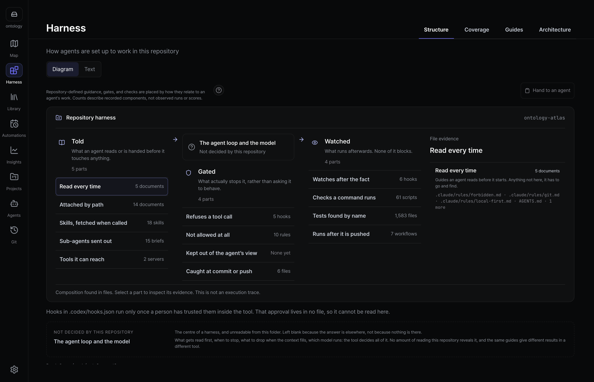
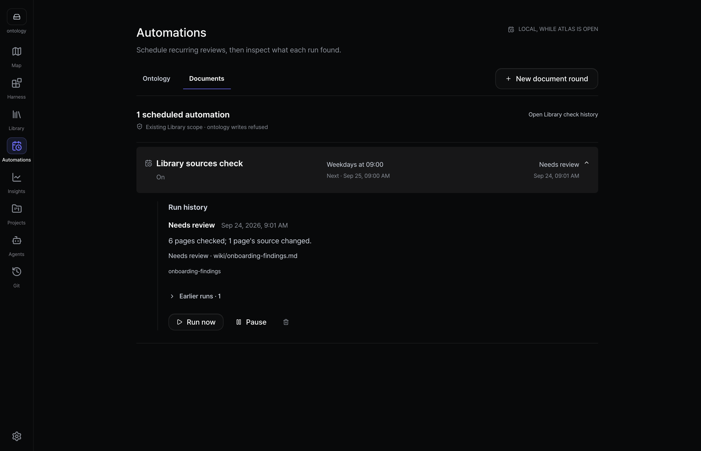

[English](README.md) | [한국어](README.ko.md) | [日本語](README.ja.md) | [简体中文](README.zh.md)

<h1 align="center">
  <picture>
    <source media="(prefers-color-scheme: dark)" srcset="public/brand/lockup-dark@2x.png" />
    
  </picture>
</h1>

<p align="center"><strong>AI 智能体改动代码时，你依然能看懂自己的系统。</strong></p>

<p align="center">
  把代码做了什么、为什么这样设计，整理成一张地图，以 Markdown 的形式保存在你的仓库里。<br />
  你和你的编码智能体读的是同一份文件。
</p>

<p align="center">
  <a href="https://ontologyatlas.com/zh/download/"><strong>下载 macOS 版</strong></a> ·
  <a href="https://ontologyatlas.com/zh/topology/">在浏览器中试用</a> ·
  <a href="https://ontologyatlas.com/zh/guide/">指南</a>
</p>

<p align="center"><a href="LICENSE"></a> <a href="https://github.com/wlsdks/ontology-atlas/releases"></a> <a href="https://mcpservers.org/servers/wlsdks/ontology-atlas"></a></p>


## 为什么需要 Atlas

如今编码智能体改动代码的速度，已经超过团队在脑中维持全貌的速度。Atlas 把这份全貌放在代码旁边：每个部分是做什么的、由哪些文件实现、什么依赖什么，以及还有什么没人知道。你的智能体在任务前读取它，在任务后提议更新；每一处变更都以 Markdown diff 的形式交给你，你可以保留、修改或拒绝。

- **智能体带着上下文开工。** Claude Code、Codex、Cursor 和 Antigravity 通过 MCP 读取任务涉及的概念、代码路径、依赖关系和待解决的问题。
- **记录归你所有。** `atlas/` 文件夹里每个概念一个 Markdown 文件，像代码一样用 Git 做版本管理和评审。
- **什么是真的由你决定。** 智能体的提议在你接受之前，始终只是提议。
- **不知道的，就说不知道。** 地图上的连线只是声明过的关系，并不能证明运行时的影响；缺少证据时显示为未知，而不是安全。

## 界面一览

<table>
<tr>
<td width="50%"><br /><b>项目</b> — 每个项目，以及其中有多少已有代码依据。</td>
<td width="50%"><br /><b>资料库</b> — 文档放进去，带出处的 Wiki 页面出来。</td>
</tr>
<tr>
<td><br /><b>Git</b> — 保存前就能看到精确的 Markdown diff。</td>
<td><br /><b>分析</b> — 靠测量而不是打分，告诉你下一步该修什么。</td>
</tr>
<tr>
<td><br /><b>Harness</b> — 仓库向智能体告知、拦截和监测的内容。</td>
<td><br /><b>自动化</b> — 让文件夹保持最新的定时检查。</td>
</tr>
</table>

## 快速开始

1. **安装**：从[下载页面](https://ontologyatlas.com/zh/download/)获取应用，或打开[浏览器版](https://ontologyatlas.com/zh/topology/)。
2. **打开文件夹**：Atlas 会原地读取其中的 Markdown，或在你的仓库中新建 `atlas/` 文件夹，并且在写入任何内容之前先显示路径。
3. **连接智能体**：在 **智能体 › MCP** 中，为你使用的工具点击 **连接**，重启智能体，然后问问它你的下一个任务。

macOS（Apple Silicon）版已签名并通过公证，应用内置 MCP 服务器。Windows x64 是未签名的测试版。在 Linux 上，请使用浏览器版，或在[源码检出](cli/README.md#set-up-from-a-source-checkout)中运行 CLI 和 MCP 服务器。[Releases](https://github.com/wlsdks/ontology-atlas/releases) 列出了每个版本的文件和校验和。

## 工作原理

```text
your-repo/
├── src/
└── atlas/                 ← 与代码一起克隆、建分支、评审
    ├── project.md
    ├── domains/  capabilities/  elements/
    ├── sources/           按收到时的原样保存的文档
    └── wiki/              据这些文档撰写的页面，每条事实都有出处
```

frontmatter 中带有 `kind:` 的 Markdown 文件就是一个概念。它的 `uid` 永不改变，`slug` 是它当前的地址，`path` 指向它所描述的代码。地图、文档、资料库、分析和 Git 界面读取的都是这些文件。

你的智能体通过两种方式接触这个文件夹：

- **MCP：** 智能体会启动 Atlas MCP 服务器，由它直接读写磁盘上的文件夹，应用关闭时也能工作。[连接智能体](docs/guide/connect-agent.md) · [MCP 参考](mcp/README.md)
- **ACP：** Claude Agent 和 Codex 也可以在应用自带的对话中工作；每次写入都要等你允许后才会执行。[智能体](docs/features/agents.md)

## 本地优先

- 没有后端、账号或遥测。你的文件夹以普通 Markdown 的形式保存在你的磁盘上。
- 使用你的 API key 或本地模型调用模型的功能需要主动开启，每次调用的目的地都会记录在 `.ontology-atlas/llm-audit.jsonl` 中。
- 已连接的编码智能体可能会把你的提示词和它读取的内容发送给它自己的提供方，Atlas 的日志不涵盖这些传输。

[关于信任](docs/guide/trust.md) · [安全](SECURITY.md)

## 当前状态

Atlas 还处在早期。我们的基准测试尚未显示使用 Atlas 能得到更好的回答，而且使用 Atlas更慢（[更正说明](docs/benchmark/FINDINGS-2026-08-31-metric-split.md)）。构建试验及其失败与局限见[构建测量](docs/benchmark/CONSTRUCTION.md)。

## 文档

[认识 Atlas](docs/guide/what-is-atlas.md) · [最初五分钟](docs/guide/first-five-minutes.md) · [什么会成为概念](docs/guide/what-becomes-a-node.md) · [关系](docs/guide/relations.md) · [规范](docs/ONTOLOGY-ATLAS-SPEC.md) · [功能](docs/FEATURES.md) · [CLI](cli/README.md) · [架构](docs/ARCHITECTURE.md)

## 参与贡献

请先阅读 [CONTRIBUTING.md](CONTRIBUTING.md)，外部的 pull request 请从 fork 提交。[AGENTS.md](AGENTS.md) 是人和智能体共同遵守的约定。

```bash
pnpm install
pnpm dev
pnpm checks:changed -- --run
```

`pnpm pr:land <number>` 会合并一个已评审的 pull request，并保留它原有的提交。完整的检查说明见[开发检查](docs/DEVELOPMENT-CHECKS.md)。仓库命令表见英文 README 的 [Contributing](README.md#contributing)。

## 许可证

[MIT](LICENSE)。第三方声明见 [NOTICE.md](NOTICE.md)，许可证全文见 [public/third-party-licenses.txt](public/third-party-licenses.txt)。像素吉祥物及其素材来源见[品牌](docs/design/brand.md)。
