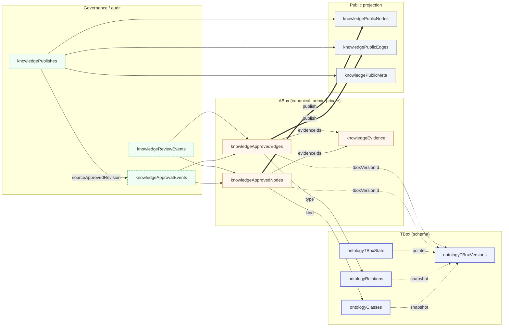
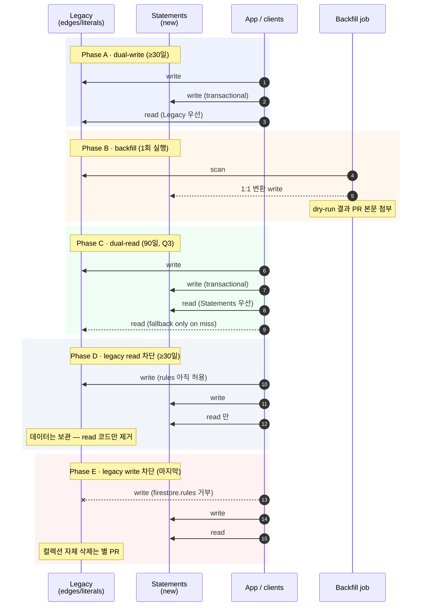

# Ontology Model V2 — DRAFT (V1.1 ✅ 머지 완료)

> **Status**: V1.1 머지 완료 (PR #10, 2026-05-01). V1.2-V1.5 + V2 통합은 여전히 user 승인 대기 + Q3-Q8 답 필요.
> **Author**: 자율 루프 iter#12 (2026-05-01) + 이후 update.
> **Inputs**: C0 (현재 모델 캡처) · C1 (Wikidata 학습) · C2 (Palantir 학습).
> **Goal**: 현재 *4-layer class + 7-relation TBox + evidence-grounded ABox* 위에 *qualifiers · rank · literal properties · rich references · cardinality · action type* 을 점진 도입해 RDF-star + Foundry-class 표현력에 도달.

## 진행 상황

| 단계 | 상태 |
|---|---|
| V1.1 — Statement Qualifiers + Rank | ✅ 머지 완료 (PR #10, additive, breakage 0) |
| V1.2 — Literal Properties | ⏳ Q6+Q7 답 후 진행 |
| V1.3 — Rich References | ⏳ Q5 답 후 진행 |
| V1.4 — Action Type | ⏸ DEFERRED (Q4 + 보안 sub-spec 필요) |
| V1.5 — Relation Cardinality | ⏳ 즉시 가능 (Q 답 무관) |
| V2 — 통합 KnowledgeStatement | ⏳ V1.x 완료 + 90일 dual-read soak 후 |

Open question 진행: Q1=(a) ✅ · Q2 ✅ (share-doc 이미 제거) · Q3-Q8 + multi-vault 시점 대기.

---

## 빠른 진입점

> **30초 요약**: 우리 V1.0 은 이미 schema-versioned + evidence-grounded ontology. V2 는 *Wikidata + Palantir* 의 6 갈래 (qualifier · rank · literal · rich-ref · cardinality · action) 를 V1.1~V1.5 5단계 + V2 통합 마이그레이션 으로 점진 도입. 모든 단계가 *markdown frontmatter 호환* + *legacy 데이터 무손실*.

| 누구 | 어디부터 읽어야 |
|---|---|
| **새로운 contributor** | §0 (디자인 원칙) → §1 (현재 모델 요약) → §9.1 (단계 매트릭스) → §12 (Glossary) |
| **이 spec 을 PR 로 옮기는 reviewer** | §10 (체크리스트 90+ 항목) → §11 (open questions) → §13 (관련 spec 일람) |
| **단계별 implementor** | §0 → §해당-단계 (§2~§7) → §8.1 의 매핑 표 → §10.x 의 추가 검증 |
| **마이그레이션 위험 평가자** | §9 (도입 순서 + 위험) → §10.7 (V2 phase A~E) → §11 Q1/Q3 |
| **AI agent / ActionType 보안** | §5 (V1.4) → §10.5 (보안 8 항목) → §11 Q2 → 별도 ACTION-TYPE-SECURITY spec (작성 예정) |
| **로컬 사용자** | §8 (Markdown-first 헌장) → §8.1 (frontmatter 매핑 예제) → `docs/LOCAL-FIRST-SYNC.md` |
| **단순 ontology 학습** | §1 → §12 (Glossary) → 외부 레퍼런스 |

## 목차

- §0 [디자인 원칙](#0-디자인-원칙) — 16 원칙 (구조 / 안전 / 사용자 신뢰 / 운영)
- §1 [현재 모델 요약 (V1.0)](#1-현재-모델-요약-v10) — TBox / ABox / governance / public projection 코드 정의
- §2 [V1.1 — Qualifiers + Rank](#2-v11--statement-qualifiers--rank-wikidata-영감)
- §3 [V1.2 — Literal Properties](#3-v12--literal-properties-wikidata-영감)
- §4 [V1.3 — Rich References](#4-v13--rich-references-wikidata-영감)
- §5 [V1.4 — Action Type](#5-v14--action-type-palantir-영감) — *별도 보안 spec 필요*
- §6 [V1.5 — Relation Cardinality](#6-v15--relation-cardinality-palantir-영감)
- §7 [V2 — 통합 Statement 모델](#7-v2--통합-statement-모델-목표-도착)
- §8 [오픈소스 차별점 — Markdown-first](#8-오픈소스-차별점--markdown-first)
- §8.1 [Markdown ↔ Firestore 매핑](#81-markdown--firestore-매핑-v1x-단계별-검증)
- §9 [도입 순서 + 위험](#9-점진-도입-순서--위험) — critical path · 거절 기준 · 일정
- §10 [User 승인 체크리스트](#10-user-승인-체크리스트) — PR 머지 전 90+ 항목
- §11 [Open questions](#11-open-questions-user-답-필요) — P0/P1/P2 우선순위
- §12 [Glossary](#12-glossary) — 50+ 용어
- §13 [관련 spec 일람](#13-관련-spec-일람) — paths-changed cross-reference

> 본 spec 은 시간이 지나며 *6 카테고리* 에서 정리된다: **개념 학습 (§1, §12) → 단계 정의 (§2~§7) → 호환 검증 (§8, §8.1) → 도입 가이드 (§9, §10) → 결정 대기 (§11) → 외부 cross-link (§13)**. 각 카테고리는 독립적으로 머지 / 보류 가능.

---

## 0. 디자인 원칙

### 0.1 구조 원칙

1. **Additive first** — V1.x 는 모두 *기존 컬렉션에 옵셔널 필드 추가* 만. legacy fact 는 한 번도 마이그레이션 없이 작동.
2. **Single-folder onboarding 보존** — 사용자는 여전히 markdown 폴더 하나로 시작. 새 컬렉션이 늘어도 *로컬 모드는 무시* 가능해야 함.
3. **TBox versioning 1급 시민** — 새 필드도 모두 `OntologyTBoxVersion` snapshot 에 잡혀야 함.
4. **Trademark 회피** — `Foundry`, `AIP`, `Wikibase` 등을 우리 식별자에 박지 않는다. 개념만 차용.
5. **로컬 / 클라우드 동등** — 모든 V2 개념은 markdown frontmatter 로도 표현 가능해야 함 (local-first 룰 준수).

### 0.2 안전 원칙 (data loss prevention / rollback)

이 원칙들은 *모든 V1.x PR 이 위반 안 했음을 §10 체크리스트로 검증* 한다.

6. **Roll-forward + Roll-back 양방향 호환** — 새 코드는 legacy 데이터 read OK (이미 §10.1 BC 항목). *그리고* 이전 코드는 새 데이터 read 시 unknown 필드 무시 + crash 0. 단방향만 호환되는 단계는 **즉시 거절** (V1.x 의 schema 진화는 옵셔널 필드만이라 자동 만족, V2 는 dual-read phase 가 명시).
7. **Audit chain 불가역** — `lastApprovedAt` / `currentRevisionId` / `manualAuthor` 등 governance 필드는 PR 마다 *손실 0* 검증 (§10.7 Phase B backfill 의 1:1 매핑 강제). audit 누락 = 데이터 손실 = 즉시 PR revert.
8. **Public projection 무결성 우선** — admin canonical 변경이 public projection (`knowledgePublicNodes/Edges`) 의 사용자 경험을 깨면 안 됨. publish event 가 항상 *전후 무결* (rolled-back 가능성 보존). V2 마이그레이션은 publish event 의 `sourceApprovedRevision` 를 statement-aware 로 갱신해야.
9. **데이터 삭제는 phase 가 분리** — V2 Phase D (legacy read 차단) 이후에도 legacy doc 자체는 *보관*. 실 삭제는 별도 PR + 30일 grace period + audit log. 운영 중 *직접 컬렉션 drop* 명시 금지.
10. **모든 destructive 변경에 dry-run** — V2 Phase B backfill / V1.2 의 `summary` → `description` 마이그레이션 등 mutation 은 운영 실행 전 dry-run 필수. 결과 (예상 read row 수 / write row 수 / 충돌 row 수 / skip row 수) 가 PR 본문에 첨부되어야 한다 (§10.7 Phase A 명시).

### 0.3 사용자 신뢰 원칙

11. **사용자 데이터의 *모든* 변경은 audit 가 따라간다** — manual edit / AI 추출 / migration / rollback 모두 audit collection 에 기록. *조용히* 사용자 데이터를 바꾸는 코드 path 를 **만들지 말 것**.
12. **사용자 디스크는 신성 — 자동 sync 금지** — `.claude/rules/local-first.md` 와 `docs/LOCAL-FIRST-SYNC.md` 헌장. 로컬 → 클라우드 push 는 *항상 사용자 명시 opt-in*. 자동 추출 / 자동 publish / 자동 delete 금지.
13. **AI 출력은 stub 으로만 진입** — V1.4 ActionType 의 `humanReview` 가 default `'always'`. extract / propose / merge 가 *직접* canonical 노드/엣지를 만드는 게 아니라 *항상* 검수 큐의 stub. 사람 승인 후에만 fact.

### 0.4 운영 원칙

14. **모든 phase 사이에 30일 cool-off** — V2 Phase A → B → C → D → E 사이 최소 30일. 사용자 보고 zero-issue 검증 후 다음 phase. (Q3 답에 따라 phase C 만 90일 또는 길게.)
15. **rollback PR 미리 작성** — 각 V1.x 단계 / V2 phase 마다 *되돌리는* PR template 을 같이 PR description 에 첨부 (§10.7 Rollback plan). 머지 후 issue 발생 시 *분 단위* revert 가능해야.
16. **observability first** — 새 컬렉션 / 필드 / Action 의 *write 비율 / 실패 비율 / latency p99* 가 첫날부터 dashboard 화. metric 없는 변경은 거절.

---

## 1. 현재 모델 요약 (V1.0)

### 1.1 컬렉션 관계도



**핵심 4 영역**:
- **TBox** (schema) — class / relation 정의 + immutable snapshot. fact 가 만들어진 시점 schema 가 `tboxVersionId` 로 freeze.
- **ABox** (canonical, admin-private) — 실 entity / fact 들. 모든 fact 가 evidence 와 link.
- **Governance** — approval / review event 로 변경 이력 보존. revertable. publish 가 canonical → public 의 sealed audit.
- **Public projection** — 외부 공개용 단방향 사영. publish event 로만 갱신.

V2 통합 모델 (§7) 은 이 4 영역의 *경계* 를 그대로 보존한다 — `knowledgeStatements` 컬렉션이 ABox 만 흡수, governance / public projection 은 *그대로 호환*.

### 1.2 TypeScript 타입 정의

```ts
// TBox
interface OntologyClass {
  id: string;                // e.g. 'project', 'capability', 'element'
  name: string;
  description?: string;
  parentClassId?: string;    // class hierarchy
  elementType?: OntologyElementType;
  version: number;
  ...timestamps + author
}

interface OntologyRelation {
  id: string;                // e.g. 'depends_on'
  name: string;
  inverseName?: string;
  sourceClassIds: string[];  // domain 제약
  targetClassIds: string[];  // range 제약
  category: 'structure' | 'behavior' | 'evidence' | 'weak';
  symmetric: boolean;
  transitive: boolean;
  version: number;
  ...
}

interface OntologyTBoxVersion {
  versionId: string;
  classes: OntologyClass[];
  relations: OntologyRelation[];
  ...
}

// ABox — canonical (admin-private)
interface KnowledgeApprovedNode {
  id: string;                  // <kind>:<frontmatterId>
  title: string;
  kind: string;                // = OntologyClass.id
  projectIds: string[];
  parentId?: string;
  summary?: string;
  evidenceIds: string[];
  // -- audit / governance (이미 존재 — V2 도 보존)
  currentRevisionId?: string;  // 최근 approval event ID
  lastApprovedAt: Timestamp;
  lastApprovedBy: string;      // admin 이메일
  source?: 'manual' | 'extraction';
  manualAuthor?: string;       // source==='manual' 시 작성자 uid
  manualNote?: string;         // source==='manual' 시 메모
  tboxVersionId?: string;      // 검수 시점 활성 TBox version
  // -- stub / forward-ref
  isStub?: boolean;            // placeholder (검수 큐 별도 섹션)
  pendingType?: string;        // stub promote 시 복원할 edge type
  pendingFromId?: string;      // stub promote 시 복원할 source canonical ID
}

interface KnowledgeApprovedEdge {
  id: string;
  from: string;                // node id
  to: string;
  type: string;                // = OntologyRelation.id
  projectIds: string[];
  evidenceIds: string[];
  // -- audit / governance (이미 존재 — V2 도 보존)
  currentRevisionId?: string;
  lastApprovedAt: Timestamp;
  lastApprovedBy: string;
  source?: 'manual' | 'extraction';
  manualAuthor?: string;
  manualNote?: string;
  tboxVersionId?: string;
}

// Evidence — node/edge 별 별도 doc
interface KnowledgeEvidence {
  id: string;
  // ... documentId / chunkId / fragment / locator 등 (구체 schema 는 docs/DATA-MODEL.md)
  // V1.3 가 retrievedAt / statedInNodeId / extractionModelId / confidence 추가.
}

// Governance / audit 컬렉션 (이미 존재)
interface KnowledgeApprovalEvent {
  id: string;
  // ... 노드/엣지 승인 history. revertable.
  revertsEventId?: string;
}

interface KnowledgeReviewEvent {
  id: string;
  // ... 검수 큐 이벤트 (요청 / 처리 / 코멘트).
}

interface KnowledgePublish {
  id: string;
  status: 'running' | 'succeeded' | 'failed' | 'rolled-back';
  initiatedBy: string;
  startedAt: Timestamp;
  completedAt?: Timestamp;
  sourceApprovedRevision: string;
  nodeCount?: number;
  edgeCount?: number;
  projectionVersion: string;
  rollbackOfPublishId?: string;
  // ... canonical → public projection 의 sealed audit
}

// Public projection (canonical 의 단방향 사영, publish 시 갱신)
// = knowledgePublicNodes / knowledgePublicEdges / knowledgePublicMeta
//   필드는 canonical 의 부분집합 + publishId / projectionVersion / publishedAt.
```

이미 갖춰진 **강점**:
- Schema versioning (`OntologyTBoxVersion` immutable snapshot + `tboxVersionId` 박힘)
- Evidence grounding (`evidenceIds[]` 모든 fact 가 evidence 에 link)
- Source/target class 제약 (rdfs:domain/range 비슷)
- Symmetric / transitive 메타 (OWL property characteristics)
- **Approval / review event audit** — `knowledgeApprovalEvents`, `knowledgeReviewEvents` 가 모든 변경 이력 보존, revert 가능
- **Manual vs extraction source 추적** — `manualAuthor` / `manualNote` 로 사용자 직접 작성 vs AI 추출 구분
- **Stub forward-ref** — `isStub`, `pendingType`, `pendingFromId` 로 placeholder 노드를 promote 시 정확 복원
- **Public/private projection 분리** — admin canonical (`knowledgeApprovedNodes/Edges`) → public (`knowledgePublicNodes/Edges`) via sealed publish event

**갭** (V2 가 채울 것):
- Literal property (node atomic property)
- Statement qualifier (조건부 / 시간 한정자)
- Rank (다중 statement 우선순위)
- Rich reference metadata (retrievedAt / extractionModelId / confidence)
- Relation cardinality
- Declarative ActionType (현재 implicit approval/review event 들이 흡수 대상)

> 중요: V2 의 `KnowledgeStatement` 통합 모델은 위 **audit / governance 필드를 모두 보존** 해야 한다. `lastApprovedAt`, `currentRevisionId`, `manualAuthor`, `tboxVersionId` 가 statement 의 *immutable history* 의 일부 — V2 마이그레이션 시 누락 시 데이터 손실. §10.7 Phase B backfill 검증에서 이 필드들의 1:1 mapping 명시.

---

## 2. V1.1 — Statement Qualifiers + Rank (Wikidata 영감) — ✅ 머지 완료 (PR #10)

> ✅ 2026-05-01 머지. `KnowledgeGraphEdge` 에 옵셔널 필드 2개 추가됨. 5 단위 test 추가, additive, breakage 0. 자세히: `src/entities/knowledge-graph/model/types.ts` + `qualifier.test.ts`.

**컬렉션 변경**: `knowledgeApprovedEdges` 에 **옵셔널** 필드 2개 추가.

```ts
interface KnowledgeApprovedEdgeV11 extends KnowledgeApprovedEdge {
  /**
   * Statement 한정자. property-value 쌍 배열.
   * 예: [{propertyId: 'since', value: '2024-Q1'}, {propertyId: 'via', value: 'REST'}]
   * propertyId 는 새로 만들 `ontologyQualifierProperties` 의 id 또는
   * 기존 OntologyRelation.id 를 재사용 (TBox 가 둘 다 허용하면).
   */
  qualifiers?: Array<{ propertyId: string; value: QualifierValue }>;

  /**
   * 같은 (from, to, type) 의 다중 statement 우선순위.
   * 'normal' 이 default. legacy edge 는 모두 normal 로 해석.
   */
  rank?: 'preferred' | 'normal' | 'deprecated';
}

type QualifierValue =
  | { kind: 'string'; raw: string }
  | { kind: 'time'; iso: string; precision: 'year' | 'month' | 'day' }
  | { kind: 'quantity'; value: number; unit?: string }
  | { kind: 'nodeRef'; nodeId: string };
```

**호환**: legacy edge 는 `qualifiers` 없음 / `rank` undefined → 코드는 `rank ?? 'normal'` 폴백.
**TBox 변경**: 없음 (현 OntologyRelation 그대로).
**UI 변경**: edge 편집기에 "한정자 추가" 버튼 (옵션). preferred/deprecated 토글.
**마이그레이션**: 없음.

---

## 3. V1.2 — Literal Properties (Wikidata 영감)

**새 컬렉션**: `knowledgeApprovedLiterals/{literalId}` — node 의 atomic property.

```ts
interface KnowledgeApprovedLiteral {
  id: string;
  subjectId: string;             // = KnowledgeApprovedNode.id
  propertyId: string;            // = OntologyLiteralProperty.id (새 TBox 컬렉션)
  value: QualifierValue;         // V1.1 의 동일 union 재사용
  qualifiers?: Array<{ propertyId: string; value: QualifierValue }>;
  evidenceIds: string[];
  rank?: 'preferred' | 'normal' | 'deprecated';
  source?: 'manual' | 'extraction';
  tboxVersionId?: string;
  ...timestamps
}
```

**새 TBox 컬렉션**: `ontologyLiteralProperties/{propertyId}`

```ts
interface OntologyLiteralProperty {
  id: string;                       // e.g. 'description', 'color', 'releasedAt'
  name: string;
  description?: string;
  subjectClassIds: string[];        // 어느 class 에 붙을 수 있는지
  valueKind: 'string' | 'time' | 'quantity' | 'nodeRef';
  cardinality?: 'one' | 'many';     // V1.5 의 cardinality 와 통합
  version: number;
  ...
}
```

**호환**: 기존 node 의 `summary` / `title` 자유 텍스트 그대로 유지. 새 literal property 는 *추가 정보*. `summary` 는 V2 에서 description literal 로 마이그레이션 후보.
**TBox snapshot 영향**: `OntologyTBoxVersion` 에 `literalProperties: OntologyLiteralProperty[]` 추가.
**Markdown 표현**: frontmatter 의 임의 키 = literal property ID. 예:
```yaml
---
id: doc:checkout
kind: capability
description: 결제 요청부터 정산까지의 흐름  # → literal property
releasedAt: 2024-03-15                    # → literal property
---
```

---

## 4. V1.3 — Rich References (Wikidata 영감)

**컬렉션 변경**: `knowledgeEvidence/{evidenceId}` 에 옵셔널 필드 추가.

```ts
interface KnowledgeEvidenceV13 {
  // ...기존 필드
  /** 이 evidence 가 추출된 시점 (= 외부 자료 fetch 시각). */
  retrievedAt?: Timestamp;
  /** 출처가 *다른 ontology node* (예: '다른 위키 페이지') 일 때. */
  statedInNodeId?: string;
  /** AI 추출이 만든 evidence 면 그 모델 식별자 (예: 'opus-4.7-claude'). 사람 검수면 undefined. */
  extractionModelId?: string;
  /** evidence 자체의 confidence (0..1). */
  confidence?: number;
}
```

**호환**: 모두 옵셔널.
**가치**: AI 추출 vs 사람 검수 vs 외부 import 구분. confidence 누적이 rank 자동 결정에 입력.

---

## 5. V1.4 — Action Type (Palantir 영감) — **DEFERRED**

> ⚠️ **2026-05-01 업데이트**: AI 추출 path 가 v0.x 보류됐다 (LLM API 비용 부담). V1.4 의 핵심 가치 = `aiCallable: true` Action 으로 *AI agent 통합*. AI 의존이 빠지면 V1.4 는 단순 audit/event 통합 레이어만 남는데, 그것은 기존 `knowledgeApprovalEvents` + `knowledgeReviewEvents` 로 이미 처리된다. 따라서 **V1.4 는 V2 통합 spec 의 *후순위*로 미룬다**. AI 추출 도입 결정 (별도 spec) 후 재평가.


**새 TBox 컬렉션**: `ontologyActionTypes/{actionTypeId}`

```ts
interface OntologyActionType {
  id: string;                              // e.g. 'extract-from-document', 'merge-nodes'
  name: string;
  description?: string;

  /** 입력 schema. JSON-schema-lite. */
  parameters: Array<{
    name: string;
    valueKind: 'string' | 'time' | 'quantity' | 'nodeRef' | 'classId' | 'relationId';
    required: boolean;
    enum?: unknown[];                      // dropdown / 검증
    description?: string;
  }>;

  /** 변경 가능한 entity / relation. 화이트리스트. */
  mutates: Array<
    | { kind: 'node'; classId: string; op: 'create' | 'update' | 'delete' }
    | { kind: 'edge'; relationId: string; op: 'create' | 'update' | 'delete' }
    | { kind: 'literal'; propertyId: string; op: 'create' | 'update' | 'delete' }
  >;

  /** AI agent 가 호출 가능한지. */
  aiCallable: boolean;

  /** human review gate. 'always' 면 결과는 항상 stub → 검수 큐. */
  humanReview: 'always' | 'on-conflict' | 'never';

  version: number;
  ...
}
```

**새 컬렉션**: `knowledgeActionInvocations/{invocationId}` — 각 호출 인스턴스.

```ts
interface KnowledgeActionInvocation {
  id: string;
  actionTypeId: string;
  parameters: Record<string, unknown>;
  invokedBy: string;                  // uid 또는 'ai:opus-4.7'
  invokedAt: Timestamp;
  status: 'queued' | 'running' | 'succeeded' | 'failed' | 'awaiting-review';
  outputs?: {
    createdNodeIds?: string[];
    createdEdgeIds?: string[];
    createdLiteralIds?: string[];
    errorMessage?: string;
  };
  reviewEventId?: string;            // 사람 검수 결과 (knowledgeReviewEvents 와 연결)
  tboxVersionId: string;
}
```

**기존 통합**: `knowledgeApprovalEvents` + `knowledgeReviewEvents` 가 ActionInvocation 으로 점진 흡수. *기존 두 컬렉션은 V2 까지 유지* — 마이그레이션 전 dual-write.

**가치**: AI agent 가 LLM tool call 로 ActionType 을 호출. parameter 검증 + mutate 화이트리스트 가 *prompt injection 방어선*.

---

## 6. V1.5 — Relation Cardinality (Palantir 영감)

**컬렉션 변경**: `OntologyRelation` 에 옵셔널 필드 2개.

```ts
interface OntologyRelationV15 extends OntologyRelation {
  /** source node 가 같은 relation 으로 향할 수 있는 target 개수 제약. */
  sourceCardinality?: 'one' | 'many';
  /** target node 가 받을 수 있는 source 개수 제약. */
  targetCardinality?: 'one' | 'many';
}
```

예: `belongs_to` 의 `sourceCardinality = 'one'` (한 node 는 한 부모만) — 검증 시 에러.
**호환**: undefined = 'many' / 'many' (= 현재 동작).
**적용**: edge 생성 / approve 단계에서 검증.

---

## 7. V2 — 통합 Statement 모델 (목표 도착)

V1.1 ~ V1.5 까지 도입하면 ABox 가 다음 3 컬렉션에 분산:
- `knowledgeApprovedEdges` (relation statement)
- `knowledgeApprovedLiterals` (atomic property statement)
- `knowledgeActionInvocations` (action history)

**V2 에서 통합**: `knowledgeStatements/{statementId}` 단일 컬렉션.

```ts
interface KnowledgeStatement {
  id: string;
  subjectId: string;                  // = node.id
  predicate: { kind: 'relation' | 'literal'; id: string };
  object:
    | { kind: 'nodeRef'; nodeId: string }
    | { kind: 'value'; value: QualifierValue }
    | { kind: 'none' }                // "no value" — 명시적 부재
    | { kind: 'unknown' };            // "unknown" — 아직 모름 (= 기존 isStub 상응)
  qualifiers?: Array<{ propertyId: string; value: QualifierValue }>;
  rank: 'preferred' | 'normal' | 'deprecated';
  references: Array<{
    evidenceId: string;
    retrievedAt?: Timestamp;
    statedInNodeId?: string;
    extractionModelId?: string;
    confidence?: number;
  }>;
  source: 'manual' | 'extraction' | 'action';
  invocationId?: string;              // ActionInvocation 으로부터 만들어졌으면
  tboxVersionId: string;
  ...timestamps + author
}
```

이 시점부터 RDF-star 호환 export 가 자연스러움 (statement 가 1급, qualifier 가 statement 의 annotation).

**V2 마이그레이션**: 별도 commit / PR 로. dual-write 단계 → backfill → 기존 컬렉션 read 차단 → 삭제. 최소 한 minor version 의 dual-read 기간.

---

## 8. 오픈소스 차별점 — Markdown-first

각 V1.x 단계에서 *markdown frontmatter 만으로* 동등한 표현이 가능해야 한다. 사용자가 자기 디스크 폴더에 .md 파일을 두고도:

- `---` frontmatter 로 literal property 작성
- 본문 wikilink `[[other-doc]]` 가 relation
- 별도 `_qualifiers.md` 또는 frontmatter 의 객체값으로 qualifier
- `_actions.md` 가 ActionType 정의 (옵션, 클라우드 모드만)

→ 클라우드 sync 시 같은 의미가 Firestore 컬렉션으로 1:1 변환.

이 매핑이 깨지면 V1.x 단계 자체를 거절. **markdown 표현이 안 되면 그 V 는 우리 mission 에 반함**.

---

## 8.1 Markdown ↔ Firestore 매핑 (V1.x 단계별 검증)

각 단계의 *동등 표현* 을 구체 예제로 명시. 좌측 = 사용자 디스크의 `.md`, 우측 = sync 시 만들어지는 Firestore document.

### V1.0 (현재) — 기준선

```yaml
# vault/projects/checkout.md
---
id: project:checkout
kind: project
title: 결제 시스템
parents: []
projects: [checkout]
summary: 결제 요청부터 정산까지의 흐름
---

# 결제 시스템

[[doc:payment-spec]] 에 명시된 흐름을 구현. [[capability:tax]] 에 의존.
```

→ Firestore:
- `knowledgeApprovedNodes/project:checkout` ← frontmatter + summary
- `knowledgeApprovedEdges/<auto>` × 2 ← 본문 wikilink (`describes` + `depends_on` 추출)
- `knowledgeEvidence/<auto>` × 2 ← wikilink 의 출현 위치 + 컨텍스트
- `tboxVersionId` ← sync 시점의 활성 version

이미 동작. 마이그레이션 0.

### V1.1 — Qualifiers + Rank

```yaml
---
id: project:checkout
kind: project
title: 결제 시스템
relations:
  - type: depends_on
    target: capability:tax
    qualifiers:
      since: 2024-Q1
      via: REST
    rank: preferred
  - type: depends_on
    target: capability:tax-legacy
    rank: deprecated
    qualifiers:
      until: 2024-Q1
---
```

→ Firestore (`knowledgeApprovedEdges/<auto>` × 2):
```json
{ "from": "project:checkout", "to": "capability:tax",
  "type": "depends_on",
  "qualifiers": [
    {"propertyId": "since", "value": {"kind": "time", "iso": "2024-Q1", "precision": "month"}},
    {"propertyId": "via", "value": {"kind": "string", "raw": "REST"}}
  ],
  "rank": "preferred" }
{ "from": "project:checkout", "to": "capability:tax-legacy",
  "type": "depends_on",
  "qualifiers": [{"propertyId": "until", "value": {"kind": "time", "iso": "2024-Q1", "precision": "month"}}],
  "rank": "deprecated" }
```

**호환 규칙**: frontmatter 에 `relations` 키가 없으면 V1.0 동작 그대로 (본문 wikilink 만 추출). `relations` 키가 있으면 **추가** 로 처리 (본문 wikilink 와 합산).

### V1.2 — Literal Properties

```yaml
---
id: project:checkout
kind: project
title: 결제 시스템
properties:
  description: 결제 요청부터 정산까지의 흐름
  releasedAt: 2024-03-15
  tier: premium
  estimatedTPS:
    value: 12000
    unit: tps
---
```

→ Firestore:
- `knowledgeApprovedNodes/project:checkout` (변경 없음)
- `knowledgeApprovedLiterals/<auto>` × 4:
  ```json
  {"subjectId": "project:checkout", "propertyId": "description", "value": {"kind": "string", "raw": "결제 요청부터 정산까지의 흐름"}}
  {"subjectId": "project:checkout", "propertyId": "releasedAt", "value": {"kind": "time", "iso": "2024-03-15", "precision": "day"}}
  {"subjectId": "project:checkout", "propertyId": "tier", "value": {"kind": "string", "raw": "premium"}}
  {"subjectId": "project:checkout", "propertyId": "estimatedTPS", "value": {"kind": "quantity", "value": 12000, "unit": "tps"}}
  ```

**호환 규칙**:
- 기존 `summary` (top-level frontmatter) 는 자동으로 `description` literal 로 마이그레이션 (frontmatter 의 `properties.description` 가 우선).
- `properties.*` 의 키가 등록된 `OntologyLiteralProperty.id` 가 아니면 *자동 등록 후보* 로 검수 큐 (auto-create 하지 않음).
- TBox active version 에 없는 property 는 sync 시 warning 표시.

### V1.3 — Rich References

```yaml
---
id: project:checkout
kind: project
properties:
  description: 결제 요청부터 정산까지의 흐름
references:
  description:
    - source: doc:payment-spec
      retrievedAt: 2025-11-12
      confidence: 0.95
    - source: external:rfc-9457
      retrievedAt: 2024-06-01
      extractionModel: opus-4.7
---
```

→ Firestore:
- `knowledgeApprovedLiterals/<...>` 의 `evidenceIds[]` 가 채워지고
- `knowledgeEvidence/<id1>`: `{ retrievedAt: 2025-11-12, statedInNodeId: "doc:payment-spec", confidence: 0.95 }`
- `knowledgeEvidence/<id2>`: `{ retrievedAt: 2024-06-01, extractionModelId: "opus-4.7" }`

**호환 규칙**: 기존 `evidenceIds[]` 만 있는 fact 는 그대로. `references` 추가는 super-set.

### V1.4 — Action Type

```yaml
# vault/_actions/extract-from-document.md
---
id: extract-from-document
kind: actionType
parameters:
  - name: documentId
    valueKind: nodeRef
    required: true
  - name: focusClass
    valueKind: classId
    required: false
mutates:
  - kind: node
    classId: "*"
    op: create
  - kind: edge
    relationId: describes
    op: create
aiCallable: true
humanReview: always
---

# 문서로부터 fact 추출

이 action 은 문서를 입력으로 받아 후보 노드/엣지를 stub 으로 만든다.
사람이 검수 큐에서 승인해야 fact 가 된다.
```

→ Firestore:
- `ontologyActionTypes/extract-from-document` ← frontmatter
- 본문은 `description` literal 로
- `_actions/` 폴더는 **클라우드 모드 전용** — 로컬 모드는 무시 (action 은 서버 권한 필요)

**호환 규칙**: 로컬 모드에서 `_actions/` 폴더는 *읽지 않음*. 사용자가 클라우드 sync 후에만 적용. 권한 모델 결정은 spec §11 의 open question #2.

### V1.5 — Relation Cardinality

```yaml
# vault/_relations/belongs_to.md (TBox 정의)
---
id: belongs_to
kind: relationType
sourceClassIds: [element]
targetClassIds: [capability, domain, project]
category: structure
sourceCardinality: one     # element 는 한 부모만
targetCardinality: many    # 부모는 여러 자식 가능
symmetric: false
transitive: false
---
```

→ Firestore (`ontologyRelations/belongs_to`): 동일 shape. `sourceCardinality` / `targetCardinality` 가 옵셔널 필드로 추가.

**호환 규칙**: 기존 `belongs_to` 정의는 cardinality 필드 없음 → `'many'` / `'many'` 로 해석 (현재 동작 유지). cardinality 추가는 `OntologyTBoxVersion` snapshot 에 새 version 으로 박힘.

### V2 — 통합 Statement 모델

```yaml
---
id: project:checkout
kind: project
statements:
  - predicate: literal:description
    object: 결제 요청부터 정산까지의 흐름
    references:
      - source: doc:payment-spec
        confidence: 0.95
  - predicate: relation:depends_on
    object:
      kind: nodeRef
      id: capability:tax
    qualifiers:
      since: 2024-Q1
    rank: preferred
  - predicate: literal:owner
    object:
      kind: unknown   # 아직 모름
---
```

→ Firestore: 모든 statement 가 `knowledgeStatements/<auto>` 단일 컬렉션.

**호환 규칙**: V2 는 *마이그레이션 phase 가 별도 PR*. dual-write 단계에서 V1.2 의 `properties` / V1.1 의 `relations` 키도 *동시에* 받아 둘 다 만들고 read 만 V2 우선. 최소 1 minor version 의 dual-read 후 V1 컬렉션 read 차단.

---

### 매핑 일관성 검증 룰

V1.x 단계가 늘어나면서 frontmatter 가 비대해지는 위험. 다음 룰로 cap:

1. **각 단계 키는 별도 namespace** — `relations:`, `properties:`, `references:`, `statements:` 가 충돌하지 않게 분리.
2. **로컬 모드에서 빠진 단계는 무시** — V2 가 들어와도 V1.0 frontmatter 만 쓴 사용자는 그대로 동작.
3. **TBox 알 수 없는 키는 검수 큐로** — auto-create 절대 X. 사람이 ontology 정의 추가 후에야 fact 로 승격.
4. **frontmatter 와 본문이 충돌하면 frontmatter 우선** — 본문 wikilink 가 만든 edge 와 frontmatter `relations:` 가 같은 (from, to, type) 를 만들면 frontmatter 의 qualifier/rank 채택.
5. **`_` prefix 폴더는 schema 전용** — `_actions/`, `_relations/`, `_classes/`, `_literals/` 가 TBox 정의 위치. 일반 노드와 구분.

---

## 9. 점진 도입 순서 + 위험

### 9.1 단계별 매트릭스

| 단계 | 위험 | 도입 비용 | 가치 | Open Q (P1 차단) | Schema 변경 | UI 변경 | 새 컬렉션 |
|---|---|---|---|---|---|---|---|
| V1.1 qualifiers + rank | 낮음 (옵셔널) | 작음 | 시간/조건부 fact | — | edges 필드 2개 | edge editor 한정자 | X |
| V1.2 literals | 중간 (새 컬렉션) | 중간 | description / color / atomic property | Q6, Q7 | 신규 entity | property panel | ✅ literals + literalProperties |
| V1.3 rich refs | 낮음 | 작음 | AI 신뢰도 / 자동화 | Q5 | evidence 필드 4개 | reference badge | X |
| V1.4 ActionType | **높음** (보안 surface) | 큼 | AI agent 통합 기반 | Q2, Q8 + 별도 spec | 신규 2 entity | action invoker | ✅ actionTypes + actionInvocations |
| V1.5 cardinality | 낮음 | 작음 | 데이터 무결성 | — | relations 필드 2개 | violation 경고 | X |
| V2 통합 | **높음** (마이그레이션) | 큼 | RDF-star 호환 | Q3, Q4 | 통합 statements | Statement viewer | ✅ statements (legacy 흡수) |

### 9.2 Critical path

다음 단계는 *후속 단계의 전제* 라 우회 불가:

```
V1.1 ───────────────┐
                    ├─→ V1.3 ─→ V2 (Phase A dual-write)
V1.2 ─→ V1.5 ──────┘                  ↓
                                      V2 (Phase B-E)
V1.4 (독립적, 다른 스택과 직교)
```

**필수 dependency**:
- **V2 ⟸ V1.1 + V1.2 + V1.3** — V2 통합 statement model 의 qualifier·literal·reference 표현이 그대로 흡수돼야 함. V1.x 가 모두 미도입이면 V2 스키마가 "고아 필드" 가득.
- **V1.5 ⟸ V1.2** — cardinality 검증이 literal property 의 `cardinality?` 필드와 통합. V1.2 의 schema 가 먼저.
- **V1.4 는 독립** — ActionType 은 ABox 위에 *행동 layer* 로 얹히므로 V1.x 다른 단계와 schema 충돌 없음. 별도 트랙 가능.

**우회 가능 dependency**:
- V1.3 → V1.1 — rich reference 의 confidence 가 rank 자동 결정에 영향 가능 *but* 둘 다 옵셔널이라 도입 순서 swap 가능.

### 9.3 권장 도입 순서 (위험 ascending + critical path 준수)

1. **V1.1 qualifiers + rank** — 가장 안전. 옵셔널 필드 2개. 즉시 시작 가능 (P1 Open Q 없음).
2. **V1.5 cardinality** — V1.2 전이라 literal cardinality 와 분리 — relation 만 다룸. Q-free.
3. **V1.3 rich references** — Q5 (extractionModelId 검증) 답 후 시작. 매핑 단순.
4. **V1.2 literals** — Q6 (summary 마이그레이션) + Q7 (naming scope) 답 후. 새 컬렉션 + frontmatter 파서 큰 변경.
5. **V1.4 ActionType** — *별도 deep spec (ACTION-TYPE-SECURITY.md)* 통과 후. Q2 + Q8 답 필요. **다른 트랙과 병렬 가능** — V1.1~V1.3 가 진행 중이어도 V1.4 PR 시작 가능 (충돌 없음).
6. **V2 통합** — V1.1 + V1.2 + V1.3 모두 운영 안정화 (각각 ≥30일) 후. Phase A~E 5 단계 별 PR (§10.7).

### 9.4 보류 / 거절 시나리오

각 단계에 *명시적 거절 기준* — 어떤 데이터가 나오면 단계 자체를 보류해야 하는가:

- **V1.1 거절** — qualifier 의 5 datatype 표현이 frontmatter 에서 사용자에게 *불편* 으로 검증되면 (예: 시간 datatype 의 ISO precision 이 어색). V1.1 PR 머지 전 frontmatter UX 사용자 테스트.
- **V1.2 거절** — `properties.foo` 가 자유롭게 추가되는 게 검수 큐를 폭주시키면 (예: 사용자가 이름 typo 마다 새 property 후보 발생). literal property 의 *closed-vocabulary* 정책으로 회귀.
- **V1.4 거절** — security review 에서 prompt-injection 시연이 mutation whitelist 를 우회 가능하면. **즉시 PR revert**.
- **V2 거절** — backfill dry-run 이 legacy fact 의 ≥1% 를 statement 로 변환 못 하면. 데이터 손실 위험으로 V2 phase A 자체 보류.

### 9.5 일정 가이드 (참고)

순수 *spec* 기준 일정 (구현 시간 X, 검수 / 안정화 / open Q 답 기준):

| 단계 | 시작 기준 | 안정화 | 비고 |
|---|---|---|---|
| V1.1 | 즉시 | 30일 운영 후 stable | 옵셔널이라 빠름 |
| V1.5 | V1.1 stable | 30일 | 짧은 검증 |
| V1.3 | Q5 답 + V1.5 stable | 30일 | rich evidence 도입 |
| V1.2 | Q6+Q7 답 + V1.3 stable | 60일 | 큰 변경, 검수 큐 변동 |
| V1.4 | Q2+Q8 답 + ACTION-TYPE-SECURITY spec 통과 | 90일 | 보안 surface 큼 |
| V2 Phase A | V1.1+V1.2+V1.3 모두 stable | 30일 dual-write | |
| V2 Phase B | A stable | backfill 1회 | 운영 일자 단발 |
| V2 Phase C | B 완료 | 90일 dual-read (Q3 답) | 가장 긴 단계 |
| V2 Phase D | C 무결 | 30일 | legacy read 차단 |
| V2 Phase E | D 무결 | — | legacy write 차단, 종료 |

총 V1.1 시작부터 V2 종료까지 가장 빠른 경우 ≈ **9-12 개월**. open question 답 지연 시 더 길어짐.

---

## 10. user 승인 체크리스트

각 V1.x PR 마다 적용. **모든 박스가 체크되지 않은 PR 은 main merge 금지**.

### 10.1 모든 단계 공통 (항상)

**Mission alignment**
- [ ] §8 / §8.1 의 markdown frontmatter 예제가 *이 단계까지* 의 모든 새 필드를 포함하도록 갱신됐다.
- [ ] 로컬 모드 (Firebase 없이 디스크만) 에서도 새 frontmatter 가 무시되거나 동작하는 게 검증됐다 (옵션 필드는 무시, 필수 변경은 명시적 fail).
- [ ] 새 컬렉션 / 필드가 *진실원* 이 markdown 임을 깨지 않는다 — Firestore 가 단방향 사영이거나, 양방향 sync 면 충돌 해소 정책이 §8.1.5 (frontmatter 우선) 에 일치.

**Security**
- [ ] `firestore.rules` 가 새 필드 / 컬렉션을 읽기·쓰기 권한별로 명시.
- [ ] Emulator 로 *공격 시나리오 3종* 테스트: 비로그인 쓰기 / 비인가 사용자 쓰기 / `admins/*` 직접 쓰기 — 모두 거부.
- [ ] client 가 절대 쓸 수 없어야 하는 필드 (예: `tboxVersionId`, `lastApprovedAt`, `lastApprovedBy`, `currentRevisionId`) 가 rules 의 `allow update: if false` 로 잠겨있다.
- [ ] 서버 (Cloud Functions) 만 쓸 수 있는 collection 은 `allow create/update/delete: if false` 한 다음 admin SDK 로만 write.

**Schema 변경 프로세스 (.claude/rules/firestore-schema.md)**
- [ ] `docs/DATA-MODEL.md` 에 새 필드 / 컬렉션 명시 (필수/옵션 / 타입 / 설명).
- [ ] `src/entities/*/model/types.ts` 가 같이 갱신.
- [ ] `src/entities/*/api/*` 의 mapper / fromFirestore / toFirestore 가 같이 갱신 + 단위 test 라운드트립.
- [ ] `firestore.indexes.json` 에 새 query 가 필요로 하는 복합 인덱스 정의.
- [ ] `scripts/seed.ts` (있으면) 가 새 필드를 채우거나 의도적으로 비워두는 정책 명시.
- [ ] `docs/CHANGELOG.md` 에 날짜 + 단계 + 한 줄 요약.

**Test coverage**
- [ ] 영향 받는 mapper / 변환 함수에 *라운드트립* 단위 test (TS 객체 → Firestore doc → TS 객체 = identity).
- [ ] 기존 e2e 가 깨지지 않음 (`pnpm exec playwright test`).
- [ ] *legacy 데이터* 에 새 코드를 적용해도 read 가 통과 (옵션 필드 부재 시 default 값 사용 검증).
- [ ] Vitest run: `pnpm test:run` 0 fail.
- [ ] tsc / lint / build 0 error.

**Backwards-compatibility**
- [ ] 새 필드는 모두 옵셔널 (V1.x 단계). 필수 추가가 정말 필요하면 *별도 spec PR* 로 분리.
- [ ] 코드 path 가 `field ?? default` 로 legacy 핸들링.
- [ ] *roll-forward only* 아니라 *roll-back* 도 가능한지 검증: 이전 버전 코드가 새 필드가 박힌 doc 를 읽어도 crash 없이 무시.

**Observability**
- [ ] 새 필드 / collection 의 write 가 `clientErrors` / Cloud Functions log 에 누적되지 않는 (정상) 흐름 확인.
- [ ] 새 critical path 에 console.log → `clientErrors` 또는 `developerActivityEvents` 기록.

### 10.2 V1.1 — Qualifiers + Rank

추가:
- [ ] frontmatter 의 `relations: [...]` 파서 단위 test (qualifier value 의 5종 datatype 모두 round-trip).
- [ ] *본문 wikilink* 와 `relations:` 가 동일 (from, to, type) 를 만들 때 §8.1.5 룰대로 frontmatter 가 우선되는지 e2e.
- [ ] `rank: deprecated` edge 가 default UI 에서 숨고 명시적 토글로만 보이는지 시각 회귀.
- [ ] 같은 (from, to, type, rank) 중복 edge 가 *하나의 doc* 으로 합쳐지는지 (race-write 충돌 방어).

### 10.3 V1.2 — Literal Properties

추가:
- [ ] `knowledgeApprovedLiterals` 컬렉션의 firestore.rules 가 *evidenceIds 가 빈 manual literal* 도 허용 (검수 큐).
- [ ] `OntologyLiteralProperty.subjectClassIds` 의 화이트리스트 위반 (예: project 클래스에 등록되지 않은 property 시도) 을 server 가 거부.
- [ ] frontmatter 의 `properties: { … }` 에서 알 수 없는 키가 *auto-create 되지 않고* 검수 큐로 이동 (§8.1.5 룰).
- [ ] `summary` legacy 필드 → `description` literal 마이그레이션 plan 명시 (one-shot 또는 dual-read).

### 10.4 V1.3 — Rich References

추가:
- [ ] `extractionModelId` 가 사용자 입력 string 이 아니라 *서버 화이트리스트* (현재 활성 model 만) 만 받는다.
- [ ] `confidence` 가 0..1 범위 검증 (rules 또는 server validation).
- [ ] 기존 evidence 에 새 필드 backfill *자동 X* — 수동 또는 다음 추출 시점에만 채워진다는 것 명시.

### 10.5 V1.4 — Action Type (보안 surface 큼 — 별도 deep spec)

추가 (이 항목들은 *별도 ACTION-TYPE-SECURITY.md spec 통과 후* 체크):
- [ ] **Parameter validation** — 모든 `parameters[].valueKind` 가 server 측에서 강타입 검증. 누락된 required 거부. enum 값 외 거부.
- [ ] **Mutation whitelist** — Action 이 `mutates[]` 외의 entity 를 변경하려 하면 transaction 자체 abort. Server-side enforcement, client trust 금지.
- [ ] **Prompt injection** — `aiCallable: true` action 의 string parameter 는 LLM 이 ontology 컨텍스트의 다른 정보로 변조 가능 — 별도 sanitize / context-isolation 검증.
- [ ] **AI agent auth** — `aiCallable: true` action 호출은 사용자 OAuth token + 명시적 scope (action ID 별 화이트리스트) 가 모두 있어야 통과 (Open question #2 답 필요).
- [ ] **Audit completeness** — 모든 `KnowledgeActionInvocation` 이 invokedBy / invokedAt / 입력 / 출력 / 실패 사유까지 immutable. 후속 변조 불가능 (rules `allow update: if false`).
- [ ] **Human review gate** — `humanReview: 'always'` action 의 출력은 stub 으로만 들어가고, `knowledgeApprovedNodes/Edges` 의 `isStub: true` 가 박힌다.
- [ ] **Rate limit / quota** — AI agent 가 폭주 호출 시 사용자 quota 차감. Cloud Functions 에 quota 미들웨어.
- [ ] **로컬 모드 격리** — `_actions/` 폴더는 로컬 모드에서 *읽지 않음*. 클라우드 sync 후에만 적용. parser 가 명시 스킵.

### 10.6 V1.5 — Relation Cardinality

추가:
- [ ] cardinality 위반 (예: `belongs_to.sourceCardinality = 'one'` 인데 한 element 에 두 belongs_to edge) 을 *server 측* 이 거부 (firestore.rules 또는 Cloud Function).
- [ ] client 측은 *시각 경고* 만 — server 가 진실원.
- [ ] 기존 데이터에 cardinality violation 이 있으면 *migration 가이드* 또는 *grace period* 명시 (강제 cleanup 금지).
- [ ] `OntologyTBoxVersion` snapshot 이 cardinality 추가를 새 version 으로 인식.

### 10.7 V2 — 통합 Statement 모델 (마이그레이션)

V2 PR 은 **단일 commit 으로 머지 금지**. 다음 단계를 **각각 별 PR**:

**Phase 흐름 시각화**



**핵심 원칙** (Mermaid 가 못 표현):
- 각 phase 사이 *최소 30일 cool-off* (§0.4 원칙 14).
- Phase C 만 *90일 dual-read* — open question Q3 답에 따라 길어질 수도.
- 각 phase 마다 *되돌리는 PR template* 미리 작성 (§0.4 원칙 15).
- Phase D / E 는 **되돌릴 수 없는 단계** — Phase C 의 zero-issue 검증 후만 진행.

**Phase A: dual-write 도입**
- [ ] 새 `knowledgeStatements` 쓰기 path 추가. 기존 `knowledgeApprovedEdges/Literals` 도 *같이* 쓰기 (transactional dual-write).
- [ ] read path 는 여전히 legacy 우선.
- [ ] backfill 스크립트 dry-run 결과 (예상 read row 수, write row 수, 충돌 row 수) PR 본문에 첨부.

**Phase B: backfill**
- [ ] 운영 데이터에 backfill 실행. 결과 audit log (성공 / 실패 / skip) 가 별도 collection 에 영속.
- [ ] backfill 후 statement count == legacy edge count + literal count 검증.

**Phase C: dual-read 전환**
- [ ] read path 가 `knowledgeStatements` 우선, fallback only on miss.
- [ ] 최소 1 minor version (≥ 30 일) dual-read 유지.
- [ ] 사용자 보고 zero-issue 후 다음 phase 로.

**Phase D: legacy read 차단**
- [ ] read path 가 statements 만. legacy collection read 코드 제거.
- [ ] 단, legacy doc 자체는 *삭제하지 않음* — 백업 / 디버그 / rollback 용으로 보관.

**Phase E: legacy write 차단**
- [ ] firestore.rules 가 legacy collection write 를 거부.
- [ ] 마지막 phase. 이후 `knowledgeApprovedEdges` 등 컬렉션 제거는 별 PR.

**Rollback plan**
- [ ] 각 phase 마다 *이전 phase 로 되돌리는* 단일 PR 이 미리 작성되어 있어야 한다 (commit history 에 작성되지 않더라도 PR template 으로).
- [ ] Phase D / E 는 *되돌릴 수 없는* 단계 — 운영 데이터 손실 위험. 충분한 dual-read 기간 (Phase C) 후에만.

---

## 11. Open questions (user 답 필요)

각 질문에 **우선순위 (P0/P1/P2)**, **막는 단계**, **선택지** 명시. P0 는 spec 자체 main merge 전 답 필요. P1 은 해당 단계 PR 전 답. P2 는 구현 중 점진 결정 가능.

### Q1 — multi-vault 지원 시점 (P0, 모든 V1.x 영향)

| 측면 | 내용 |
|---|---|
| **막는 단계** | 모든 단계 — multi-vault 면 모든 새 컬렉션이 `accountId` 로 partition 되어야 함. v0.x 가 single 면 partition 키 자체가 사라짐. |
| **현재 가정** | single-vault (1인 도구). |
| **선택지** | (a) v0.x = single, v1.0 부터 multi → spec 그대로 진행 (b) 처음부터 multi-vault 도입 → 모든 schema 에 `accountId` 추가 (c) 결정 보류 → spec 자체 대기 |
| **추천 기본** | (a) — `.claude/rules/local-first.md` 의 "v2 협업 단계에서 도입" 과 일치. v1.0 협업 시점에 별도 spec PR. |

### Q2 — V1.4 ActionType 의 `aiCallable` 인증 모델 (P1, V1.4 전용)

| 측면 | 내용 |
|---|---|
| **막는 단계** | V1.4. 다른 단계는 영향 없음. |
| **현재 가정** | 미정 — §10.5 의 보안 항목이 이 답에 의존. |
| **선택지** | (a) Firebase Auth OAuth + `aiActionScopes` claim (action ID 화이트리스트) (b) 외부 LLM 의 OAuth Bearer + 별도 verifier (c) 로컬 모드는 인증 없이 (사용자 디스크 = 사용자 신뢰), 클라우드 모드는 (a) (d) 별도 ACTION-TYPE-SECURITY spec 으로 deepen |
| **추천 기본** | (c) + (d) — local 은 디스크 권한이 이미 사용자 신뢰선. cloud 는 별도 deep spec 으로 안전성 검증 후 결정. |

### Q3 — V2 dual-read 기간 (P2, V2 마이그레이션 phase C)

| 측면 | 내용 |
|---|---|
| **막는 단계** | V2 Phase C → D 전환 시점. V2 시작 자체는 이 답 없이도 가능. |
| **현재 가정** | 최소 1 minor version (≥30일) — §10.7 Phase C 명시. |
| **선택지** | (a) 30일 (b) 90일 (c) 6개월 (d) 무기한 dual-read 유지 — legacy 영구 보존 |
| **추천 기본** | (b) — backfill 후 90일 사용자 보고 zero-issue 면 안전. (a) 는 catch-up edge-case 에 짧음. (d) 는 인프라 cost. |

### Q4 — Wikidata 의 `none` / `unknown` 매핑 (P1, V2 통합 단계 — Statement.object)

| 측면 | 내용 |
|---|---|
| **막는 단계** | V2. V1.x 까지는 `isStub` 으로 충분. |
| **현재 가정** | `unknown` = 기존 `isStub: true` (forward ref) 의미 보존. `none` 은 신규. |
| **선택지** | (a) `unknown` = `isStub`, `none` = `Statement.object.kind: 'none'` 신규 (b) `isStub` 폐기 → `unknown` / `none` 두 새 kind 만 (c) 셋 다 보존 — `isStub` 은 forward-ref 만, `unknown`/`none` 은 명시적 부재/모름 |
| **추천 기본** | (a) — minimal 변경. 의미상 `isStub` 의 *진짜* 의미가 "존재하지만 아직 anchor 안 잡힘" 이라 `unknown` 과 잘 맞음. |

### Q5 — V1.3 `extractionModelId` 검증 정책 (P1, V1.3)

| 측면 | 내용 |
|---|---|
| **막는 단계** | V1.3. |
| **현재 가정** | §10.4 가 *서버 화이트리스트* 만 받는다고 명시. |
| **선택지** | (a) 화이트리스트 정확 매칭 (b) prefix 매칭 (예: `opus-*`, `sonnet-*`) (c) free string + 서버 audit 만 |
| **추천 기본** | (b) — 모델 minor version 변경에 robust. (a) 는 매번 deploy 필요, (c) 는 audit-only 라 abuse 가능. |

### Q6 — V1.2 `summary` legacy 마이그레이션 방식 (P1, V1.2)

| 측면 | 내용 |
|---|---|
| **막는 단계** | V1.2. |
| **현재 가정** | "자동으로 `description` literal 로 마이그레이션" 명시 — 방식 미정. |
| **선택지** | (a) one-shot 스크립트로 일괄 backfill (b) read 시점에 lazy 마이그레이션 (read-and-rewrite) (c) dual-write 기간 후 cutoff |
| **추천 기본** | (a) — 데이터 양이 작고 (∼ 수백~수천 doc), 일관성이 중요. lazy 는 race / 부분 마이그레이션 위험. |

### Q7 — V1.2 literal property naming scope (P1, V1.2)

| 측면 | 내용 |
|---|---|
| **막는 단계** | V1.2. |
| **현재 가정** | `OntologyLiteralProperty.subjectClassIds` 가 어느 class 에 적용 가능한지 화이트리스트 — 즉 *property id 는 글로벌 unique*. |
| **선택지** | (a) 글로벌 unique (현 가정) — `description` 은 어느 class 에서나 같은 의미 (b) class-scoped — `element.color` 와 `project.color` 가 다른 의미일 수 있음 |
| **추천 기본** | (a) — Wikidata / RDF 가 모두 글로벌 property. mental model 단순. 같은 단어 다른 의미는 별 property id 로 (`element-color` vs `project-color`). |

### Q8 — V1.4 ActionInvocation 보존 기간 (P2, V1.4)

| 측면 | 내용 |
|---|---|
| **막는 단계** | V1.4 deploy 후. spec 자체에는 영향 없음. |
| **현재 가정** | 미정 — audit immutability 만 명시. |
| **선택지** | (a) 영구 보존 — 디스크 cost 누적 (b) 1년 후 archive 로 이동 (c) 사용자별 quota 기반 자동 prune |
| **추천 기본** | (b) — 1년 후 cold storage. 법적 / 디버그 요구는 1년이면 충분.

---

> **결론**: 우리 V1.0 은 이미 *4-layer class hierarchy + OWL-flavored relations + immutable schema versioning + evidence-grounded ABox + public projection* 으로 충분히 진보됐다. V2 는 그 위에 *qualifier / literal / action / cardinality* 를 *additive 로* 얹어 RDF-star + Foundry-class 표현력에 접근한다. 매 단계는 markdown-first 호환을 깨지 않는다. 차별점은 *enterprise platform 없이 markdown 폴더로 시작 가능* 한 ontology 도구 — 이게 오픈소스 mission 의 진짜 진입점.

---

## 12. Glossary

이 spec 에서 쓰이는 용어 정의. 우리 식별자 / 외부 참조 / RFC 패턴 구분.

### 우리 모델 용어

- **TBox** — *Terminological Box*. 클래스 / 관계 / property *정의 자체*. 우리 `OntologyClass` + `OntologyRelation` + `OntologyTBoxVersion` (+ V1.2 후 `OntologyLiteralProperty` + V1.4 후 `OntologyActionType`) 가 여기 속한다. OWL 용어.
- **ABox** — *Assertion Box*. 실 entity / fact 들. 우리 `knowledgeApprovedNodes` + `knowledgeApprovedEdges` (+ V1.2 후 `knowledgeApprovedLiterals` + V2 후 `knowledgeStatements`).
- **Canonical** — admin-private 진실원. 검수 거친 fact 의 immutable history. `knowledgeApprovedNodes/Edges`.
- **Public projection** — canonical 의 단방향 사영. `knowledgePublicNodes/Edges`. publish event 통해 갱신.
- **Stub** — forward-reference placeholder 노드. 검수 큐의 별도 섹션. `pendingType` / `pendingFromId` 가 promote 시 복원 정보를 담는다. V2 의 `unknown` 과 의미적으로 일치.
- **Evidence** — fact 의 근거. `knowledgeEvidence/{evidenceId}`. 모든 fact 가 `evidenceIds[]` 보유. V1.3 가 retrievedAt / extractionModelId / confidence 추가.

### Wikidata / Wikibase 영감 (CC BY-SA 4.0 docs)

- **Item** — Wikidata 의 entity 단위 (Q-number). 우리 `KnowledgeApprovedNode` 와 매핑.
- **Property** (Wikidata) — predicate (P-number). 우리 `OntologyRelation` 또는 V1.2 의 `OntologyLiteralProperty` 둘 다 매핑.
- **Statement** — Wikidata 의 (subject, property, value) + qualifiers + references + rank 묶음. V2 의 `KnowledgeStatement` 가 이 모양.
- **Claim** — statement 의 핵심 (subject + property + value + qualifiers). references / rank 제외.
- **Qualifier** — claim 을 *수식하는* property-value 쌍. 예: `since: 2024-Q1`, `via: REST`. V1.1 가 우리 edges 에 도입.
- **Reference** — claim 의 *근거 cite*. 우리 `evidenceIds[]` 의 부분집합 + V1.3 의 retrievedAt / extractionModelId.
- **Rank** — 같은 (subject, property) 의 다중 statement 우선순위. `preferred` / `normal` / `deprecated`. V1.1.
- **Snak** — Wikidata 가 (property, value, snaktype) 의 atomic 단위로 부르는 이름. 우리 spec 에서는 사용 안 함 — *Wikidata 호환 export 시점* 에만 다시 등장.
- **Datatype** — value 의 종류 (item-ref / string / time / quantity / globe-coordinate / external-id …). 우리 `QualifierValue` union 이 부분 차용.

### Palantir Foundry 영감 (proprietary docs, fair-use 학습)

- **Object Type** — Foundry 의 entity 정의. 우리 `OntologyClass` + literal property schema 의 합. *Foundry trademark — 우리 식별자에 사용 금지*.
- **Object Instance** — entity 의 실제 row. 우리 `KnowledgeApprovedNode`.
- **Link Type** — Foundry 의 relation 정의. 우리 `OntologyRelation`.
- **Action Type** — Foundry 의 *입력-스키마-가진 operation*. V1.4 의 `OntologyActionType` 이 영감 받음. 우리는 **proprietary 식별자 회피** — 단순히 ActionType (capitalized) 으로 부른다.
- **Function** — Foundry 의 TS / Python 사용자 코드 layer. 우리 도입 안 함 (오픈소스 단순화 — `.claude/rules/forbidden.md` 정신과 일치).
- **Interface** — Foundry 의 polymorphism. 우리 `parentClassId` 가 더 단순 버전.

### W3C / RDF 영감 (공개 표준)

- **OWL 2** — W3C ontology language. 우리 `symmetric` / `transitive` / `parentClassId` 등 메타가 OWL flavor.
- **RDF** — Resource Description Framework. 우리 (subject, predicate, object) 트리플이 자연 변환.
- **RDF-star** — RDF 확장. statement 자체를 *subject* 로 쓸 수 있음 — annotation / qualifier 표현. V2 통합 모델이 RDF-star 호환 export 의 진입점.
- **SKOS** — Simple Knowledge Organization System. 시소러스 / 분류체계 표준. 우리 class hierarchy 와 닮음.
- **SHACL** — RDF 데이터 검증 언어. cardinality / closed-world 검증 도입 시 차용 후보 (V1.5 + 미래).
- **rdfs:domain / range** — property 의 source / target class 제약. 우리 `OntologyRelation.sourceClassIds` / `targetClassIds` 가 동일 개념.

### Markdown / Local-first 용어

- **Vault** — 사용자가 선택한 markdown 폴더. `useLocalVault` 의 동작 단위.
- **Manifest** — vault 를 스캔해 만든 메모리 객체 (`VaultManifest`). frontmatter / heading / wikilink 를 추출한 결과.
- **Fingerprint** — 디렉터리의 mtime stamps 를 정렬·hash 한 문자열. auto-refresh 시 변동 감지 (A5).
- **Frontmatter** — `.md` 파일 상단의 YAML-like 블록 (`---` 사이). 우리 single source of truth 가 자라는 곳.
- **Wikilink** — 본문의 `[[other-doc]]` 형식 참조. 우리 manifest builder 가 자동 추출 → `evidenceIds[]` 와 edge 후보로.
- **`_` prefix 폴더** — schema 정의 위치 (V1.4 후 `_actions/`, V1.5 후 `_relations/`, V2 후 `_classes/` / `_literals/`). 일반 노드와 구분 (§8.1.5).

### 운영 모드 (`docs/LOCAL-FIRST-SYNC.md` 와 일치)

- **Static (모드 A)** — `pnpm build` 의 사전 빌드 manifest 만 사용. Firebase 미사용. 가장 가벼운 진입.
- **Local (모드 B)** — File System Access API 로 디스크 폴더 → 메모리 manifest. Firebase 미사용.
- **Cloud (모드 C)** — Firebase Auth 후 Firestore 만 사용. 디스크 미사용.
- **Hybrid (모드 D, v1.0+)** — 디스크 master + Firestore slave 단방향 push. v0.x 미지원.

### Phase 용어 (V2 마이그레이션, §10.7)

- **Phase A — Dual-write** — 새 statements 컬렉션 + 기존 edges/literals 양쪽 쓰기. read 는 legacy 우선.
- **Phase B — Backfill** — 기존 edge / literal 을 statement 로 1:1 변환. dry-run → 운영 실행.
- **Phase C — Dual-read** — read 가 statements 우선, fallback only on miss. 90일 (Q3) 유지.
- **Phase D — Legacy read 차단** — read path 에서 legacy collection 제거. 그러나 doc 자체는 보관.
- **Phase E — Legacy write 차단** — firestore.rules 가 legacy collection write 거부. 마지막 단계.

---

## 13. 관련 spec 일람

이 spec 과 **반드시 같이 갱신** 해야 하는 다른 문서:

| 문서 | 영향 받는 시점 |
|---|---|
| `docs/DATA-MODEL.md` | 모든 V1.x 단계 — 새 필드 / 컬렉션 정의 |
| `firestore.rules` | V1.x — 모든 새 컬렉션 / 권한 변화 |
| `firestore.indexes.json` | 새 query 가 복합 인덱스 필요 시 |
| `docs/CHANGELOG.md` | 모든 V1.x / V2 phase |
| `docs/LOCAL-FIRST-SYNC.md` | V1.4 ActionType 의 로컬 격리 정책 |
| `docs/OFFLINE-FIRST-UX-FLOW.md` | V1.4 의 검수 큐 UX 영향 시 |
| `.claude/rules/firestore-schema.md` | 변경 프로세스 갱신 시만 |
| `src/entities/*/model/types.ts` | 모든 schema 변경 |
| `src/entities/*/api/*.ts` | mapper / fromFirestore / toFirestore 갱신 |
| `tests/e2e/*.spec.ts` | 새 사용자 흐름 — 회귀 차단 |
| `scripts/seed-*.mjs` | 시드 데이터에 새 필드 채움 / skip 정책 명시 |

각 V1.x PR 의 *paths-changed* 가 위 표 의 해당 단계 list 와 일치해야 — `git diff --name-only main...HEAD` 가 cross-reference. 누락은 §10 체크리스트에서 catch.
