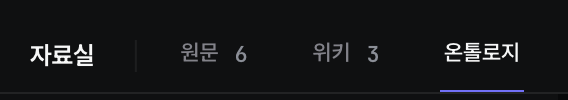
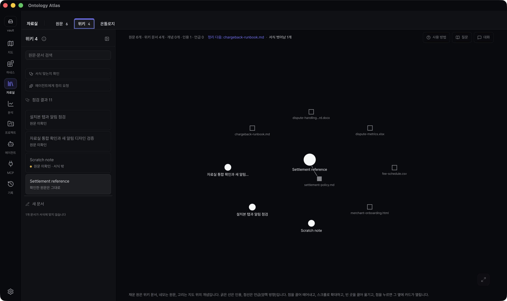
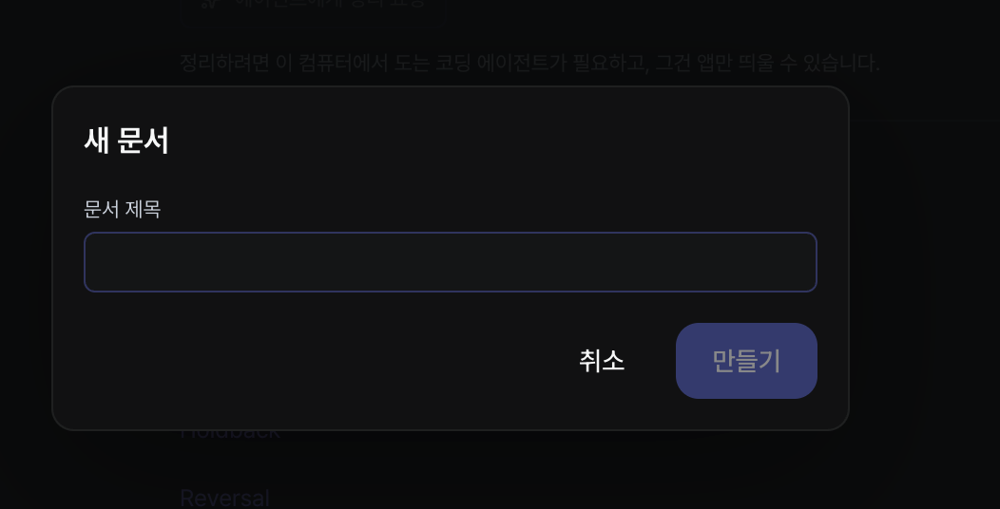
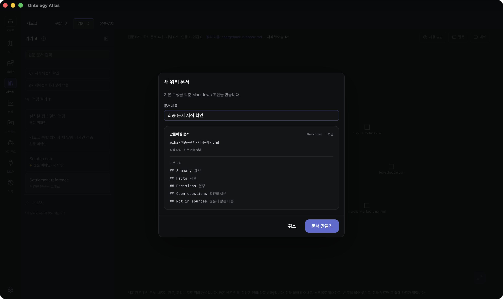
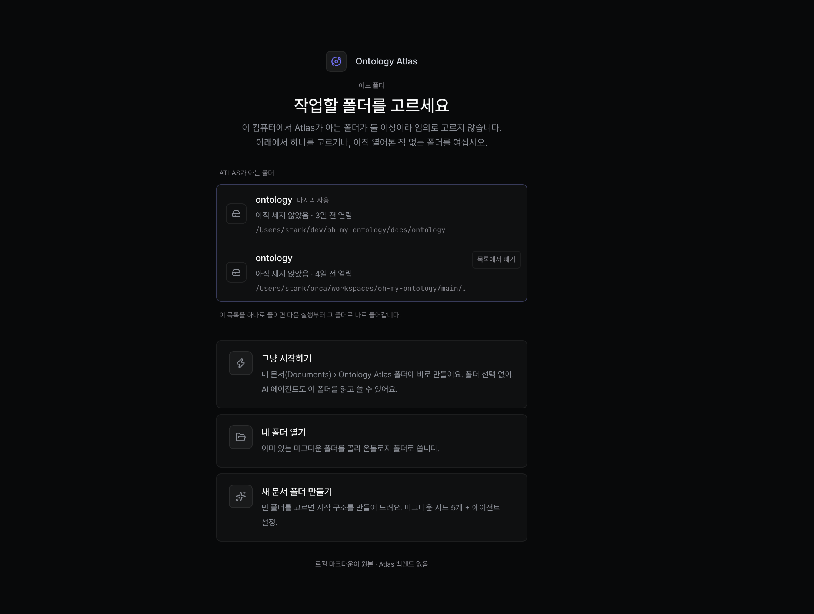
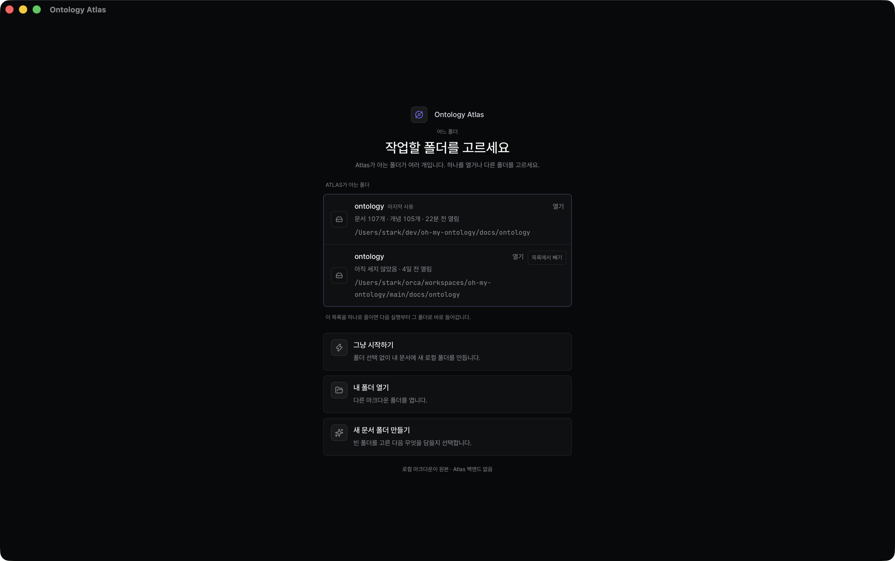

# Library workspace visual evidence — 2026-09-14

Historical snapshots for the Library integration and design review. Before images are the owner's reports. After images are actual installed macOS app captures, with matching accessibility trees retained in the local verification packet. These images record source `27c7fa13b`; the subsequent Escape-only correction does not change their layout.

| Surface | Before | Installed after |
| --- | --- | --- |
| Library tabs |  |  |
| Document creation |  |  |
| Known folders |  |  |

The installed bundle identity for these captures is `98d76fa50fd44f88941d8a9e94895cbe0d22e0e9eb80b55ae0bbba68cfbcc7fe` (11 entries). Creation and Library captures use an isolated fixture folder. The chooser uses the person's existing recent-folder records; normal launch preserved both choices and reopening the original folder returned to its map.

The settled measurements covered 82 Library/modal states and 12 chooser states in Korean and English, including 320px reflow, coarse input and a real Chromium default font of 32px. No horizontal overflow, measured control interception or inaccessible modal footer was found. A separate seven-consumer inventory measured 106 rendered tab strips in 112 states: six Inbox states were hidden by the existing responsive toolbar, verified from its computed display. All selected rendered tabs were hittable and contained their enlarged label; coarse tabs were at least 44px. Normal tab height is 32px and doubled-text height is 43px.

Keyboard creation, cancellation, reopening, creation and Undo were observed in one continuous trace; file existence checks used the same existing OPFS folder. A same-page 1440→390→834→1440 resize preserved the selected ontology slug and unsaved editor draft. Native review separately caught history Escape reaching the reader when WKWebView left focus there; the capture-phase repair has a regression with that exact focus state.

Motion proof uses real macOS recordings, not these stills. The recordings support gradual appearances, bounded completion and a stationary reduced-motion dialog crossfade. Raw changed-pixel share flags for the full-screen scrim and departing modal are retained; they do not establish human attention or a dropped frame. Rendering frame rate, input latency, interrupted velocity, physical-device safe areas and a complete live LLM compilation are not established by this packet.
